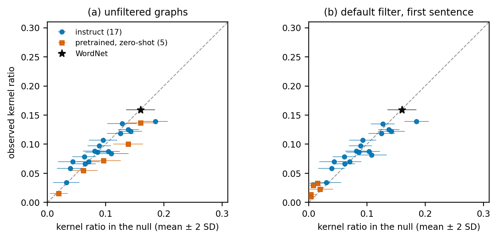
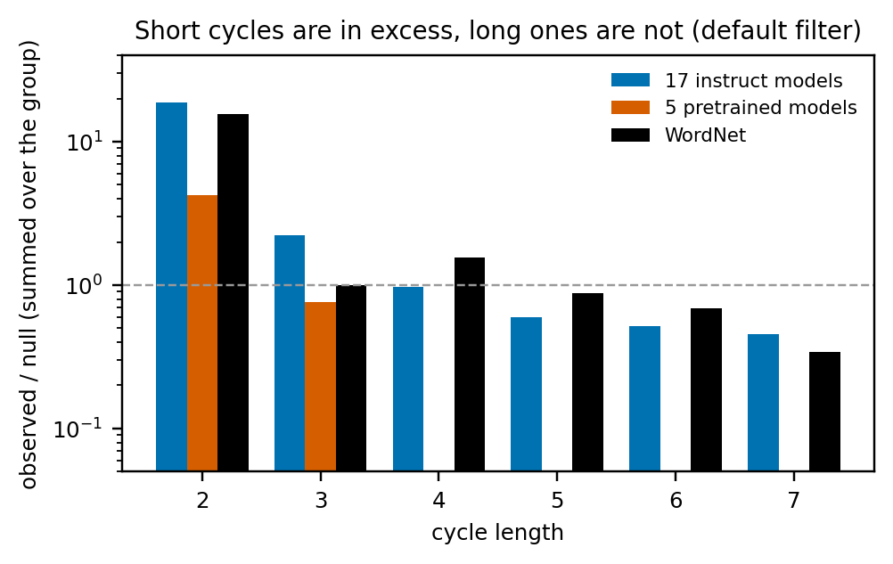
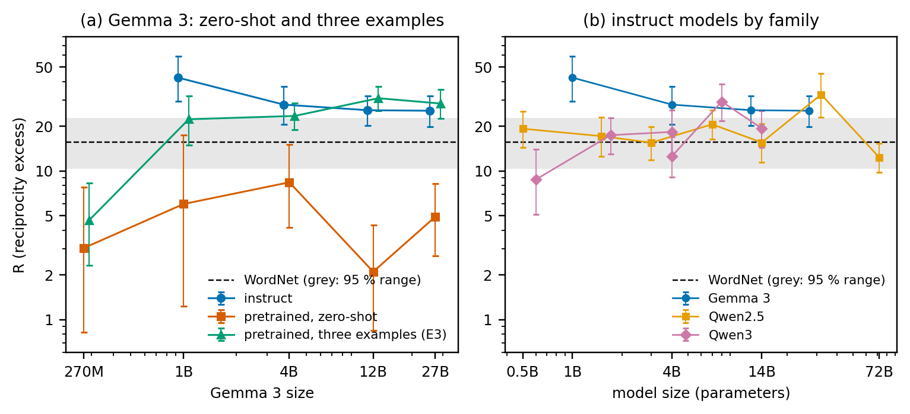
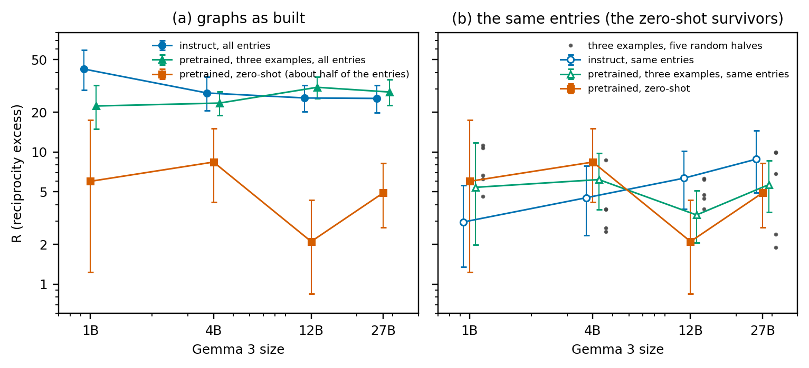

# Do LLM-Written Dictionaries Resemble Human Ones? 

> **Draft v1, 2026-10-02.** `draft_v0.md` is kept unchanged. Written by the assistant from the project records, for the researcher to revise.
> **Status.** The advisor gave a green light on the framing (D026, D028), as reported by the researcher on 2026-10-02. The text written after the D029
> result (the abstract, Section 1 item 2, Sections 4.3.1, 4.3.5, 5 and 7) is still to be shown to him. Sections 3, 4 and 6 report data. Every number comes from a file listed in
> `research/EVIDENCE_MAP.md` (tables and figures are generated by `research/audit_scripts/24_manuscript_tables.py` and
> `25_manuscript_figures.py`; two derived numbers by `26_derived_numbers.py`). Citations are in square brackets: the assistant checked each
> against the original (`research/REFERENCE_CHECK_2026-10-02.md`) and the researcher verified them (2026-10-02). Decision IDs (D0xx) point to `research/DECISION_LOG.md` and are to be removed from a
> submission version. Not for circulation.
>
> **Changes since v0.** The seven interpretations flagged in the evidence map were reworded as the researcher decided on 2026-10-02
> (Sections 1, 4.1, 4.2, 4.3.3, 5 and 2); the references were checked, and the way several sources are described was corrected (Sections 1,
> 2, 3 and the reference list); the open question about the Core in [VL16] is settled; sources were added for models, tools and methods. On 2026-10-02 the Introduction
> also records the researcher's account of the earlier analysis (it stayed within the lab and did not replicate outside one model family).
>
> **D029 (2026-10-02).** Section 4.3.5 and Figure 5 are new: at equal coverage the ratio of instruct R to zero-shot R falls from 3.3–12.2 to 0.5–3.0, so the statements that the
> zero-shot gap survives the filters (abstract, Section 1 item 2, Sections 4.3.1 and 7) now say that it compares graphs of unequal coverage. Section 5 was rewritten for the
> D029 results. Section 2 was rewritten as continuous text at the researcher's request.

## Abstract

Dictionaries define words with other words, so a dictionary is a directed graph with cycles. We ask whether dictionaries
written by language models resemble a human one in this respect, and whether instruction tuning rather than scale
produces the resemblance. Seventeen instruction-tuned models, five pretrained Gemma 3 models and WordNet glosses defined
the same 3,000 entries, and each definition graph was compared with degree-preserving null models run to convergence.
The classical kernel statistic is at chance for the instruct models and for WordNet alike. What remains is a
reciprocity excess R, the number of word pairs that define each other relative to the null: 8.8–42.5 for the instruct
models (median 19.3) and 15.7 for WordNet, although each instruct model shares only 1–4 of WordNet's 27 mutual pairs.
The hypothesis that instruction tuning creates this structure is not supported by our tests. Under a zero-shot prompt
the pretrained Gemma 3 models score 2.1–8.4 against 25.4–42.5 for their instruct counterparts, a gap that survives a
stricter filter, the whole stored text and the removal of frame words. It compares graphs of unequal coverage, however:
the filter leaves about half of the entries in the pretrained graphs, and R falls to 0.07–0.35 of its value when any graph
is limited to about half of the entries. On the same entries the pretrained and the instruct graphs have R of 2.1–8.8, although the
pretrained graphs contain fewer of the instruct models' mutual pairs (5 of 62, against 20 of 62 for pretrained models given
three example definitions). With three example definitions, pretrained models at 4B–27B show no difference from their
instruct counterparts on the whole word list, and the 1B model reaches about half. A rule-based filter for
non-definitions, validated on held-out hand labels (precision 97.5 %, recall 77.7 %), and a blind check of 100 few-shot
outputs (all definitions) support the reading. We state the limits: one model family with matched pairs, one prompt, one
generation run per model, and no instruction-tuned model run with examples.

## 1 Introduction

A dictionary defines words with other words. Because every defining word needs a definition of its own, a dictionary is
a directed graph with cycles, and the shape of those cycles says something about how a vocabulary holds together.
Vincent-Lamarre et al. [VL16] analysed four dictionaries (Longman, Cambridge, Merriam-Webster and WordNet) as graphs with links from defining
words to defined words, and found a Kernel of 7–12 % of the words from which all the others can be defined. Levary et al. [Lev12] compared
the loops of dictionary graphs with a randomization that keeps the in- and out-degree distributions: long loops follow from the degrees alone,
short ones do not, which they attribute to meaningful connections between words. Harnad [Har25] lists the circularity of verbal definition
among several "convergent biases" that, he suggests, may help language models do better than expected; his paper is a dialogue with ChatGPT-4
and reports no measurement.

Language models can now write dictionaries of their own. Earlier work asked whether the definitions they write *match* human ones: [Pha25],
for example, compared the definitions of over 2,500 words in WordNet, Merriam-Webster and Random House with those of two versions of ChatGPT,
and found the generated definitions highly accurate and comparable to the traditional ones, while definitions from different traditional
dictionaries were more similar in surface form to one another than the model-generated ones were. We ask whether the resulting dictionaries
*close* like a human one, and what produces the structure if they do.

The project began differently. It started from the idea that the kernel ratio of a model's definitions measures how well
the model "understands" concepts, and from an earlier analysis, of the first models we ran, in which larger models appeared to converge on the
structure of human dictionaries. That analysis stayed within the lab, and the pattern did not replicate outside one model family. A degree-preserving null model showed that the kernel ratio is explained by the degrees of the graph, chiefly
its density, and the same holds for a 3,000-word subgraph of WordNet (Section 4.1). We report that correction because
the rest of the paper builds on it.

After the correction one structure remained: a *reciprocity excess* R, the number of word pairs that define each other,
relative to the same null. Our hypothesis was that this structure is produced by instruction tuning and not by scale. In
a first reading, pretrained and instruction-tuned Gemma 3 models of the same size separated completely on R. The
hypothesis could fail, and the readings that would count against it were fixed before the filtered runs (Section 3.8).

Our tests do not support it. In brief:

1. The classical kernel statistic is at chance once the degrees of each graph are held fixed, for the instruct models and for WordNet
   (Section 4.1). What remains is R: 8.8–42.5 for the 17 instruct models against 15.7 for WordNet, built mostly from
   different word pairs (Section 4.2).
2. Under a zero-shot prompt, pretrained Gemma 3 models have R of 2.1–8.4 and the gap to their instruct counterparts
   survives a stricter filter, the whole stored text and the removal of frame words (Section 4.3.1). That gap compares graphs of unequal
   coverage: the filter leaves about half of the entries in the pretrained graphs, R falls to 0.07–0.35 of its value when any graph is
   limited to about half of the entries, and on the same entries the pretrained and the instruct graphs have R of 2.1–8.8, although the
   pretrained graphs contain fewer of the instruct models' mutual pairs (Section 4.3.5). With three example
   definitions, pretrained models at 4B, 12B and 27B show no difference from their instruct counterparts and the 1B model
   reaches about half (Section 4.3.2). The few-shot outputs are definitions (100 of 100 in a blind hand check, Section
   4.3.3).
3. How R varies with model size differs between families, and the data do not test the claim that scale plays no role
   (Section 4.3.4).

Beyond the answer, the paper contributes three points that apply to any study of definition graphs: null models run to
convergence (a run with 5×|E| swaps, the setting of our first run, underestimated R by a median 19 %); a rule-based filter for non-definitions
validated on held-out hand labels, with a stricter variant and a frame-word control that bracket its effect; and
uncertainty ranges that take into account the small number of mutual pairs in some graphs.

Section 2 gives background, Section 3 the method, Section 4 the results, Section 5 discusses them, and Section 6 lists
the limits.

## 2 Background and related work

The graph view of a dictionary serves a question about meaning: if every word is defined by other words, which words have to be understood without a definition for the rest to be defined at all?
Vincent-Lamarre et al. [VL16] answered it for four dictionaries by splitting each graph into a Kernel, the words that remain after repeatedly removing words that define nothing further
(7–12 % of each dictionary, and a grounding set for the rest), a Core inside it, which is the union of the Kernel's source components and equals its largest strongly connected component in two
of the four dictionaries (it adds a few small components in the other two), and Satellites, and they located minimal grounding sets (MinSets). Finding such sets is computationally hard: Blondin
Massé et al. [BM08] showed that the grounding sets of a dictionary graph are exactly its feedback vertex sets, so that deciding whether one of a given size exists is NP-complete. Our code computes
the Core as [VL16] define it; we do not test the Core or the MinSets against a null model (Section 3.4).

That work describes the structure of dictionary graphs, but not how much of it the degrees of the graph would produce anyway. Levary et al. [Lev12] asked this for loops. They compared the loops
of dictionary graphs (eXtended WordNet, Wiktionary, WordNet 3.0) with a randomization that keeps the in- and out-degree distributions and found that long loops (more than five links) follow from the
degrees, whereas short loops do not, which makes an excess of short loops the signature of meaningful connections between words. Our reciprocity excess R follows that logic: it counts the shortest
loops, the two-word ones, against a degree-preserving null. Comparing mutual links with a random graph is also the older question of reciprocity in directed networks, where Garlaschelli and Loffredo
[GL04] argued that the share of mutual links has to be compared with what a random graph of the same size gives, and proposed a reciprocity measure corrected for density. How the null is sampled
matters in turn: Fosdick et al. [Fos18] review null models with fixed degree sequences and the mixing time of edge-swap samplers, which is the question behind the number of swaps in Section 3.5.

Language models enter this picture in two ways. One is speculation about why they work at all: the "convergent biases" that Harnad lists [Har25] (Section 1) include the circularity of verbal definition,
though the paper reports no measurement. The other is that language models now write definitions. Noraset et al. [Nor17] introduced definition modeling, the task of generating a definition for a word and its embedding;
[Pha25] compared ChatGPT definitions with those of three dictionaries (Section 1); and Bommarito [Bom25] released OpenGloss, an LLM-generated dictionary and semantic graph of 537 thousand senses. Two
further works are worth separating from ours because of what they measure. Baartmans et al. [Baa25] generate and evaluate explications in the Natural Semantic Metalanguage with language models; their
evaluation flags circularity by checking whether any form of the defined word appears in the explication, and scores the use of semantic primes, so that neither the share of self-referential definitions nor prime
overlap is claimed as new here. Boudourides [Bou26] introduces "structural hallucination" and compares networks built by language models with reference networks (Roget's Thesaurus, Wikidata philosophers,
citation records); a search of its text found no null model and no cycle statistic, and it is not about definitions. Our question is posed at the level of the whole dictionary: whether the loops of the
dictionaries that models write have the structure that [Lev12] found in human ones, and what produces it if they do.

Whether what models produce is organised like human knowledge has been asked at other levels, with answers that depend on what is compared. Gammelgaard et al. [Gam23] report that bigger and better language
models organise concepts more like knowledge-graph embeddings do, across four model families; "converge" is their verb, and the verb of the earlier claim of our own project (Section 1), about a different
structure. Suresh et al. [Sur23] find that structures estimated from language-model behaviour cohere less across tasks than human ones. Gude et al. [Gud26] turn from size to tuning: they compare older base
models with newer instruction-tuned models, and both with human news text, using grammar-based diversity measures (HPSG), and find reduced syntactic and lexical diversity in the newer models, although the two
groups differ in generation as well as in tuning and the texts are news, not definitions.

If tuning rather than size is the candidate, the question becomes what tuning changes. The Superficial Alignment Hypothesis of Zhou et al. [Zho23] holds that a model's knowledge and capabilities are learnt
almost entirely in pretraining, and that alignment teaches which subdistribution of formats to use. Lin et al. [Lin24] support it: on average 77.7 % of the tokens of Llama-2-7b-chat's responses are also the base
model's top-ranked token (82.4 % for Vicuna, 82.2 % for Mistral-7b-instruct), the tokens that shift are mostly stylistic, and their URIAL method aligns base models in context with as few as three constant
stylistic examples and a system prompt. An et al. [Res24] report that tuning on responses alone, without instructions, gives models that respond to a wide range of instructions like instruction-tuned ones, and
Lake et al. [Lak25] find that the apparent drop in response diversity after alignment is largely explained by quality control and information aggregation (longer responses), and that the behaviour of aligned
models is recoverable from base models without fine-tuning, with in-context examples and semantic hints. Our few-shot result fits this hypothesis [Zho23; Lin24]: three examples, a change to the prompt alone,
bring pretrained R to the instruct level at 4B and above. The hypothesis also predicts the zero-shot failures of format, which the filter removes; it does not say why, on the same entries, the zero-shot outputs
that are definitions contain fewer of the instruct models' mutual pairs than the three-example outputs do (Section 4.3.5).

Finally, what one measures can create or remove an effect. Schaeffer et al. [Sch23] show that apparent emergent abilities can be an artifact of the researcher's choice of metric: nonlinear or discontinuous
metrics produce them, linear or continuous ones do not. This is why we report counts and continuous quantities beside ratios, why we test whether R follows definition length (Section 4.4), and why Section 4.3.5
compares R only between graphs that cover the same entries.

## 3 Method

### 3.1 Entries, models and the human baseline

*Entries.* We use a fixed list of 3,000 (word, part-of-speech) entries: 1,500 nouns, 900 verbs and 600 adjectives, sampled
from WordNet [Mil95; Fel98] with seed 42 among words with a Brown-corpus frequency [FK79] of at least 5. The list holds 2,750 distinct lemmas
(234 lemmas appear twice and 8 three times, under different parts of speech), so a graph has at most 2,750 nodes. The words
are not restricted to common ones: the list includes, for example, *consonantal*, *soloist* and *tuberculosis*.

*Models.* Seventeen instruction-tuned models: Gemma 3 [Gem25] at 1B, 4B, 12B and 27B; Qwen2.5-Instruct [Qw25] at 0.5B, 1.5B, 3B, 7B,
14B, 32B and 72B; Qwen3 [Qw3] at 0.6B, 1.7B, 4B, 8B and 14B (thinking disabled); and Qwen3-4B-Instruct-2507, an update of the 4B
non-thinking model whose model card gives [Qw3] as its citation. Five pretrained (base) Gemma 3 models at 270M, 1B, 4B, 12B and 27B, which pair
with the instruct models of the same size except at 270M. The 270M models are not covered by the Gemma 3 report (1B to 27B); they were announced
on 14 August 2025 [Gem270]. Gemma 3 270M instruct was generated but is excluded because its graph has no cycle at all (D011). Only Gemma 3
offers matched pretrained and instruction-tuned checkpoints across sizes, so the contrast between tuning and scale rests on one family. The
human baseline is the WordNet gloss of the same 3,000 entries.

### 3.2 Generation

For every entry each model received the prompt *Define the {noun|verb|adjective} "{word}" in one short sentence. Use only
common English words. Do not use the word itself in the definition.* Instruction-tuned models received it through their
chat template, pretrained models as raw text. All runs used bf16 weights, sampling at temperature 0.7 with top-p 0.8 and
top-k 20, at most 200 new tokens, one run per model and generation seed 0.

*Three-example control (E3).* Pretrained models also received a raw-text header with three worked examples (*book*, *walk*,
*large*) in a Q/A format, under the instruction that each definition is one sentence, uses only simple English words and
does not repeat the word being defined; decoding was the same. Three examples are also what URIAL [Lin24] uses to align base models in context (with a system prompt). The examples define by category and features and not by
synonym (for example, a book is "a set of printed or written pages bound together between covers"). Two of the three
headwords (*book*, *large*) and ten words of the example definitions are in the vocabulary; Section 4.3.3 bounds how much of
the result they can account for.

*Length control (E4) and template control (E5).* The 17 instruct models were also asked for definitions "in 8 words or
fewer" (E4), and given the original prompt without the chat template (E5).

### 3.3 From outputs to graphs

Every stored output is cut to its first line and first sentence, without markup or list markers (uniform extraction, D009).
The text is lower-cased, stripped of punctuation and stopwords, POS-tagged and WordNet-lemmatised (NLTK [BKL09]), and reduced to the lemmas
that are in the vocabulary. The graph has an edge *u → v* if and only if the lemma *u* occurs in the definition of *v* (*u*
"defines" *v*); there are no self-loops or multi-edges. All graphs have the same 2,750 nodes (D010): a record removed by the
filter (Section 3.6) keeps its node and contributes no edge.

### 3.4 Graph statistics

The *kernel* is what remains after repeatedly removing nodes with out-degree 0; the kernel ratio is its size divided by the
number of nodes. The *circulation rate* is the share of nodes that lie in a strongly connected component of at least two
nodes. A *mutual pair* is two words that occur in each other's definitions (a 2-cycle). We also count simple cycles up to
length 7. The core and the minimum grounding set are not tested against a null and are not reported (in [VL16] the Core is the union of the
source components of the Kernel's condensation, as in our code).

### 3.5 Null model, R and uncertainty

Each graph is rewired with directed edge swaps that preserve every node's in-degree and out-degree (`directed_edge_swap` of NetworkX
[HSS08]; the configuration model behind it is described in [New18], chapter 12), 100 replicates per graph, and each observed statistic is
compared with the replicates (z-scores with the population standard deviation). How many swaps a sampler needs is a question of mixing time
[Fos18], and here it matters. A convergence study on six graphs (30 chains each, up to 128×|E| swaps) showed that the mean number of mutual
pairs settles within 4–24×|E| swaps and that 5×|E| swaps, the setting of our first run (the default of `null_model.py`), left R too low by
12–90 % on those graphs. We use 32×|E| swaps per replicate, with at most 300 tries per swap, for every analysis; on the 23 unfiltered main
graphs R is a median 19 % higher at this setting than at 5×|E|.

The *reciprocity excess* is R = (observed mutual pairs) / max(mean number of mutual pairs in the null, 0.5); the floor
prevents division by a tiny mean and applies to one graph (Gemma 3 1B pretrained, null mean 0.45). Like the reciprocity measure of [GL04], R compares
the observed mutual links with what a random graph gives; the null here keeps every node's degrees.

The 95 % intervals printed by the null runs reflect the sampling of the null only. Some graphs hold only 3–14 mutual pairs,
so we also report (i) the exact Poisson 95 % range [Gar36] of the observed number of mutual pairs divided by the null mean, with the
null mean taken as known; (ii) for the ratio of two values of R, the exact conditional (binomial) range [CP34]; and, where the two
disagree, (iii) a conservative range that combines the two ends of the Poisson ranges. These ranges treat mutual pairs as
independent, although pairs share words, so they may be too narrow.

### 3.6 Hand labels, extraction and the non-definition filter

*Hand labels.* The researcher labeled the full output of every model for the same 100 randomly chosen words (23 models ×
100 words = 2,300 rows) with seven labels: definition, echo, question, off-topic, restatement, refusal and unclear. Pretrained
models gave a definition on 42 % of rows (21–54 % by model); instruct models on about 100 %, except Gemma 3 270M (27 %) and
Qwen3-0.6B (87 %). A re-label of a random sample of 110 rows agreed on 88.2 % of rows on the seven labels (κ = 0.79) and on
95.5 % on definition versus not (κ = 0.90). The labeler reports that about a day separated the two labelings; we regard the
agreement as a possible upper bound (D022).

*Extraction and second pass.* The first-sentence cut removes words from 36.6 % of the records of the pretrained models. A
second labeling pass covered the 58 labeled rows that the cut changes and that had been labeled definition or unclear, so that
the filter is validated on the unit it classifies.

*The filter.* A rule-based filter (Appendix A) decides for each first sentence whether it is a definition. Its rules cover
blank or headword-only text, questions, first-person text, echoed task language, exam and off-topic markers and unfinished
sentences; the default is to keep, so a record is dropped only when a rule fires. The 100 labeled words were split at random,
with a fixed seed, into 50 development words and 50 test words; the rules were written on the development words, frozen (the
module hash is recorded), and the test words were scored once. After that scoring the rules were also checked on records of the
2,900 unlabeled words, only to remove rules that dropped real definitions; this is disclosed in Appendix A. A *strict*
variant adds the rules that had been removed for dropping real definitions; it brackets how R reacts to a modest change of the
filter and is not a bound for a perfect one. A *frame-word* control removes six words that dominate the pretrained graphs
(*define*, *mean*, *refer*, *describe*, *phrase*, *use*) from every graph.

### 3.7 Pair typing and overlap

Each mutual pair is typed with WordNet over all senses of both words and without part of speech, in this order: synonym (a shared
synset), antonym, derived form, hypernym (one word's synset is a direct hypernym of the other's), sister term (a shared direct
hypernym), and otherwise no direct link. The typing is generous and says nothing about the quality of a definition. Sets of mutual
pairs are compared with the Jaccard index.

### 3.8 Readings fixed in advance, and the hand check of the few-shot outputs

*Readings.* Before the filtered null runs, the contrast between pretrained and instruct models was defined as surviving
filtering if the ratio of instruct R to pretrained R is at least 2 for at least three of the four matched Gemma 3 pairs under both
the default and the strict filter (D024). A factor of 2 was chosen because changing only the prompt moved R of the same model by a
median factor of 1.3 (length control) to 1.9 (no template) on the unfiltered graphs. For the three-example prompt, the pretrained R
was to count as reaching the instruct range if it lies within a factor 2 of the instruct R for at least three of four sizes. A
second reading (D025) fixed that the gap depends on the frame words only if the ratio falls below 2 for at least three pairs after
removing them. These readings were written after the unfiltered results, the three-example results included, were known; they
were fixed before any filtered run existed. They were written for point estimates; Section 4.3 adds the counting ranges.

*Coverage and content (D029).* After the zero-shot gap had resisted the stricter filter, the whole stored text and the frame words, two further explanations were tested
on the CPU, with the readings written before any restricted graph went through the null model (the numbers of surviving entries and a code smoke test were known). For coverage, the few-shot
and the instruct graph of each size were limited to the entries whose zero-shot record survived the filter, and the few-shot graph also to five random sets of entries of the
same size. Coverage was to count as explaining most of the gap if, at three or four sizes, R of the restricted few-shot graph was at or below the geometric
mean of the zero-shot R and the whole-graph few-shot R and below the smallest random restriction, and as not explaining it if it was above that mean and not
below the smallest random restriction. For content, the defining words of the same entry were compared by the Jaccard index (zero-shot definitions use other words if the mean index with the
instruct definition is lower than the few-shot one by a factor of 1.5 at three or four sizes, and do not if the factor is below 1.25), and the recovery of the instruct graph's mutual pairs at
equal coverage by the zero-shot and the few-shot graph (content differs if the few-shot share is at least twice the zero-shot share with an exact McNemar p below 0.05, and does not if it is
below 1.25 times). In between, the result is called mixed.

*Hand check of the few-shot outputs.* The filter was validated on zero-shot outputs only. We therefore labeled 100 few-shot
outputs (25 words drawn at random from the words not among the 100 labeled words, for each of the four pretrained models from 1B to
27B; shuffled; shown without the model or the filter's decision) with the same seven labels. The rule that gives the result its
meaning was fixed before labeling: the few-shot result stands if at least 90 % of the outputs the filter keeps are definitions and no
model is below 80 % (D027). The check was scored once.

## 4 Results

### 4.1 The classical statistic is at chance (claim 1)

*Figure 2.* Kernel ratio of each graph against its mean in the degree-preserving null (bars: ±2 SD of the null). Points near the
diagonal are at chance.

**Table 1.** Claim 1: z-scores of the kernel ratio and the circulation rate against the degree-preserving null, by group (median, with the number of graphs below 0 / beyond -2 / beyond +2).

| Measure | Group | n | Unfiltered | Default filter | Strict filter |
|---|---|---:|---|---|---|
| Kernel ratio | 17 instruct models | 17 | +0.16 (7 / 2 / 1) | +0.31 (7 / 2 / 1) | +0.10 (7 / 3 / 1) |
| Kernel ratio | 5 pretrained models | 5 | -1.67 (5 / 2 / 0) | +1.68 (0 / 0 / 2) | +1.37 (0 / 0 / 2) |
| Kernel ratio | WordNet | 1 | -0.08 (1 / 0 / 0) | -0.08 (1 / 0 / 0) | -0.08 (1 / 0 / 0) |
| Circulation rate | 17 instruct models | 17 | -1.34 (15 / 6 / 0) | -1.51 (15 / 6 / 0) | -1.37 (15 / 6 / 0) |
| Circulation rate | 5 pretrained models | 5 | -1.81 (5 / 2 / 0) | +1.90 (0 / 0 / 2) | +2.20 (0 / 0 / 3) |
| Circulation rate | WordNet | 1 | -1.89 (1 / 0 / 0) | -1.89 (1 / 0 / 0) | -1.89 (1 / 0 / 0) |

<!-- source: research/audit_scripts/outputs/24_manuscript_tables.md, Table 1 (computed from the per-graph results of the runs in results_2026-10-01_Local/) -->

For the 17 instruct models the median z of the kernel ratio is +0.16 unfiltered, +0.31 under the default filter and +0.10 under
the strict filter; WordNet is at −0.08 in all three. Two or three instruct models lie below −2 and one (Qwen2.5-32B) above +2.
The classical statistic therefore does not tell an LLM dictionary, or the 3,000-word WordNet subgraph, from a random graph with
the same degrees (Figure 2): its value is explained by the degrees of the graph, of which density is the main part. A statement that larger
models converge on human dictionary structure because their kernel ratio is higher is thus a statement about the degrees of the graph, chiefly
how many links longer definitions create, and not about how the links are arranged; this corrects our earlier analysis (Section 1).

The circulation rate, the share of words that lie on a loop with another word, is *below* the null for the instruct models
(median z −1.34, −1.51 and −1.37; 15 of 17 below 0 and 6 below −2 in each variant) and for WordNet (−1.89). The five pretrained
graphs change sign with the filter (circulation z median −1.81 unfiltered, +1.90 under the default filter; kernel −1.67 and
+1.68), because after filtering they hold only 3–14 mutual pairs and 2,358–3,268 edges; for them neither measure is stable. Core
and minimum grounding sets are not tested.

### 4.2 One structure remains: reciprocity excess (claim 2)

**Table A1** (Appendix B) gives the observed numbers, the null mean, R and its range for every graph. Under the default filter the
17 instruct models have R from 8.8 to 42.5 (median 19.3), WordNet 15.7 [10.3, 22.8], and the five pretrained models, zero-shot,
2.1 to 8.4 (median 4.9). Unfiltered the figures are 9.4–42.5 (18.3), 15.7 and 2.1–9.0 (5.2); under the strict filter 8.9–34.9
(19.3), 15.7 and 1.8–6.0 (5.6). Twelve of the 17 instruct models have R above WordNet's in each variant; the ranges of seven lie
entirely above WordNet's value (the four Gemma 3 models, Qwen2.5-32B, Qwen2.5-7B and Qwen3-8B), those of two entirely below
(Qwen2.5-72B, Qwen3-0.6B), and eight contain it. Across families the groups are not separated: the lowest instruct model
(Qwen3-0.6B, 8.8 [5.1, 14.0]) and the highest pretrained model (Gemma 3 4B pretrained, 8.4 [4.2, 15.0]) overlap.

**Table 2.** Cycle lengths in the default-filter graphs: observed number of cycles / mean number in the null, summed over the graphs of a group.

| Group | 2 | 3 | 4 | 5 | 6 | 7 |
|---|---:|---:|---:|---:|---:|---:|
| 17 instruct models | 881 / 47 = 18.83x | 93 / 41 = 2.24x | 56 / 58 = 0.97x | 58 / 98 = 0.59x | 86 / 167 = 0.52x | 138 / 302 = 0.46x |
| 5 pretrained models | 39 / 9 = 4.21x | 2 / 3 = 0.76x | 0 / 1 = 0.00x | 0 / 1 = 0.00x | 0 / 0 = 0.00x | 0 / 0 = 0.00x |
| WordNet | 27 / 2 = 15.70x | 2 / 2 = 1.00x | 4 / 3 = 1.57x | 3 / 3 = 0.88x | 3 / 4 = 0.69x | 2 / 6 = 0.34x |

<!-- source: outputs/24_manuscript_tables.md, Table 2 -->

*Figure 3.* Observed / null number of cycles by length (default filter). No bar means no cycle of that length was observed (the
pretrained graphs have none longer than 3).

Mutual pairs are in strong excess, longer cycles are not (Table 2, Figure 3). In the instruct graphs 2-cycles are 18.8 times
as frequent as in the null, 3-cycles 2.2 times, 4-cycles at chance (0.97), and cycles of length 5, 6 and 7 below chance (0.59, 0.52,
0.46). WordNet, with 27 mutual pairs, has the same pattern (15.7 times at length 2; 0.88, 0.69 and 0.34 at lengths 5–7, from 3, 3 and
2 observed cycles). The pretrained graphs have 39 mutual pairs in all and no cycle longer than 3.

**Table 3.** Mutual pairs by WordNet relation (all senses, no part of speech; the first match in the order of the columns decides). Counts, with shares of the pair occurrences in brackets.

| Source | Pair occurrences | Synonym | Hypernym | Sister term | Antonym | Derived form | No direct link |
|---|---:|---:|---:|---:|---:|---:|---:|
| WordNet | 27 | 2 (7 %) | 9 (33 %) | 1 (4 %) | 0 (0 %) | 3 (11 %) | 12 (44 %) |
| 17 instruct models | 881 | 339 (38 %) | 192 (22 %) | 77 (9 %) | 14 (2 %) | 7 (1 %) | 252 (29 %) |
| Few-shot pretrained (E3) | 324 | 106 (33 %) | 69 (21 %) | 35 (11 %) | 3 (1 %) | 5 (2 %) | 106 (33 %) |
| Zero-shot pretrained | 39 | 9 (23 %) | 11 (28 %) | 0 (0 %) | 0 (0 %) | 1 (3 %) | 18 (46 %) |

<!-- source: outputs/24_manuscript_tables.md, Table 3, parsed from outputs/20_pair_types.txt -->

*What the pairs are.* The 17 instruct graphs hold 881 pair occurrences, 363 different pairs (Table 3). By WordNet relation 38 % are
synonyms (begin–start in all 17 models; collect–gather, complete–finish, correct–right), 22 % hypernym pairs (flavor–taste,
grasp–understand), 9 % sister terms (fifteen–fourteen, fifteen–sixteen), 2 % antonyms (rough–smooth), 1 % derived forms and 29 % have
no direct link (location–place, big–size, greet–hello, eat–mouth). WordNet's relations type the pairs coarsely: some pairs typed as hypernym pairs or as unlinked are close in ordinary use (flavor–taste,
location–place), others are associations (eat–mouth, greet–hello). WordNet's own 27 pairs are 2 synonyms (accent–stress, begin–start), 9 hypernym
pairs, 1 sister pair, 3 derived forms (europe–european, pursue–pursuit) and 12 with no direct link (baseball–bat, brief–summary).

*LLMs and WordNet agree in the size of the excess, not in which words form it.* Ten of WordNet's 27 pairs occur in some instruct
graph, but each instruct model shares only 1–4 of them (Jaccard index 0.010–0.055), whereas two instruct models overlap more (median
Jaccard 0.14, range 0.03–0.33; 77 % of the pair occurrences in an instruct graph also occur in another instruct graph).

### 4.3 Does instruction tuning create the structure? (claim 3)

#### 4.3.1 Zero-shot: a gap that survives filtering

The comparison in this section is between graphs of unequal coverage: the filter leaves about half of the entries in the pretrained graphs and nearly all of them in the
instruct graphs. Section 4.3.5 compares them on the same entries.

Under the zero-shot prompt the pretrained Gemma 3 models have R of 6.0, 8.4, 2.1 and 4.9 at 1B, 4B, 12B and 27B (default filter),
against 42.5, 28.0, 25.7 and 25.4 for the instruct models of the same size (Table 4).

**Table 4.** Matched Gemma3 pairs under a zero-shot prompt: R of the instruct model / R of the pretrained model, with the exact conditional 95 % range of the ratio, under five variants of the analysis.

| Size | Instruct R | Pretrained R | Default filter | Unfiltered | Strict filter | Whole stored text | Six frame words removed |
|---|---:|---:|---|---|---|---|---|
| 1B | 42.5 | 6.0 | 7.1 [2.2, 36.0] | 13.9 [7.1, 28.6] | 5.8 [1.8, 29.9] | 7.1 [2.9, 20.6] | 7.1 [2.2, 35.9] |
| 4B | 28.0 | 8.4 | 3.3 [1.7, 7.1] | 4.3 [2.5, 7.8] | 4.8 [2.4, 10.7] | 2.2 [1.2, 4.5] | 9.7 [4.9, 20.7] |
| 12B | 25.7 | 2.1 | 12.2 [5.7, 31.4] | 4.9 [2.9, 9.1] | 11.7 [5.4, 29.9] | 10.0 [4.8, 23.9] | 12.9 [6.0, 33.1] |
| 27B | 25.4 | 4.9 | 5.2 [2.9, 10.0] | 2.5 [1.6, 4.1] | 3.8 [2.1, 7.3] | 3.4 [1.9, 6.4] | 6.7 [3.7, 12.9] |

Over the 20 pair-by-variant comparisons the range excludes 1 in 20 and excludes 2 in 15.

<!-- source: outputs/24_manuscript_tables.md, Table 4 -->

The filter removes 47–58 % of the records of the pretrained models (and 0.0–0.7 % of those of the 17 instruct models), and about
half of the pretrained models' mutual pairs with them; the filtered pretrained graphs hold 3–14 mutual pairs. The ratio of instruct R
to pretrained R is 7.1, 3.3, 12.2 and 5.2 under the default filter and 5.8, 4.8, 11.7 and 3.8 under the strict filter: at least 2 for
four of four pairs under both, which is the first of the readings fixed in advance (Section 3.8). The gap also remains with the whole
stored text in place of the first sentence (7.1, 2.2, 10.0, 3.4) and with the six frame words removed (7.1, 9.7, 12.9, 6.7; the
second reading, "does not depend on the frame words"). Removing the frame words, which dominate the pretrained graphs ("mean" occurs
in 217–292 definitions in four of the five), did not raise pretrained R (median 4.9 before, 3.3 after) and did not lower instruct R
(median 19.3 before, 19.5 after).

The counting ranges temper this. The exact range of the ratio excludes 1 in all 20 comparisons and excludes 2 in 15 of them. The
weakest pair is 4B: 3.3 [1.7, 7.1] under the default filter and 2.2 [1.2, 4.5] with the whole stored text. The filter leaves about
18.5 % of the pretrained models' non-definitions in the graphs (Section 6). Junk that stays adds edges that rarely point back at each
other, so we expect, without having measured it, that pretrained R is if anything too low; the strict filter, which catches about five
more points of the junk, did not close the gap.

#### 4.3.2 Three examples: no measurable gap from 4B up

*Figure 4.* (a) R of the Gemma 3 models against size, zero-shot (pretrained and instruct) and with three examples (pretrained); bars
are exact Poisson 95 % ranges; the grey band is WordNet's. The zero-shot pretrained graphs cover about half of the entries (Section 4.3.5). (b) R of the instruct models by family.

**Table 5.** The three-example prompt (E3): R of the pretrained Gemma3 models given three example definitions, against the zero-shot pretrained model and the instruct model of the same size (default filter). The ratio is instruct R / few-shot R; the exact range is the conditional range, the conservative range combines the two ends of the Poisson ranges.

| Size | Zero-shot pretrained R | Few-shot pretrained R (95 % range) | Instruct R | Instruct / few-shot | Exact range | Conservative range |
|---|---:|---:|---:|---:|---|---|
| 270M | 3.0 | 4.6 [2.3, 8.3] | no cycles (D011) | -- | -- | -- |
| 1B | 6.0 | 22.3 [14.9, 32.0] | 42.5 | 1.91 | [1.13, 3.24] | [0.92, 3.98] |
| 4B | 8.4 | 23.5 [18.9, 28.8] | 28.0 | 1.19 | [0.82, 1.71] | [0.71, 1.97] |
| 12B | 2.1 | 30.9 [25.5, 37.1] | 25.7 | 0.83 | [0.61, 1.12] | [0.55, 1.26] |
| 27B | 4.9 | 28.5 [22.5, 35.5] | 25.4 | 0.89 | [0.64, 1.25] | [0.56, 1.43] |

<!-- source: outputs/24_manuscript_tables.md, Table 5 -->

With three example definitions the pretrained models' R is 4.6 (270M), 22.3, 23.5, 30.9 and 28.5 (1B to 27B) (Table 5, Figure 4a). The
instruct R divided by the few-shot pretrained R is 1.91, 1.19, 0.83 and 0.89 at 1B, 4B, 12B and 27B. At 4B, 12B and 27B the exact
95 % ranges include 1 ([0.82, 1.71], [0.61, 1.12], [0.64, 1.25]): no difference can be shown, though the ranges still allow differences
of up to about 1.6–1.7 times (instruct higher at 4B, pretrained higher at 12B and 27B). At 1B the pretrained model reaches about half
of the instruct R by the exact method (range [1.13, 3.24]) but not by the conservative one ([0.92, 3.98]), so that gap depends on the
method. In terms of the reading fixed in advance, the pretrained R lies within a factor 2 of the instruct R at four of four sizes by
the point estimates (factors 1.91, 1.19, 1.20 and 1.12 under the default filter; 1.57, 1.14, 1.15 and 1.46 under the strict filter;
the unfiltered graphs agree) and at three of four sizes by the ranges. Gemma 3 270M has no instruct counterpart because its graph has
no cycle; its few-shot R is 4.6 [2.3, 8.3] (11 mutual pairs), below every instruct model (the lowest, Qwen3-0.6B, is 8.8 [5.1, 14.0]).

#### 4.3.3 The few-shot outputs are definitions, and their pairs overlap the instruct models' pairs

*Hand check.* In the blind check of 100 few-shot outputs (25 words for each of the four pretrained models from 1B to 27B), all 100 were
labeled definition: 100 of 100 (exact 95 % interval 96–100 %), and 25 of 25 for each model (86–100 %). The filter kept all 100 and
agrees with the labels on every row, so the rule fixed in advance is met. The label certifies form, not accuracy. A few outputs repeat
the headword (for *spring*, 1B: "To move forward or upward, especially in a spring or a spring-like manner."), and some small-model
definitions are wrong (*quarterly*, 1B: "Occurring or taking place every four weeks."). The few-shot outputs are copies of the examples
only rarely: exact copies of an example definition in 11, 12, 2, 1 and 2 of the 3,000 records (270M to 27B), and no more than 2.2 % of
records share a sentence with another word's definition.

*Pairs.* The few-shot models' mutual pairs overlap the instruct models' pairs: 16 of 29, 63 of 92, 79 of 114 and 59 of 78 pairs
(55 %, 68 %, 69 %, 76 %; 1B to 27B) occur in at least one instruct graph, against 77 % for an instruct graph's pairs in the other
instruct graphs (the 1B model has the lowest share). The Jaccard index with the matched Gemma 3 instruct model is 0.15, 0.17, 0.22 and 0.20, inside the range between two
Gemma 3 instruct models (0.12–0.28, median 0.21) and above the index with the non-Gemma instruct models (median 0.08, 0.12, 0.15, 0.14).
The mix of pair types is that of the instruct models (Table 3: 33 % synonyms, 21 % hypernym pairs, 11 % sister terms, 33 % no direct
link).

*Example words.* Edges that start at the 12 example words are 5.1–5.5 % of the edges at 4B–27B, as in the matched instruct graphs
(5.1–5.6 %); the share is higher at 1B (8.7 %, instruct 6.5 %) and 270M (12.8 %). Between 4 and 6 of the 29–114 mutual pairs at 1B–27B
involve one of the words (3 to 10 of 34–78 for the instruct models), and the two headwords occur in one pair only (great–large, 270M).
R does not come from copying the examples or reusing their words: removing every mutual pair that involves an example word would lower
the few-shot count by at most 14 % (1B) and 5–7 % (4B–27B) (`26_derived_numbers.py`).

#### 4.3.4 Scale: a description

The original hypothesis also said that scale does not create the structure. We describe how R varies with size and do not test it
(Figure 4b). Among the 17 instruct models there is no overall relation between R and size (Spearman ρ = +0.18, p = 0.50). Within
families the picture differs: R falls within Gemma 3 (42.5 at 1B to 25.4 at 27B), shows no trend within Qwen2.5 (ρ = −0.18, n = 7), and
rises within Qwen3 (8.8 at 0.6B to 29.3 at 8B; ρ = +0.84, n = 6). Few-shot pretrained R rises from 4.6 at 270M to 22.3 at 1B and lies
between 22 and 31 from 1B to 27B; the instruct advantage under three examples shrinks from 1.91 at 1B to 0.89 at 27B. The data do not
support a statement about scale that does not name the family.

#### 4.3.5 Equal coverage: R falls with coverage, and the zero-shot gap shrinks (D029)

The comparison of Section 4.3.1 sets graphs of unequal coverage side by side. The default filter drops 47.3, 55.9, 49.9 and 56.7 % of the valid zero-shot records of the pretrained
models at 1B, 4B, 12B and 27B, so that 1,580, 1,322, 1,503 and 1,296 of the 3,000 entries keep a definition; the instruct graphs and the three-example graphs keep nearly all of them.
A dropped entry keeps its node and adds no edge (Section 3.3), so a pretrained graph is a graph in which about half of the words have no definition. To test whether this explains
the gap we limited the few-shot and the instruct graph of each size to the entries whose zero-shot record survived (the entries the zero-shot graph is built from), and the few-shot graph
also to five random sets of entries of the same size (Section 3.8). The null model was run as everywhere else (100 replicates, 32×|E| swaps; on three of the restricted
1B graphs the mean number of pairs in the null had settled by 8×|E| swaps and stayed there up to 256×|E|).

**Table 6.** Equal coverage (D029). R of the zero-shot pretrained graph and of the few-shot and instruct graphs limited to the entries whose zero-shot record survived the filter (the same entries), with the exact Poisson 95 % range, and the exact conditional range of instruct / zero-shot. The last three columns are the few-shot graph limited to five random sets of entries of the same size (smallest to largest R) and the graphs of the whole word list.

| Size | Entries kept (of 3,000) | Zero-shot pretrained | Few-shot, same entries | Instruct, same entries | Instruct / zero-shot (exact range) | Few-shot, five random halves | Few-shot, whole list | Instruct, whole list |
|---|---:|---|---|---|---|---|---:|---:|
| 1B | 1,580 | 6.0 [1.2, 17.5] (3 pairs) | 5.4 [2.0, 11.8] (6) | 3.0 [1.3, 5.6] (9) | 0.49 [0.12, 2.82] | 4.6 to 11.3 | 22.3 | 42.5 |
| 4B | 1,322 | 8.4 [4.2, 15.0] (11 pairs) | 6.2 [3.7, 9.8] (18) | 4.5 [2.3, 7.9] (12) | 0.54 [0.22, 1.34] | 2.5 to 8.7 | 23.5 | 28.0 |
| 12B | 1,503 | 2.1 [0.8, 4.3] (7 pairs) | 3.3 [2.1, 5.1] (21) | 6.3 [3.7, 10.2] (17) | 3.02 [1.19, 8.61] | 3.7 to 6.3 | 30.9 | 25.7 |
| 27B | 1,296 | 4.9 [2.7, 8.2] (14 pairs) | 5.7 [3.5, 8.7] (21) | 8.8 [4.9, 14.6] (15) | 1.80 [0.81, 4.02] | 1.9 to 10.0 | 28.5 | 25.4 |

The exact range of instruct / zero-shot includes 1 at 3 of 4 sizes.

<!-- source: outputs/24_manuscript_tables.md, Table 6; outputs/27_survivor_restriction.txt -->

The reading fixed in advance came out *mixed*. R of the few-shot graph limited to the survivors is at or below the midpoint (geometric mean) of the zero-shot R and the whole-graph few-shot R at four
of four sizes, but below the smallest of the five random restrictions at one size only (12B; 3.3 against 3.7). Table 6 and Figure 5 show more than the reading asked for. Limiting a graph to about half of the
entries lowers R to between 0.07 and 0.35 of its value on the whole word list (the few-shot graphs: 22.3, 23.5, 30.9 and 28.5 on the whole list, 5.4, 6.2, 3.3 and 5.7 on the survivors, 1.9 to 11.3 on random sets;
the instruct graphs: 42.5, 28.0, 25.7 and 25.4, and 3.0, 4.5, 6.3 and 8.8 on the survivors), and which half matters little: the survivors lie inside the range of the random sets at three of four sizes.
At equal coverage the zero-shot, few-shot and instruct graphs have R between 2.1 and 8.8. The instruct R divided by the zero-shot R, 7.1, 3.3, 12.2 and 5.2 on the whole graphs (Table 4), is 0.49, 0.54, 3.02 and 1.80,
and its exact range includes 1 at three of the four sizes; the counts behind these ratios are small (3 to 21 mutual pairs per graph), so the ranges are wide. The comparison of the few-shot and the zero-shot graph, and of the instruct and the few-shot graph, includes 1
at four of four sizes. This part of the analysis was not covered by the reading and is descriptive.

*Figure 5.* R of the Gemma 3 graphs (a) as built and (b) on the entries whose zero-shot record survived the filter; the zero-shot graph is the same in both panels. Bars are exact Poisson 95 % ranges; the grey
dots are the five random halves of the three-example graph.

<!-- source: outputs/24_manuscript_tables.md, Table 6; research/audit_scripts/25_manuscript_figures.py -->

Why does R fall? A mutual pair needs both words to have a definition, so the observed number falls with about the square of the share of entries kept: it is multiplied by 0.21, 0.20, 0.18 and 0.27 from the whole
few-shot graph to the survivors, against squared shares of 0.28, 0.19, 0.25 and 0.19. The mean number of pairs in the null, which keeps every word's in- and out-links, does not fall (it is multiplied by
0.85, 0.74, 1.70 and 1.35). We do not know why. Whatever the reason, R is not comparable between graphs of different coverage, and the equal-coverage columns of Table 6 are the fair comparison.

Content still differs. Table 7 counts, among the mutual pairs of the instruct graph whose two words both have a surviving zero-shot entry (62 pairs over the four sizes), those that each other graph contains.

**Table 7.** Mutual pairs of the instruct graph that the other graphs contain, at equal coverage (D029). At risk: mutual pairs of the instruct graph (whole word list) whose two words both have a surviving zero-shot entry. Zero-shot: the zero-shot graph; few-shot: the few-shot graph limited to the same entries. Exact McNemar test on the pairs found in one graph and not in the other.

| Size | Instruct pairs | At risk | Zero-shot | Few-shot, same entries | Only few-shot | Only zero-shot | Exact McNemar p |
|---|---:|---:|---|---|---:|---:|---:|
| 1B | 34 | 12 | 0 (0 %) | 0 (0 %) | 0 | 0 | 1.000 |
| 4B | 47 | 12 | 1 (8 %) | 6 (50 %) | 5 | 0 | 0.062 |
| 12B | 78 | 19 | 2 (10 %) | 8 (42 %) | 7 | 1 | 0.070 |
| 27B | 71 | 19 | 2 (10 %) | 6 (32 %) | 4 | 0 | 0.125 |
| Pooled (descriptive: pairs recur across sizes) | -- | 62 | 5 (8 %; 95 % range 3-18 %) | 20 (32 %; 21-45 %) | 16 | 1 | 0.0003 |
| Each different pair once (52 pairs) | -- | 52 | 4 | 17 | 14 | 1 | 0.001 |

<!-- source: outputs/24_manuscript_tables.md, Table 7; outputs/28_defining_words.txt -->

The zero-shot graphs contain 5 of the 62 pairs (8 %), the few-shot graphs limited to the same entries 20 (32 %); 16 pairs occur only in the few-shot graphs and 1 only in the zero-shot graphs (exact McNemar
p = 0.0003). Pairs recur across sizes, so this pooled test is descriptive; counting each of the 52 different pairs once (an analysis added after the first reading) the numbers are 14 and 1 (p = 0.001), and per
size the counts are small. The pairs found only in the few-shot graphs include asleep–awake, grasp–hold, greet–welcome, help–support, image–picture and initiate–start (the full list is in `outputs/28_defining_words.txt`).
The reading fixed in advance for this comparison is *content differs*. The defining words tell a similar story but fall short of the reading fixed for them (Table 8): the defining words of a zero-shot definition overlap
less with the instruct definition of the same entry (mean Jaccard index 0.11 to 0.17) than those of a few-shot definition do (0.17 to 0.25), by a factor of 1.43 to 1.65, which reaches the fixed factor of 1.5 at one size only, so that reading is *mixed*.
The zero-shot records also lean on a few frame words: 30 to 43 % of them contain one of six frame words against 7 to 10 % of the few-shot records.

**Table 8.** Defining words of the same entries in the three conditions (D029 (c); entries kept in all three conditions; the defining words of an entry are the in-vocabulary lemmas of its first sentence, the headword excluded). Jaccard index of the defining-word sets with the instruct definition of the same entry (mean); share of records that contain one of six frame words (define, mean, refer, describe, phrase, use); share of all defining-word occurrences carried by the five most used words.

| Size | Mean Jaccard with instruct: zero-shot | few-shot | few-shot / zero-shot | Frame word: zero-shot | few-shot | instruct | Top-5 words: zero-shot | few-shot | instruct |
|---|---:|---:|---:|---:|---:|---:|---:|---:|---:|
| 1B | 0.114 | 0.167 | 1.46 | 43 % | 7 % | 6 % | 30 % | 15 % | 14 % |
| 4B | 0.134 | 0.199 | 1.48 | 35 % | 9 % | 13 % | 22 % | 12 % | 14 % |
| 12B | 0.152 | 0.250 | 1.65 | 32 % | 10 % | 27 % | 22 % | 12 % | 17 % |
| 27B | 0.173 | 0.247 | 1.43 | 30 % | 9 % | 20 % | 21 % | 12 % | 13 % |

<!-- source: outputs/24_manuscript_tables.md, Table 8; outputs/28_defining_words.txt -->

The zero-shot dictionaries therefore differ from the others in two ways that R does not show once coverage is equal: they define about half as many words, and the pairs they form are less often the pairs of the instruct models. These are results for one family, one prompt and
one run per condition; the restriction is defined by the filter's decisions on the zero-shot records (Section 6), and the second comparison takes the instruct graph's pairs as its reference.

### 4.4 Controls: length and template

*Length (E4).* Asking for definitions in 8 words or fewer moved R of the 17 instruct models in both directions: the ratio to the main
run has a median of 1.11 (range 0.46–2.98) under the default filter, and the median size of the change is a factor 1.28. On the
unfiltered graphs the size of the change in R does not follow the size of the change in length (Spearman −0.09, p = 0.72), and R is not
related to mean length within the instruct graphs (ρ = −0.01, n = 34). The cap therefore does not show that R tracks verbosity; it shows
that a modest change of prompt moves R by a median factor of about 1.3 and up to 3.

*Template (E5).* Without the chat template R stays within a factor of about 2 of its value with the template for all four Gemma 3 instruct
models (ratios 0.53–1.19; default filter: 22.7, 33.1, 30.4 and 19.3 at 1B, 4B, 12B and 27B against 42.5, 28.0, 25.7 and 25.4) and for five of
the seven Qwen2.5 models (ratios 0.48–1.94); the other two are higher without it (7B: 51.9, a factor 2.52; 72B: 26.3, a factor 2.14). The
filter takes 33–86 % of the records of five Qwen3 models and leaves graphs too sparse to read for four of them (no mutual pair for 0.6B and
1.7B, one each for 4B and 14B), so E5 says nothing reliable about Qwen3. These two controls are also the reason for reading differences below about
a factor 2 with caution: on the unfiltered graphs changing only the prompt moved R of the same model by a median factor of 1.3 (E4) and
1.9 (E5).

## 5 Discussion

**What the hypothesis predicted, and what happened.** If instruction tuning creates the structure that R measures, two things should
hold: the gap between matched pretrained and instruct models should survive the removal of non-definitions, and pretrained models
should stay low whatever the prompt. The first held for the graphs as built (Section 4.3.1) and did not hold at equal coverage: on the entries for which the
zero-shot model produced a definition, the instruct and the few-shot graphs have R of the same size as the zero-shot graph (Section 4.3.5). The second did not hold either: with three example definitions the pretrained
models at 4B, 12B and 27B show no difference from their instruct counterparts, the 1B model reaches about half, and the outputs are
definitions (Sections 4.3.2 and 4.3.3). So, given three examples, the structure R measures does not require instruction tuning at 4B and above, and most of the zero-shot gap in R reflects how many entries
receive a definition at all: the filter keeps nearly every entry of the instruct models (it drops 0.0–0.7 % of their records) and about half of the entries of the zero-shot pretrained models. Most of the zero-shot outputs the filter keeps are definitions (82 of the 98
records kept from the four matched pretrained models on the test words, `26_derived_numbers.py`), and the pairs they form are less often the instruct models' pairs (Section 4.3.5). We word the conclusion as *not supported by
these tests*, and not as *false*, because of its conditions: one family with matched pairs, one prompt, one generation run per model, one
3,000-word sample, and, above all, no instruction-tuned model run with the examples, so the comparison is few-shot pretrained against
zero-shot instruct.

**What LLM and human dictionaries share.** Once the degrees of each graph are held fixed, an LLM dictionary and the WordNet subgraph share a
structure: the kernel is at chance, mutual pairs are in strong excess and longer cycles are not. The instruct models agree with WordNet in the
*size* of the excess (R 8.8–42.5 against 15.7), not in the words that form it: each shares 1–4 of WordNet's 27 pairs (Jaccard 0.010–0.055). The
excess is built from pairs of related words of several kinds (38 % synonyms, 22 % hypernym pairs, 29 % with no direct link), and the models
share more of their pairs with one another than with WordNet: the median overlap between two instruct models (Jaccard 0.14) is above that of
every instruct model with WordNet. Every model was told to use common words and WordNet's glosses were not, which could make the models share
pairs (Section 6). A reading in which LLM dictionaries resemble human ones is therefore supported only at the level of the amount of
reciprocal definition.

**The zero-shot gap shrinks at equal coverage, and the pairs differ.** It is not six frame words that dominate the pretrained graphs, not the cut to
the first sentence (the whole stored text gives the same picture), and not the filter's misses in any way we could test: a strict filter that
catches five more points of the junk did not close it. Two of the four explanations that the first draft left open were then tested on the CPU (D029). (b) Coverage: the zero-shot graphs
rest on about half of the entries, and limiting any graph to about half of the entries lowers R to between 0.07 and 0.35 of its value, whichever half (Section 4.3.5). The reading fixed in advance asked
whether the surviving entries are special among the halves of the word list and came out mixed, because they are not clearly (they lie inside the range of the random halves at three of four sizes). At equal coverage the zero-shot, few-shot and instruct graphs have R between 2.1 and 8.8, and
the exact range of the instruct / zero-shot ratio includes 1 at three of four sizes. (c) Content: at equal coverage the zero-shot graphs contain 5 of the 62 mutual pairs of the instruct graphs that they could contain, the few-shot graphs 20, and 30–43 % of the kept
zero-shot records contain one of six frame words against 7–10 % of the few-shot records; the defining words of the few-shot definitions overlap more with the instruct definitions by a factor of 1.43–1.65, which did not reach the fixed factor of 1.5 at three of four sizes
(mixed). Two explanations remain open. (a) Leaked junk: about one in six of the zero-shot records the filter keeps from the 1B–27B pretrained models is not a definition (16 of 98 on the test
words), which dilutes the graph. (d) Sampling: run-to-run noise and a systematic effect of temperature 0.7 on an untuned model are different things; seeds address the first and a
greedy run the second, and both need a GPU. An instruction-tuned model run with the same three examples would show whether examples change the
instruct R as well. The coverage result raises a question of its own that we cannot answer: the observed pairs fall with the square of the share of entries kept, as one expects, while the mean number of pairs in
the null does not fall, and so R falls (Section 4.3.5).

**Scale.** The one claim of the original hypothesis that the data do not test is the one about scale. R does not rise with size among the
instruct models overall, falls within Gemma 3, rises within Qwen3 and shows no trend within Qwen2.5 (Section 4.3.4); with three examples,
pretrained R rises from 270M to 1B and is flat from 1B to 27B. We report these as descriptions: they rest on single runs, on families that
differ in many ways besides size, and on counts that are often small.

**For the study of definition graphs.** Four practical points follow. A null model has to be run to convergence: at 5×|E| swaps R was too
low by a median 19 %. A filter for non-definitions matters: in zero-shot pretrained output 47–58 % of the records are dropped and the
rest hold 3–14 mutual pairs per graph, so that ratios of R carry wide ranges. R depends on the prompt: for the same model it moved by a
median factor of 1.3 (length cap) to 1.9 (no template) on the unfiltered graphs, with single changes up to a factor 3 (length cap)
(Section 4.4), so a difference smaller than about a factor 2 between two conditions should not be interpreted. And R depends on coverage: limiting a graph to about half of the entries lowered it to between 0.07 and 0.35 of its value, whichever half
(Section 4.3.5), so a graph in which many words have no definition cannot be set beside a complete one, and a comparison across conditions should say how many entries each graph covers.

**Next steps.** On the CPU, a coverage-matched analysis on closed sub-dictionaries (each graph reduced to the words that have a definition) would show whether the dependence of R on coverage belongs to the data or to the way a
half-defined graph meets the null (it needs a decision entry, not yet written); a second labeler for the filter validation does not need a GPU either. An
instruction-tuned model with the few-shot prompt, several generation seeds and a greedy run, a second prompt, and a bootstrap over word lists
need GPU time that is not available now.

## 6 Limitations

- **Design.** One generation seed and one prompt per model, sampled at temperature 0.7; run-to-run variance is not estimated (D014). One
  word list of 3,000 entries (2,750 lemmas). Matched pretrained and instruction-tuned models exist for Gemma 3 only (D013); no Qwen base
  model was run. No instruction-tuned model was run with the three-example prompt.
- **Statistics.** Filtered pretrained graphs hold 3–14 mutual pairs, so their R has wide ranges; the ranges treat pairs as independent
  although pairs share words (fifteen–sixteen, fifteen–fourteen) and may be too narrow; the null mean is taken as known. The readings
  fixed in advance were written after the unfiltered results were known and for point estimates; with the counting ranges the 4B pair is
  the weakest (3.3 [1.7, 7.1]) and the 1B few-shot gap depends on the interval method.
- **Coverage.** R falls when a graph covers fewer entries (Section 4.3.5), and the filtered zero-shot pretrained graphs cover 1,296–1,580 of the 3,000 entries. We therefore compare them with other graphs at equal
  coverage, where the counts are small (3–21 mutual pairs per graph) and the ranges wide (Table 6). The tests were run once per condition, with five random sets as the only control for which entries are kept. We do not know why the
  null does not fall with coverage as the observed pairs do, so values of R from graphs of different coverage should not be compared.
- **Filter.** On held-out words it catches 77.7 % of non-definitions (81.5 % for pretrained models, 64.4 % for instruct models) with a
  precision of 97.5 %; about 18.5 % of the pretrained models' non-definitions remain in the graphs. Seen from the other side, about one in six of
  the records it keeps from the 1B–27B pretrained models on the test words is not a definition (16 of 98). Off-topic text is its weak class (27
  of 61 caught) and the bare imperatives of Qwen3-0.6B are not detected. It was validated on zero-shot outputs; the few-shot outputs were
  checked by hand on 100 rows (form, not accuracy), and E4 and E5 outputs were not checked by hand.
- **Labels.** One labeler produced all hand labels. The filter's rules were also adjusted after the test words were scored, only
  to remove rules that dropped real definitions (Appendix A).
- **Reference and sample.** The human baseline is WordNet's glosses, one resource and not a dictionary written for people; [VL16] also analysed
  WordNet, but beside three conventional dictionaries (Longman, Cambridge, Merriam-Webster), which we do not have. The graphs cover an open sample
  of 2,750 words, not a closed dictionary, which may be why the kernel ratio cannot tell WordNet from a random graph.
- **Prompt.** Every prompt asks for common (or simple) words and no repeated headword. This cannot explain why three examples close the
  zero-shot gap, since the three-example header keeps both constraints. It does bear on the comparison with WordNet, whose glosses were not written
  under that constraint: it could make the models share pairs with one another more than with WordNet. It is untested.
- **Pipeline.** The main instruct set was generated with per-word seeding, the pretrained set and E3–E5 with batched generation (inferred
  from manifests); preprocessing uses lemmatisation where the original analysis used stemming; graph edge counts depend slightly on the NLTK
  version.
- **Not done.** The similarity of definitions to WordNet glosses (E8), multiple seeds (E6), a word-list bootstrap (E7), quantisation (E9)
  and prompt variation (E10).

## 7 Conclusion

Dictionaries written by 17 instruction-tuned language models resemble WordNet in the amount of reciprocal definition that remains after
density correction, and not in which words define each other. The hypothesis that instruction tuning produces this structure is not
supported by our tests. Under a zero-shot prompt the gap between matched pretrained and instruct models is large and survives filtering, but it is a gap between graphs
of unequal coverage: the filter keeps only about half of the pretrained models' zero-shot records, R falls steeply when a graph covers fewer entries, and on the same entries the
ratio of instruct R to pretrained R is 0.5 to 3.0, with a range that includes 1 at three of four sizes. What still differs at equal coverage is which pairs form, since the zero-shot
graphs contain fewer of the instruct models' pairs. With three example definitions no difference can be shown at 4B and above, and the gap narrows at 1B. Why R depends on
coverage is not known, and the role of scale is described, not tested. These conclusions hold for one model family with matched pairs, one prompt and one generation run
per model.

---

## References

The assistant checked each entry against Crossref, arXiv, the ACL Anthology, the proceedings pages or the full text on 2026-10-02 (details, and
what each source was checked for, in `research/REFERENCE_CHECK_2026-10-02.md`). The researcher verified them the same day. No `.bib` file exists yet.

- [VL16] Vincent-Lamarre, P., Blondin Massé, A., Lopes, M., Lord, M., Marcotte, O., Harnad, S. (2016). The Latent Structure of Dictionaries.
  *Topics in Cognitive Science* 8(3): 625–659. DOI 10.1111/tops.12211.
- [BM08] Blondin Massé, A., Chicoisne, G., Gargouri, Y., Harnad, S., Picard, O., Marcotte, O. (2008). How Is Meaning Grounded in Dictionary
  Definitions? TextGraphs-3 Workshop at Coling 2008. arXiv:0806.3710.
- [Lev12] Levary, D., Eckmann, J.-P., Moses, E., Tlusty, T. (2012). Loops and Self-Reference in the Construction of Dictionaries. *Physical Review X*
  2: 031018.
- [GL04] Garlaschelli, D., Loffredo, M. I. (2004). Patterns of Link Reciprocity in Directed Networks. *Physical Review Letters* 93: 268701.
- [Fos18] Fosdick, B. K., Larremore, D. B., Nishimura, J., Ugander, J. (2018). Configuring Random Graph Models with Fixed Degree Sequences.
  *SIAM Review* 60(2): 315–355.
- [New18] Newman, M. (2018). *Networks*, 2nd edition. Oxford University Press (chapter 12, The configuration model).
- [Gar36] Garwood, F. (1936). Fiducial limits for the Poisson distribution. *Biometrika* 28(3–4): 437–442.
- [CP34] Clopper, C. J., Pearson, E. S. (1934). The use of confidence or fiducial limits illustrated in the case of the binomial. *Biometrika*
  26(4): 404–413.
- [Har25] Harnad, S. (2025). Language writ large: LLMs, ChatGPT, meaning, and understanding. *Frontiers in Artificial Intelligence* 7: 1490698.
- [Baa25] Baartmans, R., Raffel, M., Vikram, R., Deringer, A., Chen, L. (2025). Towards Universal Semantics With Large Language Models.
  arXiv:2505.11764 (code and models: DeepNSM).
- [Bou26] Boudourides, M. (2026). Structural Hallucination in Large Language Models: A Network-Based Evaluation of Knowledge Organization and
  Citation Integrity. arXiv:2603.01341.
- [Gam23] Gammelgaard, M. L., Christiansen, J. G., Søgaard, A. (2023). Large language models converge toward human-like concept organization.
  arXiv:2308.15047.
- [Sur23] Suresh, S., Mukherjee, K., Yu, X., Huang, W.-C., Padua, L., Rogers, T. (2023). Conceptual structure coheres in human cognition but not
  in large language models. *EMNLP 2023*, pp. 722–738.
- [Gud26] Gude, A., Santos-Ríos, R., Bond, F., Flickinger, D., Gómez-Rodríguez, C., Zamaraeva, O. (2026). More Aligned, Less Diverse? Analyzing the
  Grammar and Lexicon of Two Generations of LLMs. arXiv:2605.06030. (The roadmap gives ACL 2026 as the venue; the arXiv record does not
  confirm it.)
- [Zho23] Zhou, C., Liu, P., Xu, P., Iyer, S., Sun, J., Mao, Y., Ma, X., Efrat, A., Yu, P., Yu, L., Zhang, S., Ghosh, G., Lewis, M.,
  Zettlemoyer, L., Levy, O. (2023). LIMA: Less Is More for Alignment. *NeurIPS 2023* (Advances in Neural Information Processing Systems 36).
  arXiv:2305.11206.
- [Lin24] Lin, B. Y., Ravichander, A., Lu, X., Dziri, N., Sclar, M., Chandu, K., Bhagavatula, C., Choi, Y. (2024). The Unlocking Spell on Base
  LLMs: Rethinking Alignment via In-Context Learning. *ICLR 2024*. arXiv:2312.01552.
- [Res24] An, S., Kim, M., Kim, H. (2025). Revealing the Inherent Instructability of Pre-Trained Language Models (first version, by An and Kim:
  Response Tuning: Aligning Large Language Models without Instruction). *Findings of EMNLP 2025*. arXiv:2410.02465.
- [Lak25] Lake, T., Choi, E., Durrett, G. (2025). From Distributional to Overton Pluralism: Investigating Large Language Model Alignment. *NAACL
  2025* (Long Papers), pp. 6794–6814.
- [Sch23] Schaeffer, R., Miranda, B., Koyejo, S. (2023). Are Emergent Abilities of Large Language Models a Mirage? *NeurIPS 2023* (Advances in
  Neural Information Processing Systems 36). arXiv:2304.15004.
- [Nor17] Noraset, T., Liang, C., Birnbaum, L., Downey, D. (2017). Definition Modeling: Learning to define word embeddings in natural language.
  *AAAI 2017*. arXiv:1612.00394.
- [Pha25] Pham, B., Wong, J., Kim, S., Yin, Y., Skiena, S. (2025). Word Definitions from Large Language Models. *2025 IEEE 19th International
  Conference on Semantic Computing (ICSC)*. arXiv:2311.06362.
- [Bom25] Bommarito, M. J. (2025). OpenGloss: A Synthetic Encyclopedic Dictionary and Semantic Knowledge Graph. arXiv:2511.18622.
- [Gem25] Gemma Team (2025). Gemma 3 Technical Report (1B to 27B). arXiv:2503.19786.
- [Gem270] Google Developers Blog (14 August 2025). Introducing Gemma 3 270M: The compact model for hyper-efficient AI.
- [Qw25] Qwen Team (2024). Qwen2.5 Technical Report. arXiv:2412.15115.
- [Qw3] Yang, A., et al. (Qwen Team) (2025). Qwen3 Technical Report. arXiv:2505.09388.
- [Mil95] Miller, G. A. (1995). WordNet. *Communications of the ACM* 38(11): 39–41.
- [Fel98] Fellbaum, C. (ed.) (1998). *WordNet: An Electronic Lexical Database*. MIT Press.
- [FK79] Francis, W. N., Kučera, H. (1979). *Brown Corpus Manual* (revised and amplified edition). Brown University, Providence, RI.
- [BKL09] Bird, S., Klein, E., Loper, E. (2009). *Natural Language Processing with Python*. O'Reilly Media.
- [HSS08] Hagberg, A. A., Schult, D. A., Swart, P. J. (2008). Exploring network structure, dynamics, and function using NetworkX. *Proceedings of
  the 7th Python in Science Conference (SciPy 2008)*, pp. 11–15.

## Appendix A: The non-definition filter

**Rules**, in the order they are tried (default: keep). (1) Blank text, or text without a Latin letter. (2) Nothing but the headword and
grammar words ("Plank", "Yes.", "Clip (verb)"). (3) A question: a question mark, or a wh-word with an auxiliary. (4) First person ("I think
it is ..."). (5) Echoed or task language: a span of the prompt, "in one short sentence", "The definition should ...", an instruction verb
with a task word. (6) Off-topic markers: "the following" with answer options, "is used in the sentence", "is not a word", "For example, ...".
(7) A lead-in that never arrives, or a sentence that stops before it says anything. **Deliberately not done**, because each would drop real
definitions: a length cut ("To make smaller." has three words), a rule on the subject of the sentence, a rule on imperative verbs such as
"Give", a rule on the headword occurring in its own definition, and any use of part of speech or an external dictionary. Bare imperatives
built on the headword ("Bury something in the ground.") cannot be told from short definitions without part of speech; a sensitivity run that
drops them for Qwen3-0.6B (251 of 3,000 records) moved its R from 8.8 to 7.4 [6.8, 8.1], within the noise of R.

**Validation** (first sentence; positive = should be dropped = label other than definition; development words: rules written here; test words:
scored once, rules frozen):

| | development (50 words) | test (50 words, scored once) | all 100 words |
|---|---|---|---|
| precision of a drop | 97.7 % | 97.5 % | 97.6 % |
| recall of non-definitions | 89.6 % | 77.7 % | 83.5 % |
| definitions wrongly dropped | 4 of 957 (0.4 %) | 4 of 948 (0.4 %) | 8 of 1,905 (0.4 %) |
| κ against the labels | 0.92 | 0.84 | 0.88 |
| pretrained models, precision / recall | 97.1 / 90.0 % | 97.0 / 81.5 % | 97.0 / 85.7 % |
| instruct models, precision / recall | 100 / 88.4 % | 100 / 64.4 % | 100 / 76.1 % |

<!-- source: research/audit_scripts/outputs/14_filter_validation.txt; values as recorded in research/EXPERIMENT_REGISTRY.md (E2, Filter D023) -->

On the test words the recall by class is: question 32 of 32, restatement 32 of 33, refusal 2 of 2, echo 3 of 4, unclear 6 of 11, off topic 27 of
61 (44 %). Per model it ranges from 69.8 % (Gemma 3 270M pretrained) to 93.9 % (Gemma 3 27B pretrained), and Qwen3-0.6B is 0 of 8. The 45
non-definitions missed are mostly fluent off-topic sentences from the smallest models ("The dog is a small, furry creature.") and Qwen3-0.6B
imperatives. The *strict* variant (test words, scored once with its own lock): precision 93.8 %, recall 82.7 % (pretrained 85.4 %, instruct 73.3 %),
11 of 948 definitions wrongly dropped (1.2 %), κ 0.86, off-topic text 37 of 61 caught.

**Disclosure.** Besides the development words, the rules were checked by reading records of the 2,900 words that have no label, never the 100
labeled words, to find rules that drop real definitions. That led to removing a rule on the subject of a sentence (it dropped 41 of 3,000
Gemma 3 1B definitions such as "A courageous person is willing to face danger."); to not treating *passage*, "the following" or "true or false" as
exam markers on their own; to limiting the question rule to question marks and unmistakable forms; to removing "Give", "Provide", "Make sure",
"Please" and "Answer:" as echo starts; to narrowing "in a sentence" and the unfinished-sentence rule; to adding a rule for text in other scripts; and
to matching word forms by suffix stripping. Task-language rules for the no-template outputs were added after reading unlabeled outputs of that
experiment, which has no hand labels.

## Appendix B: Per-graph results

**Table A1.** Definition graphs of the 23 analysed sources (default filter, first sentence; 2,750-lemma node set). R = observed mutual pairs / null mean (floor 0.5); the 95 % range is the exact Poisson range of the observed number of mutual pairs divided by the null mean; the last column is R of the unfiltered graphs (stored text). The zero-shot pretrained graphs cover about half of the entries (Section 4.3.5), which lowers their R.

| Source | Edges | Mutual pairs | Null mean | R | 95 % range | R unfiltered |
|---|---:|---:|---:|---:|---|---:|
| *Gemma3 instruct* | | | | | | |
| Gemma3-1B | 4448 | 34 | 0.80 | 42.5 | [29.4, 59.4] | 42.5 |
| Gemma3-4B | 5842 | 47 | 1.68 | 28.0 | [20.6, 37.2] | 28.0 |
| Gemma3-12B | 7052 | 78 | 3.04 | 25.7 | [20.3, 32.0] | 25.7 |
| Gemma3-27B | 7896 | 71 | 2.79 | 25.4 | [19.9, 32.1] | 22.3 |
| *Qwen2.5 instruct* | | | | | | |
| Qwen2.5-0.5B | 6999 | 52 | 2.70 | 19.3 | [14.4, 25.3] | 17.5 |
| Qwen2.5-1.5B | 5074 | 46 | 2.68 | 17.2 | [12.6, 22.9] | 17.9 |
| Qwen2.5-3B | 4880 | 61 | 3.93 | 15.5 | [11.9, 19.9] | 15.4 |
| Qwen2.5-7B | 5054 | 80 | 3.88 | 20.6 | [16.3, 25.7] | 20.4 |
| Qwen2.5-14B | 5343 | 47 | 3.02 | 15.6 | [11.4, 20.7] | 14.4 |
| Qwen2.5-32B | 5104 | 36 | 1.10 | 32.7 | [22.9, 45.3] | 32.7 |
| Qwen2.5-72B | 5085 | 82 | 6.65 | 12.3 | [9.8, 15.3] | 12.3 |
| *Qwen3 instruct* | | | | | | |
| Qwen3-0.6B | 4939 | 17 | 1.94 | 8.8 | [5.1, 14.0] | 9.4 |
| Qwen3-1.7B | 7087 | 53 | 3.04 | 17.4 | [13.1, 22.8] | 18.3 |
| Qwen3-4B | 5113 | 43 | 3.42 | 12.6 | [9.1, 16.9] | 12.6 |
| Qwen3-4B-Instruct-2507 | 5904 | 33 | 1.80 | 18.3 | [12.6, 25.7] | 17.0 |
| Qwen3-8B | 6220 | 51 | 1.74 | 29.3 | [21.8, 38.5] | 23.7 |
| Qwen3-14B | 5869 | 50 | 2.58 | 19.4 | [14.4, 25.5] | 18.5 |
| *Gemma3 pretrained (zero-shot)* | | | | | | |
| Gemma3-270M-pt | 2358 | 4 | 1.32 | 3.0 | [0.8, 7.8] | 2.1 |
| Gemma3-1B-pt | 3249 | 3 | 0.45 | 6.0 | [1.2, 17.5] | 3.1 |
| Gemma3-4B-pt | 2904 | 11 | 1.31 | 8.4 | [4.2, 15.0] | 6.5 |
| Gemma3-12B-pt | 3268 | 7 | 3.33 | 2.1 | [0.8, 4.3] | 5.2 |
| Gemma3-27B-pt | 2812 | 14 | 2.85 | 4.9 | [2.7, 8.2] | 9.0 |
| *Human baseline* | | | | | | |
| wordnet | 4599 | 27 | 1.72 | 15.7 | [10.3, 22.8] | 15.7 |

<!-- source: outputs/24_manuscript_tables.md, Table A1 -->

## Appendix C: Reproduction

Environment: Python 3.11, networkx 3.6.1, nltk 3.9.1 (versions are also recorded in the manifest of each run). Tests: `PYTHONPATH=src python -m
pytest -q` (182 pass). Word list: `data/sample_words/word_list_3k_v1.json`. Null model: `python -m experiments.e1_full_null --out
results_<date>_Local/<name> --reps 100 --workers 10 --nswap-mult 32 --tries-mult 9600`, with `--filter default|strict --unit first_sentence|stored`
for the filtered graphs; seeds are derived from the graph and replicate indices, so a rerun gives identical output. Result folders:
`results_2026-10-01_Local/` (`e1d_*` unfiltered, `e2_filtered_default_*`, `e2_filtered_strict_*`, `e2_frame_words_removed_default_main_32x`,
`e2_filtered_default_storedtext_main_32x`; D029: `results_2026-10-02_Local/d029_survivor_restriction`, run with `python -m experiments.d029_survivor_restriction --out results_2026-10-02_Local/d029_survivor_restriction --workers 12`
and read by `research/audit_scripts/27_survivor_restriction.py` and `28_defining_words.py`). Tables and figures: `research/audit_scripts/24_manuscript_tables.py` and `25_manuscript_figures.py`; derived numbers: `26_derived_numbers.py`.
Hand labels: `data/exp2_labeling_workbook_labeled.xlsx`; the few-shot hand check: `data/exp2_e3_check_sheet.xlsx` (read by
`research/audit_scripts/22_e3_check_summary.py`).
