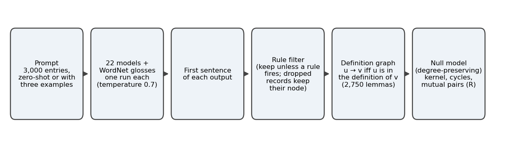
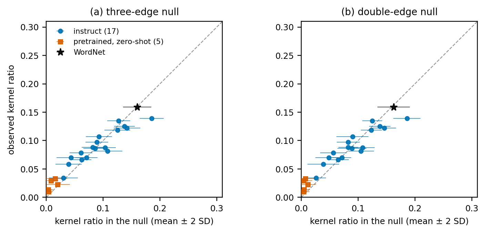
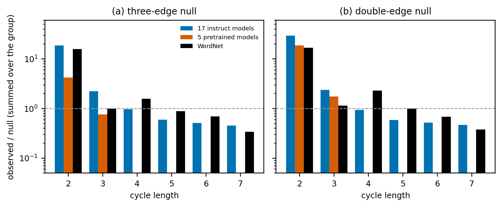
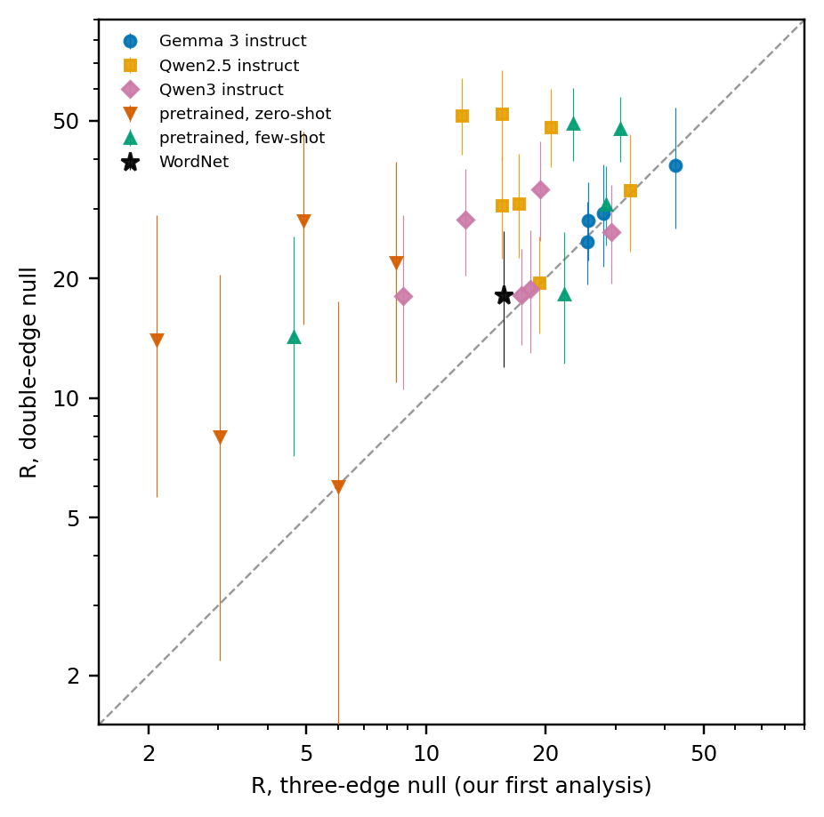
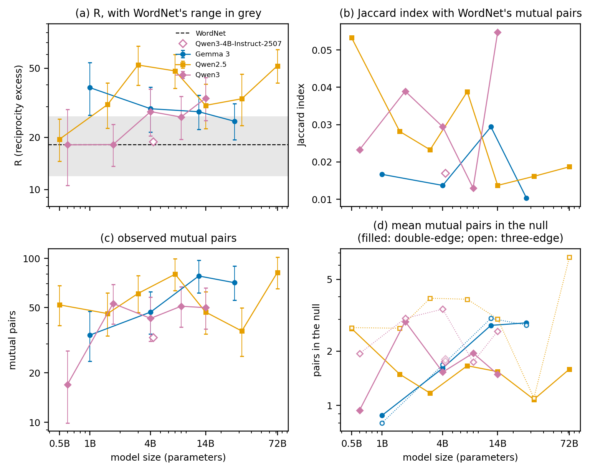
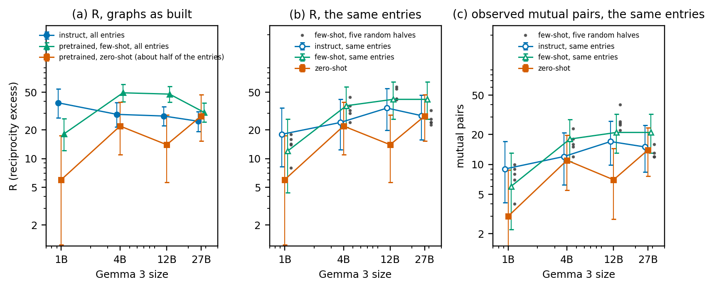

# Do LLM-Written Dictionaries Resemble Human Ones? Mutual Definitions with and without Instruction Tuning

> **Draft v2, 2026-10-02.** `draft_v1.md` and `draft_v0.md` are kept unchanged. Written by the assistant from the project records, for the researcher to revise.
> **Status.** The advisor gave a green light on the framing of v1 (D026, D028), as reported by the researcher on 2026-10-02; v2 has not been shown to the advisor. **v2 changes the main statistic.** R is computed against a directed
> double-edge swap null (D032) because the null of v1 (NetworkX `directed_edge_swap`) cannot move some mutual pairs and biased R (Section 4.3). Making the new null the primary one is *proposed* in D032 and has not been decided by the
> researcher or the advisor; the values against the first null stand beside every R. Decisions D029 to D034 were proposed by the assistant, with their readings fixed in the decision log before each run, and approved in
> general terms by the researcher ("fix the following", 2026-10-02), who has not reviewed them one by one. Every number comes from a file listed in `research/EVIDENCE_MAP.md` (tables are generated by
> `research/audit_scripts/33_manuscript_tables_v2.py`, figures by `34_manuscript_figures_v2.py`). Citations are in square brackets: the assistant checked each against the original (`research/REFERENCE_CHECK_2026-10-02.md`)
> and the researcher verified them (2026-10-02). Decision IDs (D0xx) point to `research/DECISION_LOG.md` and are to be removed from a submission version. Not for circulation.
>
> **Changes since v1**, after an outside review of v1 that the researcher pasted on 2026-10-02 and decisions D029 to D034. (1) The review asked to explain how the null behaves when a graph is limited to part of the entries (D030).
> The answer changed the paper: the null of v1 can keep some of the observed mutual pairs in every replicate. With a null that can break every pair (D032) R no longer falls with coverage, the zero-shot gap between pretrained and
> instruct models is absent by the rule fixed in advance for it, and the instruct models' R is above WordNet's and not equal to it (Section 4.3). The kernel ratio, the circulation rate and the cycle profile do not change (D033).
> (2) The results follow the questions: the kernel statistic, mutual definitions, the choice of null, the prompt controls, scale (D031 tests whether R approaches WordNet's with size), then instruction tuning. (3) The observed mutual pairs
> and the null mean sit beside every R. The hypothesis is split into three predictions, H1 to H3. The readings fixed in advance moved to Appendix D, the other variants of the matched pairs to Table A2 and the defining words to
> Table A3. (4) Internal labels (claim 1 to 3, E3 to E5) were replaced by names, and "human" is used for WordNet only. (5) Statements of v1 that the new analyses correct: the dependence of R on coverage and the range 0.07 to 0.35 "whichever
> half" (single random halves keep 0.07 to 0.51 of the whole-list R' against the first null and 0.65 to 1.52 against the new one; Table 6), the "same amount as WordNet" reading, and the zero-shot gap.

## Abstract

Dictionaries define words with other words, so a dictionary is a directed graph with cycles. We ask whether the dictionaries that language models write come closer to a human one as the models grow, and whether
instruction tuning is what gives them their structure. Seventeen instruction-tuned models, five pretrained Gemma 3 models and the glosses of WordNet defined the same 3,000 entries, and each definition graph was compared
with degree-preserving null models run to convergence. The classical kernel statistic is at chance for the instruct models and for WordNet alike, so the approach to human dictionaries that it once suggested is an effect of the
graph's degrees. What remains is an excess of mutual definitions, R: 18.1–52.1 for the instruct models and 18.1 for WordNet, against a null that can break every mutual pair. The pairs are largely different (each instruct model shares
1–4 of WordNet's 27), and R does not come closer to WordNet's with model size in any consistent way. The edge-swap null of the NetworkX library, which we used first, cannot move some mutual pairs: it biased R toward 1, unevenly
across graphs, and created a dependence of R on coverage and a large zero-shot gap between pretrained and instruct models. Against the corrected null R does not depend on coverage and the gap is absent by the rule fixed in advance for
it (instruct / pretrained ratios 6.4, 1.3, 2.0 and 0.9 at four sizes); R does fall with the length of the definitions (rank correlation −0.75 over 59 graphs), so conditions of different length cannot be compared by R alone. In Gemma 3, with this prompt, we find evidence against a need for instruction tuning: given three example definitions, pretrained models at 4B–27B have R of
30.7–49.2 against 24.7–29.2 for their instruct counterparts. What differs without examples is content: the zero-shot dictionaries define about half of the entries, and on the same entries they contain fewer of the instruct
models' pairs (5 of 62, against 20 of 62 with examples). A rule-based filter for non-definitions, validated on held-out hand labels, and a blind check of 100 few-shot outputs (all definitions) support these readings. We state the
limits: one model family with matched pairs, one prompt and one generation run per condition, no instruction-tuned model run with examples, and 3–14 mutual pairs in the zero-shot graphs.

## 1 Introduction

A dictionary defines words with other words. Because every defining word needs a definition of its own, a dictionary is
a directed graph with cycles, and the shape of those cycles says something about how a vocabulary holds together.
Vincent-Lamarre et al. [VL16] analysed four dictionaries (Longman, Cambridge, Merriam-Webster and WordNet) as graphs with links from defining
words to defined words, and found a Kernel of 7–12 % of the words from which all the others can be defined. Levary et al. [Lev12] compared
the loops of dictionary graphs with a randomization that keeps the in- and out-degree distributions: long loops follow from the degrees alone,
short ones do not, which they attribute to meaningful connections between words. Harnad [Har25] lists the circularity of verbal definition
among several "convergent biases" that, Harnad suggests, may help language models do better than expected; the paper is a dialogue with ChatGPT-4
and reports no measurement.

Language models can now write dictionaries of their own. Earlier work asked whether the definitions they write *match* human ones: [Pha25],
for example, compared the definitions of over 2,500 words in WordNet, Merriam-Webster and Random House with those of two versions of ChatGPT,
and found the generated definitions highly accurate and comparable to the traditional ones, while definitions from different traditional
dictionaries were more similar in surface form to one another than the model-generated ones were. We ask a question about the whole dictionary:
whether the dictionaries that models write *close* like a human one, that is, whether their loops have the structure that [Lev12] found. "Human" here means
WordNet, the one human-written resource we can analyse on the same 3,000 entries (Section 3.1).

The project began with a claim about scale: that larger models converge on the structure of human dictionaries. It started from the idea that the kernel
ratio of a model's definitions measures how well the model "understands" concepts, and from an earlier analysis of the first models we ran (Qwen3.5, 0.8B to 27B), in which the kernel ratio fell
steadily with size toward the range of human dictionaries. That analysis stayed within the lab, and the pattern did not replicate outside one model family. Here "convergence" is made testable: within a
family of models, a larger model's dictionary converges on WordNet's if a graph statistic comes closer to WordNet's value as the model grows, or if its mutual pairs overlap more with WordNet's (Section 3.8).
The statistics are compared with a degree-preserving null model, which asks whether a value is more than the degrees of the graph would give anyway. Whether size alone brings the dictionaries a model writes
closer to a human one matters for how such graphs can be used to compare models; if it does not, the question of what produces their structure remains.

Two answers come first. The kernel ratio, the statistic of the earlier claim, is explained by the degrees of the graph, chiefly its density, for the LLM dictionaries and for the 3,000-word subgraph of WordNet alike
(Section 4.1); we report that correction because the rest of the paper builds on it. After it, one of the statistics we tested is still in excess: a *reciprocity excess* R, the number of word pairs that define each
other, relative to the same kind of null (Section 4.2). R does not come closer to WordNet's with model size in any consistent way (Section 4.5).

The follow-up hypothesis was that the structure R measures is produced by instruction tuning and not by scale. We split it into three predictions, with readings fixed before the filtered runs (Section 3.8, Appendix D).
H1 (necessity): R at the instruct level cannot be elicited from a pretrained model without instruction tuning. H2 (scale): R comes closer to WordNet's with size. H3 (zero-shot gap): under the same zero-shot prompt
the instruct models show more of the structure than matched pretrained models. In brief:

1. The classical kernel statistic is at chance once the degrees of each graph are held fixed, for the instruct models and for WordNet (Section 4.1). What remains is R: 18.1–52.1 for the 17 instruct models against 18.1 for
   WordNet, built mostly from different word pairs (Section 4.2).
2. The null matters. The edge-swap null of NetworkX, which we used first, cannot move mutual pairs whose words have few other links; against it R was pulled toward 1, unevenly across graphs, and appeared to fall when a graph
   covered fewer entries. Against a double-edge swap null that can break every pair, R does not depend on coverage (Section 4.3), but it does fall with the length of the definitions (rank correlation −0.75 over 59 graphs; Section 4.4).
   The kernel, circulation and cycle results do not change.
3. H2 is not supported. Within the three families of instruct models neither the distance of R from WordNet's nor the overlap with WordNet's pairs shows a consistent approach with size (Section 4.5).
4. Evidence against H1, in Gemma 3 and with this prompt: given three example definitions, pretrained models at 4B and 12B have a higher R than their instruct counterparts and at 27B no different one, and the 1B model reaches
   about half. The few-shot outputs are definitions (100 of 100 in a blind hand check; Sections 4.6.4 and 4.6.5).
5. H3 does not hold on the graphs as built by the rule fixed in advance for it (the instruct / pretrained ratio of R reaches 2 at two of four sizes: 6.4, 1.3, 2.0, 0.9), and on the same entries no difference in R can be shown
   at four of four sizes. The zero-shot graphs do contain fewer of the instruct models' mutual pairs (Sections 4.6.1 to 4.6.3).

Beyond the answers, the paper contributes four points that apply to any study of definition graphs: null models run to convergence and able to break the structure they are compared with (the NetworkX edge-swap null can keep some of the
observed mutual pairs in every replicate and so bias R; a double-edge swap does not); a rule-based filter for non-definitions validated on held-out hand labels, with a stricter variant and a frame-word control that bracket its effect;
uncertainty ranges that take into account the small number of mutual pairs in some graphs; and the finding that R, read against a null that can break every pair, does not depend on how many entries a graph covers, while the raw count
of pairs does.

Section 2 gives background, Section 3 the method, Section 4 the results, Section 5 discusses them, Section 6 lists the limits and Section 7 concludes.

## 2 Background and related work

The graph view of a dictionary serves a question about meaning: if every word is defined by other words, which words have to be understood without a definition for the rest to be defined at all?
Vincent-Lamarre et al. [VL16] answered it for four dictionaries by splitting each graph into a Kernel, the words that remain after repeatedly removing words that define nothing further
(7–12 % of each dictionary, and a grounding set for the rest), a Core inside it, which is the union of the Kernel's source components and equals its largest strongly connected component in two
of the four dictionaries (it adds a few small components in the other two), and Satellites, and they located minimal grounding sets (MinSets). Finding such sets is computationally hard: Blondin
Massé et al. [BM08] showed that the grounding sets of a dictionary graph are exactly its feedback vertex sets, so that deciding whether one of a given size exists is NP-complete. Our code computes
the Core as [VL16] define it; we do not test the Core or the MinSets against a null model (Section 3.4).

That work describes the structure of dictionary graphs, but not how much of it the degrees of the graph would produce anyway. Levary et al. [Lev12] asked this for loops. They compared the loops
of dictionary graphs (eXtended WordNet, Wiktionary, WordNet 3.0) with a randomization that keeps the in- and out-degree distributions and found that long loops (more than five links) follow from the
degrees, whereas short loops do not, which makes an excess of short loops the signature of meaningful connections between words. Our reciprocity excess R follows that logic: it counts the shortest
loops, the two-word ones, against a degree-preserving null. Comparing mutual links with a random graph is also the older question of reciprocity in directed networks, where Garlaschelli and Loffredo
[GL04] argued that the share of mutual links has to be compared with what a random graph of the same size gives, and proposed a reciprocity measure corrected for density. How the null is sampled
matters in turn: Fosdick et al. [Fos18] review null models with fixed degree sequences and the mixing time of edge-swap samplers, which is the question behind the number of swaps in Section 3.5.

Language models enter this picture in two ways. One is speculation about why they work at all: the "convergent biases" that Harnad lists [Har25] (Section 1) include the circularity of verbal definition,
though the paper reports no measurement. The other is that language models now write definitions. Noraset et al. [Nor17] introduced definition modeling, the task of generating a definition for a word and its embedding;
[Pha25] compared ChatGPT definitions with those of three dictionaries (Section 1); and Bommarito [Bom25] released OpenGloss, an LLM-generated dictionary and semantic graph of 537 thousand senses. Two
further works are worth separating from ours because of what they measure. Baartmans et al. [Baa25] generate and evaluate explications in the Natural Semantic Metalanguage with language models; their
evaluation flags circularity by checking whether any form of the defined word appears in the explication, and scores the use of semantic primes, so that neither the share of self-referential definitions nor prime
overlap is claimed as new here. Boudourides [Bou26] introduces "structural hallucination" and compares networks built by language models with reference networks (Roget's Thesaurus, Wikidata philosophers,
citation records); a search of its text found no null model and no cycle statistic, and it is not about definitions. Our question is posed at the level of the whole dictionary: whether the loops of the
dictionaries that models write have the structure that [Lev12] found in human ones, and what produces it if they do.

Whether what models produce is organised like human knowledge has been asked at other levels, with answers that depend on what is compared. Gammelgaard et al. [Gam23] report that bigger and better language
models organise concepts more like knowledge-graph embeddings do, across four model families; "converge" is their verb, and the verb of the earlier claim of our own project (Section 1), about a different
structure. If size drove convergence on dictionary structure as well, a larger model would write a dictionary closer to a human one; Section 4.5 asks this. Suresh et al. [Sur23] find that structures estimated from language-model behaviour cohere less across tasks than human ones. Gude et al. [Gud26] turn from size to tuning: they compare older base
models with newer instruction-tuned models, and both with human news text, using grammar-based diversity measures (HPSG), and find reduced syntactic and lexical diversity in the newer models, although the two
groups differ in generation as well as in tuning and the texts are news, not definitions.

If tuning rather than size is the candidate, the question becomes what tuning changes. The Superficial Alignment Hypothesis of Zhou et al. [Zho23] holds that a model's knowledge and capabilities are learnt
almost entirely in pretraining, and that alignment teaches which subdistribution of formats to use. Lin et al. [Lin24] support it: on average 77.7 % of the tokens of Llama-2-7b-chat's responses are also the base
model's top-ranked token (82.4 % for Vicuna, 82.2 % for Mistral-7b-instruct), the tokens that shift are mostly stylistic, and their URIAL method aligns base models in context with as few as three constant
stylistic examples and a system prompt. An et al. [Res24] report that tuning on responses alone, without instructions, gives models that respond to a wide range of instructions like instruction-tuned ones, and
Lake et al. [Lak25] find that the apparent drop in response diversity after alignment is largely explained by quality control and information aggregation (longer responses), and that the behaviour of aligned
models is recoverable from base models without fine-tuning, with in-context examples and semantic hints. Section 5 returns to this hypothesis with our results.

Finally, what one measures can create or remove an effect. Schaeffer et al. [Sch23] show that apparent emergent abilities can be an artifact of the researcher's choice of metric: nonlinear or discontinuous
metrics produce them, linear or continuous ones do not. This is why we report counts and continuous quantities beside ratios, why we test whether R follows definition length (Section 4.4), and why Section 4.6.2
compares the zero-shot graphs with the others on the same entries as well as on the graphs as built.

## 3 Method

### 3.1 Entries, models and the reference dictionary

*Entries.* We use a fixed list of 3,000 (word, part-of-speech) entries: 1,500 nouns, 900 verbs and 600 adjectives, sampled
from WordNet [Mil95; Fel98] with seed 42 among words with a Brown-corpus frequency [FK79] of at least 5. The list holds 2,750 distinct lemmas
(234 lemmas appear twice and 8 three times, under different parts of speech), so a graph has at most 2,750 nodes. The words
are not restricted to common ones: the list includes, for example, *consonantal*, *soloist* and *tuberculosis*.

*Models.* Seventeen instruction-tuned models: Gemma 3 [Gem25] at 1B, 4B, 12B and 27B; Qwen2.5-Instruct [Qw25] at 0.5B, 1.5B, 3B, 7B,
14B, 32B and 72B; Qwen3 [Qw3] at 0.6B, 1.7B, 4B, 8B and 14B (thinking disabled); and Qwen3-4B-Instruct-2507, an update of the 4B
non-thinking model whose model card gives [Qw3] as its citation. Five pretrained (base) Gemma 3 models at 270M, 1B, 4B, 12B and 27B, which pair
with the instruct models of the same size except at 270M. The 270M models are not covered by the Gemma 3 report (1B to 27B); they were announced
on 14 August 2025 [Gem270]. Gemma 3 270M instruct was generated but is excluded because its graph has no cycle at all (D011). Only Gemma 3
offers matched pretrained and instruction-tuned checkpoints across sizes, so the contrast between tuning and scale rests on one family. The
reference is the WordNet gloss of the same 3,000 entries; wherever this paper says "human" or "a human dictionary" it means WordNet's glosses (Section 6 says what that does and does not allow).

### 3.2 Generation

For every entry each model received the prompt *Define the {noun|verb|adjective} "{word}" in one short sentence. Use only
common English words. Do not use the word itself in the definition.* Instruction-tuned models received it through their
chat template, pretrained models as raw text. All runs used bf16 weights, sampling at temperature 0.7 with top-p 0.8 and
top-k 20, at most 200 new tokens, one run per model and generation seed 0.

*Few-shot condition.* Pretrained models also received a raw-text header with three worked examples (*book*, *walk*,
*large*) in a Q/A format, under the instruction that each definition is one sentence, uses only simple English words and
does not repeat the word being defined; decoding was the same. This prompt is what "few-shot" means in this paper. Three examples are also what URIAL [Lin24] uses to align base models in context (with a system prompt). The examples define by category and features and not by
synonym (for example, a book is "a set of printed or written pages bound together between covers"). Two of the three
headwords (*book*, *large*) and ten words of the example definitions are in the vocabulary; Section 4.6.5 bounds how much of
the result they can account for.

*Length and template controls.* The 17 instruct models were also asked for definitions "in 8 words or
fewer" (length control), and given the original prompt without the chat template (template control).

### 3.3 From outputs to graphs

Every stored output is cut to its first line and first sentence, without markup or list markers (uniform extraction, D009).
The text is lower-cased, stripped of punctuation and stopwords, POS-tagged and WordNet-lemmatised (NLTK [BKL09]), and reduced to the lemmas
that are in the vocabulary. The graph has an edge *u → v* if and only if the lemma *u* occurs in the definition of *v* (*u*
"defines" *v*); there are no self-loops or multi-edges. All graphs have the same 2,750 nodes (D010): a record removed by the
filter (Section 3.6) keeps its node and contributes no edge.

### 3.4 Graph statistics

The *kernel* is what remains after repeatedly removing nodes with out-degree 0; the kernel ratio is its size divided by the
number of nodes. The *circulation rate* is the share of nodes that lie in a strongly connected component of at least two
nodes. A *mutual pair* is two words that occur in each other's definitions (a 2-cycle). We also count simple cycles up to
length 7. The core and the minimum grounding set are not tested against a null and are not reported (in [VL16] the Core is the union of the
source components of the Kernel's condensation, as in our code).

### 3.5 Null models, R and uncertainty

*Null model.* A definition graph is compared with random graphs that keep every node's in-degree and out-degree. The null of the main analysis is the *double-edge swap*: two distinct edges (a → b) and (c → d) are chosen at
random and replaced by (a → d) and (c → b), unless the swap would create a self-loop or a repeated edge or would change nothing (a = c or b = d). Either edge of a mutual pair can be one of the two chosen, so every pair can be
broken, and the move is symmetric. A replicate is 64×|E| accepted swaps, each graph has 100 replicates, and the seed is derived from the graph and the replicate index. How many swaps a sampler needs is a question of mixing time
[Fos18]. On eight graphs of different density the mean number of mutual pairs settled within 2–4×|E| swaps and agreed with the number expected if every edge u → v were present independently with probability proportional to
d_out(u) d_in(v) (Table 5); 64×|E| was the smallest checkpoint that met, on all eight graphs, the criterion fixed in advance (D032). The replicates keep 0.00 to 0.03 of the observed mutual pairs on average on each of the 88 graphs of
Section 4.

*The null of our first analysis.* We first used `directed_edge_swap` of NetworkX [HSS08], which replaces the three edges of a path a → b → c → d by a → c, c → b and b → d (the configuration model behind such nulls is described in
[New18], chapter 12). It also keeps every node's degrees, but Section 4.3 shows that it cannot break a mutual pair whose words have few other links. A convergence study on six graphs (30 chains each, up to 128×|E| swaps)
showed that the mean number of mutual pairs settles within 4–24×|E| swaps and that 5×|E| swaps, the default we first used (that of `null_model.py`), left R too low by 12–90 % on those graphs. We used 32×|E| swaps per replicate,
with at most 300 tries per swap, and 100 replicates; on the 23 unfiltered main graphs R is a median 19 % higher at this setting than at 5×|E|. We call this the *three-edge null* and give R against it beside R against the
double-edge null.

*R.* The *reciprocity excess* is R = (observed mutual pairs) / max(mean number of mutual pairs in the null, 0.5); the floor prevents division by a tiny mean. Against the double-edge null it applies to the five zero-shot pretrained
graphs (null means 0.38 to 0.44) and to 36 of the 60 restricted graphs of Sections 4.3 and 4.6; for these R is twice the observed count, and R' = observed pairs / null mean, without the floor, is given where it matters. Like the
reciprocity measure of [GL04], R compares the observed mutual links with what a random graph gives; the null here keeps every node's degrees. In the rest of the paper R without a qualifier means R against the
double-edge null.

The 95 % intervals printed by the null runs reflect the sampling of the null only. Some graphs hold only 3–14 mutual pairs,
so we also report (i) the exact Poisson 95 % range [Gar36] of the observed number of mutual pairs divided by the null mean, with the
null mean taken as known; (ii) for the ratio of two values of R, the exact conditional (binomial) range [CP34]; and, where the two
disagree, (iii) a conservative range that combines the two ends of the Poisson ranges. These ranges treat mutual pairs as
independent, although pairs share words, so they may be too narrow.

R is a ratio, and it can move because its numerator or its denominator moves. We therefore report the observed mutual pairs and the null mean beside every R. A comparison between graphs that cover different entries is confounded by
the entries, and the zero-shot graphs cover about half of them (Section 3.6, Section 4.6.2); Section 4.3 tests whether R depends on coverage, and the comparison of the zero-shot graph with the others is made on the graphs as built and on
the same entries (Section 4.6.2), with the whole-list values as references.

### 3.6 Hand labels, extraction and the non-definition filter

*Hand labels.* The researcher labeled the full output of every model for the same 100 randomly chosen words (23 models ×
100 words = 2,300 rows) with seven labels: definition, echo, question, off-topic, restatement, refusal and unclear. Pretrained
models gave a definition on 42 % of rows (21–54 % by model); instruct models on about 100 %, except Gemma 3 270M (27 %) and
Qwen3-0.6B (87 %). A re-label of a random sample of 110 rows agreed on 88.2 % of rows on the seven labels (κ = 0.79) and on
95.5 % on definition versus not (κ = 0.90). The labeler reports that about a day separated the two labelings; we regard the
agreement as a possible upper bound (D022).

*Extraction and second pass.* The first-sentence cut removes words from 36.6 % of the records of the pretrained models. A
second labeling pass covered the 58 labeled rows that the cut changes and that had been labeled definition or unclear, so that
the filter is validated on the unit it classifies.

*The filter.* A rule-based filter (Appendix A) decides for each first sentence whether it is a definition. Its rules cover
blank or headword-only text, questions, first-person text, echoed task language, exam and off-topic markers and unfinished
sentences; the default is to keep, so a record is dropped only when a rule fires. The 100 labeled words were split at random,
with a fixed seed, into 50 development words and 50 test words; the rules were written on the development words, frozen (the
module hash is recorded), and the test words were scored once. After that scoring the rules were also checked on records of the
2,900 unlabeled words, only to remove rules that dropped real definitions; this is disclosed in Appendix A. A *strict*
variant adds the rules that had been removed for dropping real definitions; it brackets how R reacts to a modest change of the
filter and is not a bound for a perfect one. A *frame-word* control removes six words that dominate the pretrained graphs
(*define*, *mean*, *refer*, *describe*, *phrase*, *use*) from every graph.

### 3.7 Pair typing and overlap

Each mutual pair is typed with WordNet over all senses of both words and without part of speech, in this order: synonym (a shared
synset), antonym, derived form, hypernym (one word's synset is a direct hypernym of the other's), sister term (a shared direct
hypernym), and otherwise no direct link. The typing is generous and says nothing about the quality of a definition. Sets of mutual
pairs are compared with the Jaccard index.

### 3.8 Predictions, readings fixed in advance, and the hand check of the few-shot outputs

*Predictions.* The hypothesis that instruction tuning, not scale, produces the structure R measures is split into three predictions. H1 (necessity): R at the instruct level cannot be elicited from a pretrained model
without instruction tuning. H2 (scale): within a model family, R comes closer to WordNet's with size, measured in two ways, as the distance |ln R − ln R_WordNet| and as the Jaccard index of the model's mutual pairs
with WordNet's pairs ("convergence", D031). H3 (zero-shot gap): under the same zero-shot prompt the instruct models show more of the structure than the matched pretrained models. H1 is tested with the few-shot condition
(Section 4.6.4), H2 within families (Section 4.5), and H3 on the graphs as built and at equal coverage (Sections 4.6.1 to 4.6.3).

*Readings.* For each test a rule was written before the result existed, and the outcome is called supported, contradicted or mixed by that rule, whatever it shows; Appendix D lists the rules, their decisions and the outcomes.
Four points about how they were written. The factor 2 that separates a gap from no gap was chosen because changing only the prompt moved R of the same model by a median factor of 1.3 to 1.9 against the first null (Section 4.4;
D034 repeats the comparison against the double-edge null and finds 1.6 and 1.2). The first rules (D024, D025) were written after the unfiltered results, the few-shot results included, were known, and before any filtered run existed, and they were
written for point estimates; the counting ranges are added in Section 4. The rules of D029 to D034 were written after the earlier results were known and before the statistics they govern were computed. When the null changed (D032),
the rules of the original tests were applied unchanged to R against the new null, and both outcomes are reported. Where a result needed more than a rule asked for, the text says so and calls it descriptive.

*Hand check of the few-shot outputs.* The filter was validated on zero-shot outputs only. We therefore labeled 100 few-shot
outputs (25 words drawn at random from the words not among the 100 labeled words, for each of the four pretrained models from 1B to
27B; shuffled; shown without the model or the filter's decision) with the same seven labels. The rule that gives the result its
meaning was fixed before labeling: the few-shot result stands if at least 90 % of the outputs the filter keeps are definitions and no
model is below 80 % (D027). The check was scored once.

## 4 Results

### 4.1 The classical statistic is at chance

*Figure 2.* Kernel ratio of each graph against its mean in the degree-preserving null (bars: ±2 SD of the null), default filter: (a) the three-edge null of our first analysis, (b) the double-edge null. Points near the diagonal are
at chance.

**Table 1.** z-scores of the kernel ratio and the circulation rate against the degree-preserving null, by group (median, with the number of graphs below 0 / beyond -2 / beyond +2). Three-edge null: the null of our first analysis, 100 replicates, three filter variants; double-edge null: 20 replicates, default filter (D033).

| Measure | Group | n | Three-edge null: unfiltered | Three-edge null: default filter | Three-edge null: strict filter | Double-edge null: default filter |
|---|---|---:|---|---|---|---|
| Kernel ratio | 17 instruct models | 17 | +0.16 (7 / 2 / 1) | +0.31 (7 / 2 / 1) | +0.10 (7 / 3 / 1) | +0.19 (8 / 3 / 0) |
| Kernel ratio | 5 pretrained models | 5 | -1.67 (5 / 2 / 0) | +1.68 (0 / 0 / 2) | +1.37 (0 / 0 / 2) | +1.70 (0 / 0 / 2) |
| Kernel ratio | WordNet | 1 | -0.08 (1 / 0 / 0) | -0.08 (1 / 0 / 0) | -0.08 (1 / 0 / 0) | -0.26 (1 / 0 / 0) |
| Circulation rate | 17 instruct models | 17 | -1.34 (15 / 6 / 0) | -1.51 (15 / 6 / 0) | -1.37 (15 / 6 / 0) | -1.31 (12 / 6 / 0) |
| Circulation rate | 5 pretrained models | 5 | -1.81 (5 / 2 / 0) | +1.90 (0 / 0 / 2) | +2.20 (0 / 0 / 3) | +4.00 (0 / 0 / 3) |
| Circulation rate | WordNet | 1 | -1.89 (1 / 0 / 0) | -1.89 (1 / 0 / 0) | -1.89 (1 / 0 / 0) | -1.51 (1 / 0 / 0) |

<!-- source: research/audit_scripts/outputs/33_manuscript_tables_v2.md, Table 1 (stored per-graph results of the runs in results_2026-10-01_Local/; D033 in results_2026-10-02_Local/d033_double_swap_full_stats) -->

For the 17 instruct models the median z of the kernel ratio is +0.19 against the double-edge null and +0.31 against the three-edge null under the default filter (+0.16 unfiltered and +0.10 under the strict filter, both against the
three-edge null); WordNet is at −0.26 and −0.08 (−0.08 in all three variants of the first null). Three instruct models lie beyond ±2 against the double-edge null, all below (Qwen2.5-0.5B −3.9, Qwen2.5-1.5B −2.1, Qwen3-1.7B −2.3),
and three against the three-edge null (Qwen2.5-0.5B −4.4 and Qwen2.5-1.5B −2.1 below, Qwen2.5-32B +2.1 above). The classical statistic therefore does not tell an LLM dictionary, or the 3,000-word WordNet subgraph, from a random
graph with the same degrees, whichever null is used (Figure 2): its value is explained by the degrees of the graph, of which density is the main part. A statement that larger models converge on human dictionary structure
because their kernel ratio is higher is thus a statement about the degrees of the graph, chiefly how many links longer definitions create, and not about how the links are arranged; this corrects our earlier analysis (Section 1).
Section 4.5 asks the same question of R.

The circulation rate, the share of words that lie on a loop with another word, is *below* the null for the instruct models (median z −1.31 against the double-edge null, 12 of 17 below 0 and 6 below −2; −1.51, 15 of 17 and 6 against the
three-edge null) and for WordNet (−1.51; −1.89). The five pretrained graphs change sign with the filter against the first null (circulation z median −1.81 unfiltered, +1.90 under the default filter; kernel −1.67 and +1.68) and are
above the null under the default filter against the new one (kernel +1.70, circulation +4.00), because after filtering they hold only 3–14 mutual pairs and 2,358–3,268 edges; for them neither measure is stable. Core and minimum
grounding sets are not tested.

### 4.2 Of the statistics tested, one is in excess: mutual definitions

Table 2 gives the group summaries and **Table A1** (Appendix B) the observed numbers, the null mean, R and its range for every graph. Against the double-edge null the 17 instruct models have R from 18.1 to 52.1 (median 29.2),
WordNet 18.1 [11.9, 26.4], the five pretrained models zero-shot 6.0 to 28.0 (median 14.0), and the five pretrained models given three example definitions 14.3 to 49.2 (median 30.7). Against the three-edge null the figures were 8.8–42.5
(median 19.3), 15.7 [10.3, 22.8], 2.1–8.4 (4.9) and 4.6–30.9 (23.5); Section 4.3 explains the difference.

**Table 2.** Mutual pairs and R by group (default filter, first sentence, 2,750-lemma node set): the range over the graphs of a group, with the median in brackets. R = observed pairs / null mean (floor 0.5). Three-edge null: 100 replicates of 32 x |E| swaps; double-edge null: 100 replicates of 64 x |E| swaps (D032). The last column is the ratio of the double-edge R to the three-edge R of the same graph.

| Group | n | Mutual pairs | Three-edge null: null mean | Three-edge null: R | Double-edge null: null mean | Double-edge null: R | R double / R three-edge: median (range) |
|---|---:|---|---|---|---|---|---|
| 17 instruct models | 17 | 17 to 82 | 0.80 to 6.65 (2.70) | 8.8 to 42.5 (19.3) | 0.88 to 2.92 (1.59) | 18.1 to 52.1 (29.2) | 1.09 (0.89 to 4.18) |
| 5 pretrained models, zero-shot | 5 | 3 to 14 | 0.45 to 3.33 (1.32) | 2.1 to 8.4 (4.9) | 0.38 to 0.44 (0.42) | 6.0 to 28.0 (14.0) | 2.64 (1.00 to 6.66) |
| 5 pretrained models, few-shot | 5 | 11 to 114 | 1.30 to 3.92 (2.74) | 4.6 to 30.9 (23.5) | 0.77 to 2.54 (1.87) | 14.3 to 49.2 (30.7) | 1.54 (0.82 to 3.08) |
| WordNet | 1 | 27 | 1.72 | 15.7 | 1.49 | 18.1 | 1.15 |

<!-- source: outputs/33_manuscript_tables_v2.md, Table 2 -->

The point estimate of 16 of the 17 instruct models is above WordNet's R, the exact range of 13 lies entirely above it (none lies entirely below; 4 contain it), and the exact range of the ratio instruct R / WordNet R excludes 1,
upward, for 8 of 17 models and downward for none. WordNet's own range is wide, and only four instruct models have a range entirely above its upper end (26.4). The instruct models therefore show at least as much reciprocal
definition as WordNet, and several clearly more; against the three-edge null they had looked equal (7 ranges above WordNet's value, 2 below and 8 containing it; the range of the ratio excluded 1 upward for 6). Across
conditions the ranges overlap: the lowest instruct model (Qwen3-0.6B, 18.1 [10.5, 29.0]) and the highest zero-shot pretrained model (Gemma 3 27B pretrained, 28.0 [15.3, 47.0]) cannot be told apart.

**Table 3.** Cycle lengths in the default-filter graphs: observed number of cycles / mean number in the null, summed over the graphs of a group, against the three-edge null (100 replicates) and the double-edge null (20 replicates, D033).

| Group | Null | 2 | 3 | 4 | 5 | 6 | 7 |
|---|---|---:|---:|---:|---:|---:|---:|
| 17 instruct models | three-edge | 881 / 47 = 18.83x | 93 / 41 = 2.24x | 56 / 58 = 0.97x | 58 / 98 = 0.59x | 86 / 167 = 0.52x | 138 / 302 = 0.46x |
| 17 instruct models | double-edge | 881 / 30 = 29.56x | 93 / 39 = 2.37x | 56 / 59 = 0.94x | 58 / 99 = 0.59x | 86 / 165 = 0.52x | 138 / 295 = 0.47x |
| 5 pretrained models | three-edge | 39 / 9 = 4.21x | 2 / 3 = 0.76x | 0 / 1 = 0.00x | 0 / 1 = 0.00x | 0 / 0 = 0.00x | 0 / 0 = 0.00x |
| 5 pretrained models | double-edge | 39 / 2 = 18.57x | 2 / 1 = 1.74x | 0 / 1 = 0.00x | 0 / 1 = 0.00x | 0 / 0 = 0.00x | 0 / 0 = 0.00x |
| WordNet | three-edge | 27 / 2 = 15.70x | 2 / 2 = 1.00x | 4 / 3 = 1.57x | 3 / 3 = 0.88x | 3 / 4 = 0.69x | 2 / 6 = 0.34x |
| WordNet | double-edge | 27 / 2 = 16.88x | 2 / 2 = 1.14x | 4 / 2 = 2.29x | 3 / 3 = 1.00x | 3 / 4 = 0.68x | 2 / 5 = 0.38x |

<!-- source: outputs/33_manuscript_tables_v2.md, Table 3 -->

*Figure 3.* Observed / null number of cycles by length (default filter), against (a) the three-edge null and (b) the double-edge null. No bar means no cycle of that length was observed (the pretrained graphs have none
longer than 3).

Mutual pairs are in strong excess, longer cycles are not (Table 3, Figure 3). In the instruct graphs 2-cycles are 29.6 times as frequent as in the double-edge null (18.8 times in the three-edge null), 3-cycles 2.4 times (2.2),
4-cycles at chance (0.94; 0.97), and cycles of length 5, 6 and 7 below chance (0.59, 0.52, 0.47; 0.59, 0.52, 0.46). WordNet, with 27 mutual pairs, has 16.9 times as many 2-cycles as the double-edge null (15.7) and fewer cycles of
length 6 and 7 than the null (0.68 and 0.38, from 3 and 2 observed cycles; 0.69 and 0.34). The pretrained graphs have 39 mutual pairs in all (18.6 times the double-edge null, 4.2 times the three-edge null) and no cycle longer
than 3.

**Table 4.** Mutual pairs by WordNet relation (all senses, no part of speech; the first match in the order of the columns decides). Counts, with shares of the pair occurrences in brackets.

| Source | Pair occurrences | Synonym | Hypernym | Sister term | Antonym | Derived form | No direct link |
|---|---:|---:|---:|---:|---:|---:|---:|
| WordNet | 27 | 2 (7 %) | 9 (33 %) | 1 (4 %) | 0 (0 %) | 3 (11 %) | 12 (44 %) |
| 17 instruct models | 881 | 339 (38 %) | 192 (22 %) | 77 (9 %) | 14 (2 %) | 7 (1 %) | 252 (29 %) |
| Few-shot pretrained | 324 | 106 (33 %) | 69 (21 %) | 35 (11 %) | 3 (1 %) | 5 (2 %) | 106 (33 %) |
| Zero-shot pretrained | 39 | 9 (23 %) | 11 (28 %) | 0 (0 %) | 0 (0 %) | 1 (3 %) | 18 (46 %) |

<!-- source: outputs/33_manuscript_tables_v2.md, Table 4, parsed from outputs/20_pair_types.txt -->

*What the pairs are.* The 17 instruct graphs hold 881 pair occurrences, 363 different pairs (Table 4). By WordNet relation 38 % are
synonyms (begin–start in all 17 models; collect–gather, complete–finish, correct–right), 22 % hypernym pairs (flavor–taste,
grasp–understand), 9 % sister terms (fifteen–fourteen, fifteen–sixteen), 2 % antonyms (rough–smooth), 1 % derived forms and 29 % have
no direct link (location–place, big–size, greet–hello, eat–mouth). WordNet's relations type the pairs coarsely: some pairs typed as hypernym pairs or as unlinked are close in ordinary use (flavor–taste,
location–place), others are associations (eat–mouth, greet–hello). WordNet's own 27 pairs are 2 synonyms (accent–stress, begin–start), 9 hypernym
pairs, 1 sister pair, 3 derived forms (europe–european, pursue–pursuit) and 12 with no direct link (baseball–bat, brief–summary).

*Both show the excess, through largely different words.* Ten of WordNet's 27 pairs occur in some instruct
graph, but each instruct model shares only 1–4 of them (Jaccard index 0.010–0.055), whereas two instruct models overlap more (median
Jaccard 0.14, range 0.03–0.33; 77 % of the pair occurrences in an instruct graph also occur in another instruct graph).

*R beside its counts.* R is the number of mutual pairs divided by the pairs the null gives, and the null mean differs between graphs (0.88 to 2.92 among the instruct models against the double-edge null, 0.80 to 6.65 against the
three-edge null; 1.49 and 1.72 for WordNet). Against the three-edge null R and the number of pairs ranked the instruct models almost independently (rank correlation −0.01): Qwen2.5-72B has the most pairs of the 23 main graphs (82)
and had an R of 12.3, Gemma 3 1B has 34 pairs and had an R of 42.5 (Table A1). Against the double-edge null the correlation is +0.30 (Qwen2.5-72B 51.6, Gemma 3 1B 38.6). We give the pairs and the null mean beside R wherever R is
compared.

### 4.3 Which null? Mutual pairs that the first null cannot move

*The question.* A review of v1 asked how the null behaves when a graph is limited to part of the entries. In an earlier analysis (D029) the few-shot graph limited to about half of the entries kept only 0.07 to 0.51 of its whole-list R', the null
mean did not fall as the observed pairs did, and random halves of one size differed in null mean by a factor of up to five (Table 6, columns of the three-edge null). We looked at which mutual pairs the null produces (D030).

*What the first null produces.* In the few-shot graphs limited to the entries whose zero-shot record survived, 10.0 of the 14.4 mutual pairs that a replicate of the three-edge null contains, summed over the four sizes, are pairs of the observed graph (69 %);
in the instruct graphs limited in the same way, 6.1 of 10.2; in five random halves of the few-shot graph, 55 to 82 %; in the whole few-shot graphs 2.9 of 12.2, and in the whole instruct graphs 0.1 of 7.9 (`29_null_pairs.py`, 40 replicates of each graph). Some
pairs are present in every replicate: battle–fight and initiate–start in the 4B few-shot graph limited to the survivors; asleep–awake, election–vote, greet–welcome, initiate–start and misfortune–unfortunate at 12B; mention–refer and naval–navy at 27B.
The rule fixed in advance for this analysis (do five words carry at least half of the null's pair endpoints?) was met at three of four sizes, but those words are the ends of such pairs and not general hub words, and the number of the ten largest hubs
that a random half covers does not predict its null mean (ρ = −0.21, p = 0.37).

*Why the first null keeps them.* The NetworkX move replaces a path a → b → c → d by a → c, c → b and b → d, and it is not made if c → b already exists. The middle edge b → c of the path therefore never belongs to a mutual pair, and a pair can
be broken only if one of its words starts or ends such a path through other words. For a pair whose words have few other links no such path exists, and the pair is present in every replicate. It adds the same number to the observed count and to the
null mean, so R is pulled toward 1, and the sparser the graph the larger the share of the null mean it makes up. Table 5 shows this on eight graphs. A replicate of the three-edge null of the 4B few-shot graph induced on a random half of the words holds
12.4 pairs, 10.4 of them pairs of the observed graph (14 observed pairs), where independent edges with the same degrees would give 0.33.

**Table 5.** The two nulls on eight graphs (default filter): mutual pairs in a replicate and how many of them are pairs of the observed graph. Three-edge null: the first 20 stored replicates (32 x |E| swaps, stored seeds); double-edge null: 100 replicates (64 x |E| swaps, D032). Independent-edge estimate: the expected number of mutual pairs if every edge u -> v were present with probability min(1, d_out(u) d_in(v) / |E|) independently.

| Graph | Observed pairs | Independent-edge estimate | Three-edge null: pairs | of them observed pairs | Double-edge null: pairs | of them observed pairs |
|---|---:|---:|---:|---:|---:|---:|
| Gemma 3 4B pretrained, few-shot | 92 | 2.01 | 4.05 | 1.60 | 1.87 | 0.00 |
| Gemma 3 1B instruct | 34 | 0.98 | 0.70 | 0.00 | 0.88 | 0.00 |
| Gemma 3 12B instruct | 78 | 2.54 | 3.10 | 0.15 | 2.78 | 0.01 |
| WordNet | 27 | 1.44 | 2.00 | 0.10 | 1.49 | 0.00 |
| Gemma 3 12B pretrained, zero-shot | 7 | 0.36 | 3.10 | 1.00 | 0.44 | 0.00 |
| 4B few-shot, entries of the zero-shot survivors | 18 | 0.31 | 2.95 | 2.20 | 0.27 | 0.00 |
| 4B few-shot, closed on a random half of the words | 14 | 0.33 | 12.40 | 10.40 | 0.33 | 0.00 |
| 1B instruct, closed on the survivors' words | 12 | 0.40 | 2.85 | 1.05 | 0.44 | 0.00 |

<!-- source: outputs/33_manuscript_tables_v2.md, Table 5; outputs/35_double_swap_validation.txt; results_2026-10-02_Local/d032_networkx_persistence -->

*The double-edge null.* A double-edge swap can break any pair (Section 3.5). It was checked on these eight graphs before the main run (D032): the observed pairs are absent from its replicates (0.00 on average on seven graphs, 0.01 on the 12B instruct graph),
its mean number of pairs settles within 2 to 4×|E| swaps, and it agrees with the number expected for independent edges (1.87 against 2.01 for the 4B few-shot graph, 0.27 against 0.31 for the survivors' graph, 0.33 against 0.33 for the closed half,
1.49 against 1.44 for WordNet). The criterion fixed in advance for the number of swaps was not met at 32×|E| on one graph (Gemma 3 12B instruct: 2.23 against 3.23 at 128×|E|), so all graphs use 64×|E|. On the 88 graphs of Section 4 the replicates
keep at most 0.03 of the observed pairs on average, and no replicate fell short of its swap budget.

*Effects on R.* Table 2 and Figure 4 put the two R side by side. For nine of the 17 instruct models R against the double-edge null is within 11 % of R against the first (the four Gemma 3 models, Qwen2.5-0.5B and 32B, Qwen3-1.7B, 4B-2507 and 8B);
for eight it is 1.7 to 4.2 times as high (Qwen2.5-1.5B, 3B, 7B, 14B and 72B, Qwen3-0.6B, 4B and 14B), because the first null's mean was that many times larger (Qwen2.5-72B: 6.65 against 1.59). The rank correlation of the two R over the 17 instruct models is
+0.07: the order of the models by R belonged largely to the null. For the zero-shot pretrained graphs, which hold few pairs, R rises by a median factor of 2.64 (1.00 to 6.66), for the few-shot graphs 1.54 (0.82 to 3.08), and for WordNet 1.15.

*Figure 4.* R against the double-edge null (vertical axis, with exact Poisson 95 % ranges) and against the three-edge null (horizontal axis) for the 23 main graphs and the 5 few-shot graphs (default filter). Graphs on the diagonal are the same under both nulls.

<!-- source: research/audit_scripts/34_manuscript_figures_v2.py -->

*Coverage.* Table 6 gives the quantity of the earlier analysis for both nulls: R' of a random half of the few-shot graph divided by R' of the whole graph.

**Table 6.** Does R depend on coverage? rho = R' of the few-shot graph limited to a random half of the entries (D029) or induced on a random half of the words (closed, D030) divided by R' of the whole few-shot graph (R' = observed pairs / null mean, no floor); median of five halves, with the smallest and the largest in brackets. A value near 1 means that the half has the same R' as the whole graph.

| Size | Whole few-shot graph: R' three-edge | R' double-edge | Entry-level halves: rho three-edge | rho double-edge | Closed halves: rho three-edge | rho double-edge |
|---|---:|---:|---|---|---|---|
| 1B | 22.3 | 18.2 | 0.30 (0.21 to 0.51) | 1.22 (0.73 to 1.41) | 0.20 (0.12 to 0.59) | 1.04 (0.95 to 1.61) |
| 4B | 23.5 | 49.2 | 0.16 (0.11 to 0.37) | 0.82 (0.65 to 1.52) | 0.14 (0.05 to 0.20) | 0.88 (0.65 to 1.09) |
| 12B | 30.9 | 47.7 | 0.15 (0.12 to 0.20) | 0.89 (0.87 to 1.20) | 0.28 (0.13 to 0.59) | 0.84 (0.73 to 1.37) |
| 27B | 28.5 | 30.7 | 0.24 (0.07 to 0.35) | 1.21 (0.74 to 1.41) | 0.18 (0.10 to 0.77) | 1.40 (0.64 to 1.73) |

<!-- source: outputs/33_manuscript_tables_v2.md, Table 6; outputs/36_double_swap_readings.txt section 2 -->

Against the three-edge null R' of a half is 0.14 to 0.30 of the whole graph's (median of five), for halves of the entries and for closed halves alike; against the double-edge null it is 0.82 to 1.40. The reading fixed in advance (D032 (r1): a median between
0.67 and 1.5 at three or four sizes) says that R does not depend on coverage, for both kinds of half. The dependence of R on coverage found earlier, and the range 0.07 to 0.35 that v1 gave for it, concern the null and not the dictionaries. The raw
count of pairs does depend on coverage (it falls with the square of the share of entries kept), which is why the comparisons of Section 4.6.2 use the same entries. A closed half is the graph induced on a random half of the words, the other words and their edges removed; Table A4 (Appendix B) gives the closed graphs of the three conditions. Applying the rule of D030 (b2) to the double-edge null (post hoc), the range of instruct R' / zero-shot R' includes 1 at three of four sizes, so a difference is not shown on closed dictionaries either; at 27B the zero-shot graph's R' is the higher (0.40 [0.19, 0.86]).

*What does not change and what does.* The kernel ratio, the circulation rate and the cycle profile stand against either null (Sections 4.1 and 4.2, D033). The pairs do not depend on the null: their number, their overlap with WordNet's pairs and with one
another, their types (Table 4) and the content comparison at equal coverage (Table 11). The verdict of the scale test is the same, though the labels of two families differ (Table 8). What changes is R and what was read from it: the instruct models, whose
R looked equal to WordNet's, are above it (Section 4.2); the zero-shot gap is absent by its rule (Section 4.6.1); the few-shot R, which was a little below the instruct R at 4B and a little above it at 12B, is clearly above it at both sizes (Section 4.6.4). This section shows that the first null is
biased where a graph is sparse. It does not show that the double-edge null is right in an absolute sense: it too keeps only the degrees (Section 6).

### 4.4 Controls: how much R moves with the prompt, and R and definition length

Two controls tell how large a difference in R has to be before it means something (Table 7). *Length.* Asking for definitions in 8 words or fewer shortened them from 10.4 to 6.3 words on average (stored text) and raised R, against the
double-edge null, for 16 of the 17 instruct models: the ratio to the main run has a median of 1.62 (range 0.74–2.44), 13 of the 17 stay within a factor 2, and the median size of the change is a factor 1.62. Against the three-edge null the same control moved R
in both directions (median ratio 1.11, range 0.46–2.98, higher for 9 of 17; median size of the change 1.28). The cap also raised the number of mutual pairs for 13 of the 17 models (median ratio 1.35). *Template.* Without the chat template the instruct
models write longer definitions (17.4 words on average) and R is lower for 11 of the 15 models with a usable ratio: the median ratio is 0.84 (range 0.06–1.39), the median size of the change 1.21, and 13 of 15 stay within a factor 2 (against the three-edge
null: 0.76, range 0.10–2.52, size 1.94, 8 of 15 within a factor 2). The two exceptions are Qwen3-4B and Qwen3-14B. The filter takes 33–86 % of the records of five Qwen3 models and leaves graphs too sparse to read for four of them (no mutual pair for 0.6B and
1.7B, one each for 4B and 14B), so this control says nothing reliable about Qwen3. Neither control was hand-validated.

**Table 7.** The prompt controls: R of the control divided by R of the same instruct model in the main run (default filter), for the models where both graphs hold a mutual pair. Size of the change = the larger of the ratio and its inverse. Length cap: answers of 8 words or fewer; no chat template: the original prompt without the chat template.

| Control | Null | Models | Median ratio (range) | Median size of the change (largest) | Within a factor 2 | Control R higher |
|---|---|---:|---|---|---:|---:|
| Length cap | three-edge | 17 | 1.11 (0.46 to 2.98) | 1.28 (2.98) | 14 of 17 | 9 of 17 |
| Length cap | double-edge | 17 | 1.62 (0.74 to 2.44) | 1.62 (2.44) | 13 of 17 | 16 of 17 |
| No chat template | three-edge | 15 | 0.76 (0.10 to 2.52) | 1.94 (9.69) | 8 of 15 | 6 of 15 |
| No chat template | double-edge | 15 | 0.84 (0.06 to 1.39) | 1.21 (16.78) | 13 of 15 | 4 of 15 |

<!-- source: outputs/33_manuscript_tables_v2.md, Table 7, parsed from outputs/38_controls_double_swap.txt -->

The factor 2 that separates a gap from no gap was set from the unfiltered medians against the first null (1.34 for the length cap, 1.90 for the template). Against the double-edge null the median sizes of the change are 1.62 and 1.21, so by the one reading of
D034 (a median above 2 would send the factor back to the researcher) it stands. It is not a noise level, though: the length cap moves R in one direction for 16 of 17 models.

*R and definition length (post hoc; added after the controls had been read).* Against the double-edge null R falls with the mean length of the definitions: the rank correlation is −0.75 over 59 graphs (p = 5·10⁻¹²), −0.73 over the instruct graphs of the main run
and the length control (n = 34), and within a model the change in R follows the change in length (length control −0.49, p = 0.048, n = 17; template control −0.48, p = 0.07, n = 15). Against the first null the same four analyses gave −0.35, +0.10, −0.14 (p = 0.59) and
−0.61; the finding of v1 that R is not related to definition length belonged to that null (it was computed on the unfiltered graphs, `13_controls_vs_main.txt`). Mean length is that of the stored text. WordNet's glosses have 8.8 words on average, the instruct models 10.4
(7.9 to 14.6 words), the instruct models under the cap 6.3 and the zero-shot pretrained models 18.3 to 23.7. In both controls the shorter definitions went with more mutual pairs and a higher R: the cap, which shortens, raised the pairs for 13 of 17 models, and the missing template, which lengthens, raised them for only 4 of 17 (median ratio 0.74). WordNet's glosses are a little shorter than the instruct models' definitions, so shorter definitions do not explain why the instruct models' R is above WordNet's (if the relation holds for glosses, it points the other way). This matters wherever conditions of different length are compared: the
Gemma 3 instruct models write longer definitions with size (7.9, 11.1, 13.0 and 14.4 words) while their R falls (Section 4.5), and the zero-shot pretrained graphs have the longest definitions (Section 4.6.1).

A search of the stored Qwen3 outputs found no think tags or reasoning openings in the main run or the length control (0 of 18,000 records each) and 1 to 107 of 3,000 records per model in the template control
(`32_qwen3_thinking_check.py`; a heuristic search, not a classifier).

### 4.5 Does R approach WordNet's with model size?

The first form of the question is whether, within a family of models, a larger model's dictionary comes closer to WordNet's. Two measures of closeness were fixed before they were computed (D031, Section 3.8): the
distance in R, |ln R − ln R_WordNet| (R_WordNet is 18.1 against the double-edge null and 15.7 against the three-edge null), and the Jaccard index of the model's mutual pairs with WordNet's 27 pairs. A family approaches WordNet if
the distance falls with size or the overlap rises (a rank correlation with the parameter count of −0.6 or lower for the distance, +0.6 or higher for the overlap); convergence with size is supported if both measures approach in
at least two of the three families and none moves away.

**Table 8.** Does R approach WordNet's with model size? Spearman rank correlation with the parameter count within each family, 17 instruct models (default filter; Qwen3-4B-Instruct-2507 left out of the trends). Labels fixed in advance (D031): the distance |ln R - ln R_WordNet| is *toward* if the correlation is -0.6 or lower, *away* if it is +0.6 or higher; the Jaccard index of the model's mutual pairs with WordNet's 27 pairs is *toward* if it is +0.6 or higher, *away* if -0.6 or lower. The overlap does not depend on the null. The last two columns are descriptive.

| Family | n | Distance in R, three-edge null | Label | Distance in R, double-edge null | Label | Overlap with WordNet's pairs | Label | Observed pairs | Null mean, double-edge |
|---|---:|---:|---|---:|---|---:|---|---:|---:|
| Gemma3 | 4 | -1.00 | toward | -1.00 | toward | -0.40 | none | +0.80 | +1.00 |
| Qwen2.5 | 7 | +0.36 | none | +0.43 | none | -0.75 | away | +0.18 | -0.29 |
| Qwen3 | 5 | +0.00 | none | +0.80 | away | +0.30 | none | +0.30 | +0.10 |

Reading fixed in advance: no consistent approach under both nulls.

<!-- source: outputs/33_manuscript_tables_v2.md, Table 8, parsed from outputs/31_scale_convergence.txt and outputs/36_double_swap_readings.txt -->

*Figure 5.* The 17 instruct models against parameter count, by family: (a) R against the double-edge null with exact Poisson 95 % ranges and WordNet's range in grey, (b) the Jaccard index of the model's mutual pairs with WordNet's,
(c) the observed mutual pairs with exact ranges, (d) the mean number of mutual pairs in the null (filled: double-edge null; open: three-edge null). Qwen3-4B-Instruct-2507, a second model at 4B, is drawn apart (open diamond) and
left out of the trends.

<!-- source: research/audit_scripts/34_manuscript_figures_v2.py -->

The reading is *no consistent approach*, against either null. The distance in R falls with size in Gemma 3 (ρ = −1.00, n = 4) but not in Qwen2.5 (+0.43 against the double-edge null, +0.36 against the first; n = 7); in Qwen3 it rises
(+0.80, labelled *away*, against the double-edge null; 0.00 against the first; n = 5). The overlap with WordNet's pairs reaches the criterion in no family (Gemma 3 −0.40, Qwen3 +0.30) and falls in Qwen2.5 (−0.75, p = 0.05). Even
the Gemma 3 trend is a statement about the null: R falls from 38.6 to 24.7 because the mean number of pairs in the null rises from 0.88 to 2.87, faster than the number of pairs (34 to 71; Figure 5c, d). The Gemma 3 models also write longer definitions with size (7.9, 11.1, 13.0 and 14.4 words) and R falls with the length of the definitions (Section 4.4), so the trend need not be an effect of size as such. Every instruct model shares between 1
and 4 of WordNet's 27 pairs. The kernel ratio, the statistic of the earlier claim, comes closer to WordNet's with size in Gemma 3 (ρ = −1.00 for the distance), a little in Qwen3 (−0.40) and not in Qwen2.5 (+0.57), and in Gemma 3 it is
at chance against the null at every size (z from +1.40 at 1B to −1.40 at 27B against the double-edge null; +1.68 to −1.39 against the three-edge null): the pattern behind the earlier claim is visible in one family and is a degree
effect. With four to seven models per family these correlations are weak evidence either way, and the families differ in much besides size; leaving Qwen3-4B-Instruct-2507 in changes none of the labels against either null.

### 4.6 Is instruction tuning needed?

#### 4.6.1 Zero-shot: no gap by the rule fixed in advance, on the graphs as built

The comparison in this section is between graphs of unequal coverage: the filter leaves about half of the entries in the pretrained graphs and nearly all of them in the
instruct graphs. Section 4.6.2 compares them on the same entries.

Under the zero-shot prompt the pretrained Gemma 3 models have R of 6.0, 22.0, 14.0 and 28.0 at 1B, 4B, 12B and 27B (default filter, double-edge null), against 38.6, 29.2, 28.1 and 24.7 for the instruct models of the same size
(Table 9). The ratio of instruct R to pretrained R is 6.4, 1.3, 2.0 and 0.9. The reading fixed in advance for H3 (D024: a ratio of at least 2 at three of the four sizes) is therefore *not met*: the gap is absent as built, since
the ratio reaches 2 at two sizes only, and the exact ranges include 1 at three of four (at 1B the range is [2.0, 32.8]). Against the three-edge null the ratios were 7.1, 3.3, 12.2 and 5.2, and the gap met the reading under
every variant of the analysis; Section 4.3 shows that those ratios belong to the null.

**Table 9.** Matched Gemma3 pairs under a zero-shot prompt, as built (the pretrained graphs cover about half of the entries; Section 4.6.2): R against the double-edge null with the observed mutual pairs and the null mean in brackets, and instruct R / pretrained R with the exact conditional 95 % range of the ratio. The last column is the ratio against the three-edge null (our first analysis). The strict filter and the other variants were not re-run with the double-edge null (Table A2).

| Size | Instruct R (pairs / null mean) | Pretrained R (pairs / null mean) | Instruct / pretrained | Same ratio, three-edge null |
|---|---:|---:|---|---|
| 1B | 38.6 (34 / 0.88) | 6.0 (3 / 0.44) | 6.4 [2.0, 32.8] | 7.1 [2.2, 36.0] |
| 4B | 29.2 (47 / 1.61) | 22.0 (11 / 0.38) | 1.3 [0.7, 2.8] | 3.3 [1.7, 7.1] |
| 12B | 28.1 (78 / 2.78) | 14.0 (7 / 0.44) | 2.0 [0.9, 5.1] | 12.2 [5.7, 31.4] |
| 27B | 24.7 (71 / 2.87) | 28.0 (14 / 0.42) | 0.9 [0.5, 1.7] | 5.2 [2.9, 10.0] |

<!-- source: outputs/33_manuscript_tables_v2.md, Table 9 -->

The null means of the four zero-shot graphs (0.44, 0.38, 0.44, 0.42) are below the floor of 0.5, so that their R is twice their pair count (6, 22, 14 and 28 from 3, 11, 7 and 14 pairs); without the floor R' would be 6.8, 28.9, 15.9 and 33.3.
These graphs hold few pairs, which is why their ranges are wide: R of the 4B model is 22.0 [11.0, 39.4] and that of the 12B model 14.0 [5.6, 28.8]. The zero-shot definitions are also the longest of the three conditions (18.3 to 23.7 words against 7.9 to 14.4 for the Gemma 3 instruct models and 9.1 to 11.3 with three examples; `13_controls_vs_main.txt`), and R falls with length (Section 4.4), so a ratio between the conditions mixes the two. The filter removes 47.3 to 57.6 % of the records of the five pretrained models
(and 0.0 to 0.7 % of those of the 17 instruct models). The variants of the analysis (the strict filter, the whole stored text in place of the first sentence, the unfiltered graphs and the removal of six frame words) were run
against the three-edge null only (Table A2); there the range of the ratio lay entirely above 1 in all 20 comparisons and entirely at or above 2 in 15. They have not been repeated against the double-edge null, so what the present data say
about leaked junk and frame words is limited to the default filter (Section 6).

#### 4.6.2 Equal coverage

The comparison of Section 4.6.1 sets graphs of unequal coverage side by side. The default filter drops 47.3, 55.9, 49.9 and 56.7 % of the valid zero-shot records of the pretrained
models at 1B, 4B, 12B and 27B, so that 1,580, 1,322, 1,503 and 1,296 of the 3,000 entries keep a definition; the instruct graphs and the few-shot graphs keep nearly all of them.
A dropped entry keeps its node and adds no edge (Section 3.3), so a pretrained graph is a graph in which about half of the words have no definition. To compare the conditions on the same entries we limited the few-shot and the
instruct graph of each size to the entries whose zero-shot record survived (the entries the zero-shot graph is built from), and the few-shot graph also to five random sets of entries of the same size (D029; the readings are in
Appendix D). The null model was run as everywhere else (Table 10, Figure 6).

**Table 10.** The same entries (D029 graphs, double-edge null): R of the zero-shot pretrained graph and of the few-shot and instruct graphs limited to the entries whose zero-shot record survived the filter, with the exact Poisson 95 % range, the observed mutual pairs and the null mean in brackets, and the exact conditional range of instruct / zero-shot. The last two columns give the range over five random sets of entries of the same size for the few-shot graph.

| Size | Entries kept (of 3,000) | Zero-shot pretrained | Few-shot, same entries | Instruct, same entries | Instruct / zero-shot (exact range) | Five random halves: R | Five random halves: null mean |
|---|---:|---|---|---|---|---|---|
| 1B | 1,580 | 6.0 [1.2, 17.5] (3 / 0.44) | 12.0 [4.4, 26.1] (6 / 0.34) | 18.0 [8.2, 34.2] (9 / 0.27) | 3.00 [0.75, 17.23] | 8.0 to 18.0 | 0.30 to 0.70 |
| 4B | 1,322 | 22.0 [11.0, 39.4] (11 / 0.38) | 36.0 [21.3, 56.9] (18 / 0.27) | 24.0 [12.4, 41.9] (12 / 0.42) | 1.09 [0.44, 2.73] | 24.0 to 44.2 | 0.24 to 0.52 |
| 12B | 1,503 | 14.0 [5.6, 28.8] (7 / 0.44) | 42.0 [26.0, 64.2] (21 / 0.46) | 34.0 [19.8, 54.4] (17 / 0.47) | 2.43 [0.96, 6.93] | 41.5 to 57.1 | 0.50 to 0.70 |
| 27B | 1,296 | 28.0 [15.3, 47.0] (14 / 0.42) | 42.0 [26.0, 64.2] (21 / 0.43) | 28.3 [15.8, 46.7] (15 / 0.53) | 1.01 [0.45, 2.26] | 22.6 to 32.0 | 0.28 to 0.53 |

The exact range of instruct / zero-shot includes 1 at 4 of 4 sizes.

<!-- source: outputs/33_manuscript_tables_v2.md, Table 10; outputs/27_survivor_restriction.txt (first null) -->

*Figure 6.* The Gemma 3 graphs (a) as built (R) and on the entries whose zero-shot record survived the filter: (b) R and (c) the observed mutual pairs; the zero-shot graph is the same in all three panels. R is against the
double-edge null. Bars are exact Poisson 95 % ranges; the grey dots are the five random halves of the few-shot graph.

<!-- source: research/audit_scripts/34_manuscript_figures_v2.py -->

The reading fixed in advance for this comparison (D032 (r3), the rule of D029 applied to R against the double-edge null: a difference is shown if the exact range of instruct R / zero-shot R excludes 1 at three or four sizes) gives *a
difference is not shown*: the ratio is 3.00 [0.75, 17.2], 1.09 [0.44, 2.73], 2.43 [0.96, 6.93] and 1.01 [0.45, 2.26], and the range includes 1 at four of four sizes. That is not evidence of equality: with 3 to 21 pairs per graph the
ranges are wide, and at 1B they allow a factor of 17. The original reading of D029 (b), which asked whether the coverage explains the gap, came out mixed against the three-edge null (Appendix D); it asked a question that no longer
arises, because R does not depend on coverage against the double-edge null (Section 4.3, Table 6).

Against the double-edge null R and the counts agree. At equal coverage the graphs hold 35 (zero-shot), 66 (few-shot) and 53 (instruct) mutual pairs summed over the four sizes (3, 11, 7, 14; 6, 18, 21, 21; 9, 12, 17, 15), on similar numbers
of edges (2,417 to 3,690), and the null means are below the floor of 0.5 in 11 of the 12 graphs of Table 10, so that R is twice the pair count there and a comparison of R is a comparison of pair counts. The few-shot graph limited to the same
entries has R of 12.0, 36.0, 42.0 and 42.0 against 18.2, 49.2, 47.7 and 30.7 for the whole few-shot graph, and the five random halves lie between 8.0 and 18.0 (1B), 24.0 and 44.2 (4B), 41.5 and 57.1 (12B) and 22.6 and 32.0 (27B).

#### 4.6.3 Which pairs differ at equal coverage

Content still differs. Table 11 counts, among the mutual pairs of the instruct graph whose two words both have a surviving zero-shot entry (62 pairs over the four sizes), those that each other graph contains. These counts do not depend on the null.

**Table 11.** Mutual pairs of the instruct graph that the other graphs contain, at equal coverage (D029; the pairs do not depend on the null). At risk: mutual pairs of the instruct graph (whole word list) whose two words both have a surviving zero-shot entry. Zero-shot: the zero-shot graph; few-shot: the few-shot graph limited to the same entries. Exact McNemar test on the pairs found in one graph and not in the other.

| Size | Instruct pairs | At risk | Zero-shot | Few-shot, same entries | Only few-shot | Only zero-shot | Exact McNemar p |
|---|---:|---:|---|---|---:|---:|---:|
| 1B | 34 | 12 | 0 (0 %) | 0 (0 %) | 0 | 0 | 1.000 |
| 4B | 47 | 12 | 1 (8 %) | 6 (50 %) | 5 | 0 | 0.062 |
| 12B | 78 | 19 | 2 (10 %) | 8 (42 %) | 7 | 1 | 0.070 |
| 27B | 71 | 19 | 2 (10 %) | 6 (32 %) | 4 | 0 | 0.125 |
| Pooled (descriptive: pairs recur across sizes) | -- | 62 | 5 (8 %; 95 % range 3-18 %) | 20 (32 %; 21-45 %) | 16 | 1 | 0.0003 |
| Each different pair once (52 pairs) | -- | 52 | 4 | 17 | 14 | 1 | 0.001 |

<!-- source: outputs/33_manuscript_tables_v2.md, Table 11; outputs/28_defining_words.txt -->

The zero-shot graphs contain 5 of the 62 pairs (8 %), the few-shot graphs limited to the same entries 20 (32 %); 16 pairs occur only in the few-shot graphs and 1 only in the zero-shot graphs (exact McNemar
p = 0.0003). Pairs recur across sizes, so this pooled test is descriptive; counting each of the 52 different pairs once (an analysis added after the first reading) the numbers are 14 and 1 (p = 0.001), and per
size the counts are small. The pairs found only in the few-shot graphs include asleep–awake, grasp–hold, greet–welcome, help–support, image–picture and initiate–start (the full list is in `outputs/28_defining_words.txt`).
The reading fixed in advance for this comparison is *content differs*. The defining words tell a similar story but fall short of the reading fixed for them (Table A3): the defining words of a zero-shot definition overlap
less with the instruct definition of the same entry (mean Jaccard index 0.11 to 0.17) than those of a few-shot definition do (0.17 to 0.25), by a factor of 1.43 to 1.65, which reaches the fixed factor of 1.5 at one size only, so that reading is *mixed*.
The zero-shot records also lean on a few frame words: 30 to 43 % of them contain one of six frame words against 7 to 10 % of the few-shot records.

The zero-shot dictionaries therefore differ from the others in two ways that a comparison of R does not show: they define about half as many words, and the pairs they form are less often the pairs of the instruct models. These are results for one family, one prompt and
one run per condition; the restriction is defined by the filter's decisions on the zero-shot records (Section 6), and the comparison takes the instruct graph's pairs as its reference.

#### 4.6.4 Few-shot: three examples, no deficit from 4B up

**Table 12.** The few-shot prompt (three worked examples): R of the pretrained Gemma3 models given three example definitions, against the zero-shot pretrained model and the instruct model of the same size (default filter, double-edge null), with the observed mutual pairs and the null mean in brackets. The ratio is instruct R / few-shot R; the exact range is the conditional range, the conservative range combines the two ends of the Poisson ranges. The last column is the few-shot R against the three-edge null.

| Size | Zero-shot pretrained R | Few-shot pretrained R (95 % range) | Instruct R | Instruct / few-shot | Exact range | Conservative range | Few-shot R, three-edge null |
|---|---:|---|---:|---:|---|---|---:|
| 270M | 8.0 (4 / 0.40) | 14.3 [7.1, 25.6] (11 / 0.77) | no cycles (D011) | -- | -- | -- | 4.6 |
| 1B | 6.0 (3 / 0.44) | 18.2 [12.2, 26.2] (29 / 1.59) | 38.6 (34 / 0.88) | 2.12 | [1.25, 3.60] | [1.02, 4.42] | 22.3 |
| 4B | 22.0 (11 / 0.38) | 49.2 [39.7, 60.3] (92 / 1.87) | 29.2 (47 / 1.61) | 0.59 | [0.41, 0.85] | [0.36, 0.98] | 23.5 |
| 12B | 14.0 (7 / 0.44) | 47.7 [39.3, 57.3] (114 / 2.39) | 28.1 (78 / 2.78) | 0.59 | [0.44, 0.79] | [0.39, 0.89] | 30.9 |
| 27B | 28.0 (14 / 0.42) | 30.7 [24.3, 38.3] (78 / 2.54) | 24.7 (71 / 2.87) | 0.81 | [0.58, 1.13] | [0.50, 1.29] | 28.5 |

<!-- source: outputs/33_manuscript_tables_v2.md, Table 12 -->

With three example definitions the pretrained models' R is 14.3 (270M), 18.2, 49.2, 47.7 and 30.7 (1B to 27B) (Table 12, Figure 6a). The instruct R divided by the few-shot pretrained R is 2.12, 0.59, 0.59 and 0.81 at 1B, 4B, 12B and 27B.
At 4B and 12B the pretrained model has the higher R (the exact ranges, [0.41, 0.85] and [0.44, 0.79], exclude 1), at 27B no difference can be shown ([0.58, 1.13]), and at 1B the pretrained model reaches about half of the instruct R
(exact range [1.25, 3.60], conservative range [1.02, 4.42]). The few-shot graphs hold more mutual pairs than the instruct graphs at 4B, 12B and 27B (92, 114 and 78 against 47, 78 and 71) and fewer at 1B (29 against 34); their null
means are 1.59, 1.87, 2.39 and 2.54 against 0.88, 1.61, 2.78 and 2.87 (1B to 27B). In terms of the reading fixed in advance (D024: the pretrained R within a factor 2 of the instruct R at three of four sizes) the few-shot R reaches the instruct range
(factors 2.12, 1.69, 1.70 and 1.24, three of four; against the three-edge null 1.91, 1.19, 1.20 and 1.12, four of four), but in the other direction at 4B and 12B: the few-shot R is the higher. The few-shot definitions have 10.4, 10.9, 11.3 and 11.2 words (1B to 27B) against 7.9, 11.1, 13.0 and 14.4 for the instruct models; since R falls with length (Section 4.4), the sign of the difference at 1B, 12B and 27B is the one the lengths would give, and at 4B, where the lengths are nearly equal, it is not. Gemma 3 270M has no instruct counterpart
because its graph has no cycle; its few-shot R is 14.3 [7.1, 25.6] (11 mutual pairs), below every instruct model (the lowest, Qwen3-0.6B, is 18.1 [10.5, 29.0]), with overlapping ranges. This is a result for Gemma 3 and one prompt, and
the comparison is few-shot pretrained against zero-shot instruct, because no instruct model was run with the examples.

#### 4.6.5 The few-shot outputs are definitions, and their pairs overlap the instruct models' pairs

*Hand check.* In the blind check of 100 few-shot outputs (25 words for each of the four pretrained models from 1B to 27B), all 100 were
labeled definition: 100 of 100 (exact 95 % interval 96–100 %), and 25 of 25 for each model (86–100 %). The filter kept all 100 and
agrees with the labels on every row, so the rule fixed in advance is met. The label certifies form, not accuracy. A few outputs repeat
the headword (for *spring*, 1B: "To move forward or upward, especially in a spring or a spring-like manner."), and some small-model
definitions are wrong (*quarterly*, 1B: "Occurring or taking place every four weeks."). The few-shot outputs are copies of the examples
only rarely: exact copies of an example definition in 11, 12, 2, 1 and 2 of the 3,000 records (270M to 27B), and no more than 2.2 % of
records share a sentence with another word's definition.

*Pairs.* The few-shot models' mutual pairs overlap the instruct models' pairs: 16 of 29, 63 of 92, 79 of 114 and 59 of 78 pairs
(55 %, 68 %, 69 %, 76 %; 1B to 27B) occur in at least one instruct graph, against 77 % for an instruct graph's pairs in the other
instruct graphs (the 1B model has the lowest share). The Jaccard index with the matched Gemma 3 instruct model is 0.15, 0.17, 0.22 and 0.20, inside the range between two
Gemma 3 instruct models (0.12–0.28, median 0.21) and above the index with the non-Gemma instruct models (median 0.08, 0.12, 0.15, 0.14).
The mix of pair types is that of the instruct models (Table 4: 33 % synonyms, 21 % hypernym pairs, 11 % sister terms, 33 % no direct
link).

*Example words.* Edges that start at the 12 example words are 5.1–5.5 % of the edges at 4B–27B, as in the matched instruct graphs
(5.1–5.6 %); the share is higher at 1B (8.7 %, instruct 6.5 %) and 270M (12.8 %). Between 4 and 6 of the 29–114 mutual pairs at 1B–27B
involve one of the words (3 to 10 of 34–78 for the instruct models), and the two headwords occur in one pair only (great–large, 270M).
R does not come from copying the examples or reusing their words: removing every mutual pair that involves an example word would lower
the few-shot count by at most 14 % (1B) and 5–7 % (4B–27B) (`26_derived_numbers.py`).

## 5 Discussion

**What the predictions allowed.** Table 13 sets the answers beside the questions they answer. The words of its last column are used in one way throughout: *not supported* means that the reading fixed in advance, or the
data, went against the prediction; *evidence against* that the data go against it under stated conditions; *not shown* that a difference could not be shown, which is not evidence of equality; *unknown* that no test exists.

**Table 13.** The questions of the paper, how each was tested, and where it stands.

| Question | Tested with | Status |
|---|---|---|
| Is the kernel ratio's approach to human dictionaries real? | z of the kernel ratio against the degree-preserving null, 17 instruct models and WordNet (Section 4.1) | Not supported: at chance once the degrees are held fixed, against both nulls |
| Does R depend on the length of the definitions? | Rank correlations of R with mean length and the length and template controls, against both nulls (Section 4.4; post hoc) | Yes against the double-edge null (rho −0.75 over 59 graphs; the length cap raised R for 16 of 17 models); not against the three-edge null in the instruct graphs |
| Do the instruct models show as much reciprocal definition as WordNet? | R against the double-edge null with exact ranges (Section 4.2) | At least as much: 16 of 17 point estimates above WordNet's, the range of the ratio excludes 1 upward for 8 and downward for none; the first null had made them look equal |
| Does R depend on how many entries a graph covers? | Random halves of the few-shot graph, entry-level and closed, against both nulls (Section 4.3, Table 6) | Not against the double-edge null (median rho 0.82 to 1.40); yes against the three-edge null (0.14 to 0.30), which is why that null is not used for the main results |
| H2: does R approach WordNet's with model size? | Within-family rank correlations of the distance in R and of the pair overlap, rules fixed in advance (D031, D032; Section 4.5) | Not supported: no consistent approach, against both nulls |
| H1: does the structure need instruction tuning? | Pretrained Gemma 3 with three example definitions against zero-shot instruct models (Section 4.6.4) | Evidence against, at 4B to 27B in Gemma 3 with this prompt (the few-shot R is higher at 4B and 12B, not different at 27B); the 1B model reaches about half; no instruct model was run with the examples |
| H3: do instruct models show more of the structure than matched pretrained models under a zero-shot prompt? | As built (Section 4.6.1), on the same entries (4.6.2), pairs (4.6.3) | Absent by the rule fixed in advance as built (a factor 2 at two of four sizes); not shown in R on the same entries at four of four sizes; the zero-shot graphs contain fewer of the instruct models' pairs |

<!-- source: Sections 4.1 to 4.6; research/DECISION_LOG.md D030 to D034 -->

**Scale.** The claim the project began with, that larger models converge on the structure of human dictionaries, finds no support in these data. The kernel ratio comes closer to WordNet's with size in Gemma 3, but against the
degree-preserving null it is at chance at every size; the distance of R from WordNet's falls with size in Gemma 3 only because the null grows faster than the pairs, rises in Qwen3 and does not move in Qwen2.5; and at every size and in every
family the models share between 1 and 4 of WordNet's 27 pairs. With four to seven models per family and families that differ in much besides size, this is the absence of a consistent trend in these data, not a proof that size
plays no role.

**Instruction tuning and the structure.** Given three example definitions, pretrained Gemma 3 models at 4B and 12B have a higher R than their instruct counterparts, at 27B no different one, and at all three they hold at least as many
mutual pairs; 68–76 % of their pairs at these sizes also occur in some instruct graph (Sections 4.6.4 and 4.6.5). This is evidence against H1 in Gemma 3 with this prompt: the structure R measures can be elicited without instruction tuning. It is
consistent with the view that alignment mostly teaches a format [Zho23; Lin24]: three examples, a change to the prompt alone, bring pretrained R to or above the instruct level at 4B and above. The comparison is few-shot pretrained against
zero-shot instruct, because no instruct model was run with the examples; if examples raise instruct R as well, they are a general elicitor, and the conclusion about tuning weakens to a conclusion about prompts. Even without examples the
pretrained graphs show R of 6.0–28.0 on 3–14 pairs (Section 4.6.1), so the excess may not need the examples either, but those graphs are too sparse to say more. We word it as *evidence against* and not as *false*: one family, one
prompt, one generation run per model, one 3,000-word sample.

**The zero-shot gap.** Against the first null the pretrained models' R on the graphs as built was far below the instruct models' (2.1–8.4 against 25.4–42.5) and the gap met the reading fixed in advance under every variant of the
analysis. Against the double-edge null the gap is absent by that reading (ratios 6.4, 1.3, 2.0 and 0.9), and on the same entries no difference in R can be shown at any size. The earlier gap belonged to the null: the first null kept the pairs
of sparse graphs, which are the zero-shot graphs, in its replicates and pulled their R toward 1 (Section 4.3). What the zero-shot pretrained models do differently is first that the filter keeps a definition for about half of their entries
and for nearly all of the instruct models' entries, and second that the pairs they form are less often the instruct models' pairs (5 of 62 against 20 of 62 with examples) and their definitions lean more on a few frame words (*mean*,
*define*, *use*). Both are differences in what the models do with the prompt, not in how strongly the words they define link back to each other. Two explanations stay untested: leaked junk (16 of the 98 kept test records of the
four matched pretrained models are not definitions) and sampling, that is, run-to-run noise and a systematic effect of temperature 0.7 on an untuned model, which seeds and a greedy run would separate and which need a GPU.

**What R measures.** R is the number of mutual pairs divided by the number a degree-preserving null produces, and the null is as much a part of the result as the pairs. Two things follow. The null has to be able to break the structure it
is compared with: the NetworkX edge-swap null keeps mutual pairs between words with few other links in every replicate, which adds the same number to the observed count and to the null mean and pulls R toward 1, most in the sparse
graphs; the order of the instruct models by R against that null (rank correlation +0.07 with the order against the double-edge null), the dependence of R on coverage and the zero-shot gap all came from that (Section 4.3). R also falls with the length of the definitions (rank correlation −0.75 over 59 graphs, Section 4.4), so that conditions which differ in length, such as a prompt that asks for short answers, the zero-shot pretrained models' long ones, or
Gemma 3 models that write longer definitions as they grow, cannot be compared by R alone. And among the
instruct models the null mean runs from 0.88 to 2.92 while R runs from 18.1 to 52.1, so that R is read here beside its counts and with ranges that state their limits. Even so R compares a graph only with graphs of the same degrees: any
structure that follows from something other than the degrees counts as excess, and whether the excess survives the removal of each graph's most frequent words has not been tested (Next steps).

**What LLM and human dictionaries share.** Once the degrees of each graph are held fixed, an LLM dictionary and the WordNet subgraph share a kind of structure: the kernel is at chance, mutual pairs are in strong excess and longer
cycles are not. The instruct models show at least as much of the excess as WordNet does (R 18.1–52.1 against 18.1) and not through the same words: each shares 1–4 of WordNet's 27 pairs (Jaccard 0.010–0.055). The
excess is built from pairs of related words of several kinds (38 % synonyms, 22 % hypernym pairs, 29 % with no direct link), and the models share more of their pairs with one another than with WordNet: the median overlap between two
instruct models (Jaccard 0.14) is above that of every instruct model with WordNet. Every model was told to use common words and WordNet's glosses were not, which could make the models share pairs (Section 6). A reading in which LLM
dictionaries resemble human ones is therefore supported at the level of the kind of structure (an excess of short loops without an excess of long ones), not of the amount and not of the words.

**For the study of definition graphs.** Five practical points follow. A statistic that follows the density of the graph, such as the kernel ratio, says nothing about structure until it has been compared with a
degree-preserving null. A null model has to be run to convergence (at 5×|E| swaps the three-edge null gave an R too low by a median 19 %) and has to be able to break the structure it is compared with: a check that the observed pairs do
not persist in its replicates takes minutes, and for the NetworkX swap it showed that the replicates of sparse graphs consist largely of the observed pairs (10.4 of 12.4 pairs in the closed half of a few-shot graph; Table 5). A filter for non-definitions matters: in zero-shot pretrained output 47–58 % of the records are dropped and
the rest hold 3–14 mutual pairs per graph, so that ratios of R carry wide ranges. R depends on the prompt: asking for answers of 8 words or fewer raised it for 16 of 17 models (median factor 1.6) against the double-edge null, R falls with the length of the definitions (rank correlation −0.75 over 59 graphs), and a difference smaller than about a factor 2 between two conditions should not be interpreted (Section 4.4). And R read against a null that can break every pair does not depend on coverage, but pair counts do, so every comparison should say how many entries each graph
covers and give the counts beside R.

**Next steps**, in the order in which they would change a conclusion. An instruction-tuned model run with the few-shot prompt would show whether examples elicit the structure in every model, which decides how much of the evidence
against H1 is a statement about tuning and how much about prompts. Several generation seeds and a greedy run would show how far a factor of 2 to 3 can be read and whether temperature 0.7 lowers the zero-shot pretrained R. On the CPU, R
recomputed with each graph's most frequent words removed, a per-definition synonym rate, and the unfiltered, strict-filter, stored-text and frame-word variants against the double-edge null would bear on what R counts and on how far the
present readings depend on the default filter. A second prompt, a second labeler for the filter validation and a bootstrap over word lists complete the list; the first, the second and the last two need GPU time that is not available now.

## 6 Limitations

- **Design.** One generation seed and one prompt per model, sampled at temperature 0.7; run-to-run variance is not estimated (D014). One
  word list of 3,000 entries (2,750 lemmas). Matched pretrained and instruction-tuned models exist for Gemma 3 only (D013); no Qwen base
  model was run. No instruction-tuned model was run with the few-shot prompt.
- **Statistics.** Filtered pretrained graphs hold 3–14 mutual pairs, so their R has wide ranges; the ranges treat pairs as independent
  although pairs share words (fifteen–sixteen, fifteen–fourteen) and may be too narrow; the null mean is taken as known. Against the double-edge null the null means of the zero-shot graphs and of 36 of the 60 restricted graphs are
  below the floor of 0.5, so that their R is twice the pair count. The readings fixed in advance (D024, D025) were written after the unfiltered results were known and for point estimates; the later ones were written before the
  statistics they govern were computed.
- **Coverage.** The zero-shot graphs cover about half of the entries. R does not depend on coverage against the double-edge null (Section 4.3), but the pair counts do. The comparison at equal coverage rests on the filter's decisions on the
  zero-shot records: the entries that survive are those the filter judged to be definitions, and the comparison of pairs takes the instruct graph's pairs as its reference.
- **R and its null.** The double-edge swap is a standard sampler for graphs with given degrees, but it is not known to reach every graph with the same degrees, and
  R compares a graph only with graphs of the same degrees, so any structure that follows from something other than the degrees counts as excess. The values against the null of our first analysis, which cannot break some pairs, stand beside
  R and are not used for conclusions. Making the double-edge null the primary one is proposed (D032) and awaits the decisions of the researcher and the advisor. The strict-filter, unfiltered, stored-text and frame-word variants
  of the matched pairs (Table A2) and the length analyses of v1 (unfiltered graphs) were run against the first null only; the relation of R to length was repeated on the default-filter graphs against both nulls (Section 4.4).
- **Length.** R falls with the mean length of the definitions (Section 4.4; post hoc). Comparisons between conditions that differ in length are confounded with it and it was not controlled for: the zero-shot pretrained models write the longest
  definitions, the Gemma 3 instruct models write longer ones as they grow, and the prompts ask for short ones. WordNet's glosses (8.8 words) are close to the instruct models' (10.4).
- **Scale.** Four to seven models per family; the families differ in data, recipe and version; Qwen3-4B-Instruct-2507 is a second model at 4B and is left out of the trends; and rank correlations have little power at
  these sizes (Section 4.5). The test is about WordNet's R, which rests on 27 pairs and has a wide range.
- **Filter.** On held-out words it catches 77.7 % of non-definitions (81.5 % for pretrained models, 64.4 % for instruct models) with a
  precision of 97.5 %; about 18.5 % of the pretrained models' non-definitions remain in the graphs. Seen from the other side, about one in six of
  the records it keeps from the 1B–27B pretrained models on the test words is not a definition (16 of 98). Off-topic text is its weak class (27
  of 61 caught) and the bare imperatives of Qwen3-0.6B are not detected. It was validated on zero-shot outputs; the few-shot outputs were
  checked by hand on 100 rows (form, not accuracy), and the outputs of the length and template controls were not checked by hand.
- **Labels.** One labeler produced all hand labels. The filter's rules were also adjusted after the test words were scored, only
  to remove rules that dropped real definitions (Appendix A).
- **Reference and sample.** The reference, which is what "human" means in this paper, is WordNet's glosses, one resource and not a dictionary written for people; [VL16] also analysed
  WordNet, but beside three conventional dictionaries (Longman, Cambridge, Merriam-Webster), which we do not have. The graphs cover an open sample
  of 2,750 words, not a closed dictionary, which may be why the kernel ratio cannot tell WordNet from a random graph.
- **Prompt.** Every prompt asks for common (or simple) words and no repeated headword. This cannot explain why no difference can be shown
  once three examples are given, since the few-shot header keeps both constraints. It does bear on the comparison with WordNet, whose glosses were not written
  under that constraint: it could make the models share pairs with one another more than with WordNet. It is untested.
- **Pipeline.** The main instruct set was generated with per-word seeding, the pretrained set, the few-shot condition and the controls with batched generation (inferred
  from manifests); preprocessing uses lemmatisation where the original analysis used stemming; graph edge counts depend slightly on the NLTK
  version.
- **Not done.** The similarity of definitions to WordNet glosses, multiple seeds, a word-list bootstrap, quantisation and prompt variation.
  An instruction-tuned model run with the few-shot prompt, and a greedy run, need a GPU.

## 7 Conclusion

We asked whether the dictionaries that language models write come closer to a human one as the models grow, and whether instruction tuning gives them the structure. Under the operationalization fixed in advance we find no
evidence of convergence with size. The classical kernel statistic is explained by the degrees of the graph, for the LLM dictionaries and for WordNet alike; R, the statistic that remains in excess, does not come closer to
WordNet's with size in any consistent way in the three families tested, and the models' mutual pairs are largely not WordNet's (each shares 1 to 4 of its 27).

What remains is an excess of mutual definitions at least as large as WordNet's (R 18.1–52.1 for the instruct models against 18.1), measured against a null that can break every pair. The null of our first analysis could not, and
with it R depended on coverage and the instruct models looked equal to WordNet. In Gemma 3 instruction tuning does not appear to be required to elicit the excess: with three example definitions pretrained models at 4B and above have an R at or above
their instruct counterparts' and hold at least as many mutual pairs. The large zero-shot gap between pretrained and instruct models belonged to the first null: against the corrected null it is absent by the rule fixed in advance, and
on the same entries no difference in R can be shown. What still differs at equal coverage is which pairs form: the zero-shot graphs contain fewer of the instruct models' pairs. R also falls with the length of the definitions, so conditions that differ in length cannot be compared by R alone.

These conclusions hold for one model family with matched pairs, one prompt and one generation run per model; no instruction-tuned model was run with the examples; and making the double-edge null the primary one awaits the
decisions of the researcher and the advisor.

---

## References

The assistant checked each entry against Crossref, arXiv, the ACL Anthology, the proceedings pages or the full text on 2026-10-02 (details, and
what each source was checked for, in `research/REFERENCE_CHECK_2026-10-02.md`). The researcher verified them the same day. No `.bib` file exists yet.

- [VL16] Vincent-Lamarre, P., Blondin Massé, A., Lopes, M., Lord, M., Marcotte, O., Harnad, S. (2016). The Latent Structure of Dictionaries.
  *Topics in Cognitive Science* 8(3): 625–659. DOI 10.1111/tops.12211.
- [BM08] Blondin Massé, A., Chicoisne, G., Gargouri, Y., Harnad, S., Picard, O., Marcotte, O. (2008). How Is Meaning Grounded in Dictionary
  Definitions? TextGraphs-3 Workshop at Coling 2008. arXiv:0806.3710.
- [Lev12] Levary, D., Eckmann, J.-P., Moses, E., Tlusty, T. (2012). Loops and Self-Reference in the Construction of Dictionaries. *Physical Review X*
  2: 031018.
- [GL04] Garlaschelli, D., Loffredo, M. I. (2004). Patterns of Link Reciprocity in Directed Networks. *Physical Review Letters* 93: 268701.
- [Fos18] Fosdick, B. K., Larremore, D. B., Nishimura, J., Ugander, J. (2018). Configuring Random Graph Models with Fixed Degree Sequences.
  *SIAM Review* 60(2): 315–355.
- [New18] Newman, M. (2018). *Networks*, 2nd edition. Oxford University Press (chapter 12, The configuration model).
- [Gar36] Garwood, F. (1936). Fiducial limits for the Poisson distribution. *Biometrika* 28(3–4): 437–442.
- [CP34] Clopper, C. J., Pearson, E. S. (1934). The use of confidence or fiducial limits illustrated in the case of the binomial. *Biometrika*
  26(4): 404–413.
- [Har25] Harnad, S. (2025). Language writ large: LLMs, ChatGPT, meaning, and understanding. *Frontiers in Artificial Intelligence* 7: 1490698.
- [Baa25] Baartmans, R., Raffel, M., Vikram, R., Deringer, A., Chen, L. (2025). Towards Universal Semantics With Large Language Models.
  arXiv:2505.11764 (code and models: DeepNSM).
- [Bou26] Boudourides, M. (2026). Structural Hallucination in Large Language Models: A Network-Based Evaluation of Knowledge Organization and
  Citation Integrity. arXiv:2603.01341.
- [Gam23] Gammelgaard, M. L., Christiansen, J. G., Søgaard, A. (2023). Large language models converge toward human-like concept organization.
  arXiv:2308.15047.
- [Sur23] Suresh, S., Mukherjee, K., Yu, X., Huang, W.-C., Padua, L., Rogers, T. (2023). Conceptual structure coheres in human cognition but not
  in large language models. *EMNLP 2023*, pp. 722–738.
- [Gud26] Gude, A., Santos-Ríos, R., Bond, F., Flickinger, D., Gómez-Rodríguez, C., Zamaraeva, O. (2026). More Aligned, Less Diverse? Analyzing the
  Grammar and Lexicon of Two Generations of LLMs. arXiv:2605.06030. (The roadmap gives ACL 2026 as the venue; the arXiv record does not
  confirm it.)
- [Zho23] Zhou, C., Liu, P., Xu, P., Iyer, S., Sun, J., Mao, Y., Ma, X., Efrat, A., Yu, P., Yu, L., Zhang, S., Ghosh, G., Lewis, M.,
  Zettlemoyer, L., Levy, O. (2023). LIMA: Less Is More for Alignment. *NeurIPS 2023* (Advances in Neural Information Processing Systems 36).
  arXiv:2305.11206.
- [Lin24] Lin, B. Y., Ravichander, A., Lu, X., Dziri, N., Sclar, M., Chandu, K., Bhagavatula, C., Choi, Y. (2024). The Unlocking Spell on Base
  LLMs: Rethinking Alignment via In-Context Learning. *ICLR 2024*. arXiv:2312.01552.
- [Res24] An, S., Kim, M., Kim, H. (2025). Revealing the Inherent Instructability of Pre-Trained Language Models (first version, by An and Kim:
  Response Tuning: Aligning Large Language Models without Instruction). *Findings of EMNLP 2025*. arXiv:2410.02465.
- [Lak25] Lake, T., Choi, E., Durrett, G. (2025). From Distributional to Overton Pluralism: Investigating Large Language Model Alignment. *NAACL
  2025* (Long Papers), pp. 6794–6814.
- [Sch23] Schaeffer, R., Miranda, B., Koyejo, S. (2023). Are Emergent Abilities of Large Language Models a Mirage? *NeurIPS 2023* (Advances in
  Neural Information Processing Systems 36). arXiv:2304.15004.
- [Nor17] Noraset, T., Liang, C., Birnbaum, L., Downey, D. (2017). Definition Modeling: Learning to define word embeddings in natural language.
  *AAAI 2017*. arXiv:1612.00394.
- [Pha25] Pham, B., Wong, J., Kim, S., Yin, Y., Skiena, S. (2025). Word Definitions from Large Language Models. *2025 IEEE 19th International
  Conference on Semantic Computing (ICSC)*. arXiv:2311.06362.
- [Bom25] Bommarito, M. J. (2025). OpenGloss: A Synthetic Encyclopedic Dictionary and Semantic Knowledge Graph. arXiv:2511.18622.
- [Gem25] Gemma Team (2025). Gemma 3 Technical Report (1B to 27B). arXiv:2503.19786.
- [Gem270] Google Developers Blog (14 August 2025). Introducing Gemma 3 270M: The compact model for hyper-efficient AI.
- [Qw25] Qwen Team (2024). Qwen2.5 Technical Report. arXiv:2412.15115.
- [Qw3] Yang, A., et al. (Qwen Team) (2025). Qwen3 Technical Report. arXiv:2505.09388.
- [Mil95] Miller, G. A. (1995). WordNet. *Communications of the ACM* 38(11): 39–41.
- [Fel98] Fellbaum, C. (ed.) (1998). *WordNet: An Electronic Lexical Database*. MIT Press.
- [FK79] Francis, W. N., Kučera, H. (1979). *Brown Corpus Manual* (revised and amplified edition). Brown University, Providence, RI.
- [BKL09] Bird, S., Klein, E., Loper, E. (2009). *Natural Language Processing with Python*. O'Reilly Media.
- [HSS08] Hagberg, A. A., Schult, D. A., Swart, P. J. (2008). Exploring network structure, dynamics, and function using NetworkX. *Proceedings of
  the 7th Python in Science Conference (SciPy 2008)*, pp. 11–15.

## Appendix A: The non-definition filter

**Rules**, in the order they are tried (default: keep). (1) Blank text, or text without a Latin letter. (2) Nothing but the headword and
grammar words ("Plank", "Yes.", "Clip (verb)"). (3) A question: a question mark, or a wh-word with an auxiliary. (4) First person ("I think
it is ..."). (5) Echoed or task language: a span of the prompt, "in one short sentence", "The definition should ...", an instruction verb
with a task word. (6) Off-topic markers: "the following" with answer options, "is used in the sentence", "is not a word", "For example, ...".
(7) A lead-in that never arrives, or a sentence that stops before it says anything. **Deliberately not done**, because each would drop real
definitions: a length cut ("To make smaller." has three words), a rule on the subject of the sentence, a rule on imperative verbs such as
"Give", a rule on the headword occurring in its own definition, and any use of part of speech or an external dictionary. Bare imperatives
built on the headword ("Bury something in the ground.") cannot be told from short definitions without part of speech; a sensitivity run that
drops them for Qwen3-0.6B (251 of 3,000 records) moved its R from 8.8 to 7.4 [6.8, 8.1], within the noise of R.

**Validation** (first sentence; positive = should be dropped = label other than definition; development words: rules written here; test words:
scored once, rules frozen):

| | development (50 words) | test (50 words, scored once) | all 100 words |
|---|---|---|---|
| precision of a drop | 97.7 % | 97.5 % | 97.6 % |
| recall of non-definitions | 89.6 % | 77.7 % | 83.5 % |
| definitions wrongly dropped | 4 of 957 (0.4 %) | 4 of 948 (0.4 %) | 8 of 1,905 (0.4 %) |
| κ against the labels | 0.92 | 0.84 | 0.88 |
| pretrained models, precision / recall | 97.1 / 90.0 % | 97.0 / 81.5 % | 97.0 / 85.7 % |
| instruct models, precision / recall | 100 / 88.4 % | 100 / 64.4 % | 100 / 76.1 % |

<!-- source: research/audit_scripts/outputs/14_filter_validation.txt; values as recorded in research/EXPERIMENT_REGISTRY.md (E2, Filter D023) -->

On the test words the recall by class is: question 32 of 32, restatement 32 of 33, refusal 2 of 2, echo 3 of 4, unclear 6 of 11, off topic 27 of
61 (44 %). Per model it ranges from 69.8 % (Gemma 3 270M pretrained) to 93.9 % (Gemma 3 27B pretrained), and Qwen3-0.6B is 0 of 8. The 45
non-definitions missed are mostly fluent off-topic sentences from the smallest models ("The dog is a small, furry creature.") and Qwen3-0.6B
imperatives. The *strict* variant (test words, scored once with its own lock): precision 93.8 %, recall 82.7 % (pretrained 85.4 %, instruct 73.3 %),
11 of 948 definitions wrongly dropped (1.2 %), κ 0.86, off-topic text 37 of 61 caught.

**Disclosure.** Besides the development words, the rules were checked by reading records of the 2,900 words that have no label, never the 100
labeled words, to find rules that drop real definitions. That led to removing a rule on the subject of a sentence (it dropped 41 of 3,000
Gemma 3 1B definitions such as "A courageous person is willing to face danger."); to not treating *passage*, "the following" or "true or false" as
exam markers on their own; to limiting the question rule to question marks and unmistakable forms; to removing "Give", "Provide", "Make sure",
"Please" and "Answer:" as echo starts; to narrowing "in a sentence" and the unfinished-sentence rule; to adding a rule for text in other scripts; and
to matching word forms by suffix stripping. Task-language rules for the no-template outputs were added after reading unlabeled outputs of that
experiment, which has no hand labels.

## Appendix B: Additional tables

**Table A1.** Definition graphs of the 23 analysed sources (default filter, first sentence; 2,750-lemma node set). Null mean and R against the three-edge null (100 replicates, 32 x |E| swaps) and against the double-edge null (100 replicates, 64 x |E| swaps); R = observed mutual pairs / null mean (floor 0.5); the 95 % range is the exact Poisson range of the observed number of mutual pairs divided by the null mean of the double-edge null; the last column is R of the unfiltered graphs (stored text; three-edge null only). The zero-shot pretrained graphs cover about half of the entries (Section 4.6.2).

| Source | Edges | Mutual pairs | Three-edge null: mean | R | Double-edge null: mean | R | 95 % range of R | R unfiltered (three-edge) |
|---|---:|---:|---:|---:|---:|---:|---|---:|
| *Gemma3 instruct* | | | | | | | | |
| Gemma3-1B | 4448 | 34 | 0.80 | 42.5 | 0.88 | 38.6 | [26.8, 54.0] | 42.5 |
| Gemma3-4B | 5842 | 47 | 1.68 | 28.0 | 1.61 | 29.2 | [21.4, 38.8] | 28.0 |
| Gemma3-12B | 7052 | 78 | 3.04 | 25.7 | 2.78 | 28.1 | [22.2, 35.0] | 25.7 |
| Gemma3-27B | 7896 | 71 | 2.79 | 25.4 | 2.87 | 24.7 | [19.3, 31.2] | 22.3 |
| *Qwen2.5 instruct* | | | | | | | | |
| Qwen2.5-0.5B | 6999 | 52 | 2.70 | 19.3 | 2.67 | 19.5 | [14.5, 25.5] | 17.5 |
| Qwen2.5-1.5B | 5074 | 46 | 2.68 | 17.2 | 1.49 | 30.9 | [22.6, 41.2] | 17.9 |
| Qwen2.5-3B | 4880 | 61 | 3.93 | 15.5 | 1.17 | 52.1 | [39.9, 67.0] | 15.4 |
| Qwen2.5-7B | 5054 | 80 | 3.88 | 20.6 | 1.66 | 48.2 | [38.2, 60.0] | 20.4 |
| Qwen2.5-14B | 5343 | 47 | 3.02 | 15.6 | 1.54 | 30.5 | [22.4, 40.6] | 14.4 |
| Qwen2.5-32B | 5104 | 36 | 1.10 | 32.7 | 1.08 | 33.3 | [23.3, 46.1] | 32.7 |
| Qwen2.5-72B | 5085 | 82 | 6.65 | 12.3 | 1.59 | 51.6 | [41.0, 64.0] | 12.3 |
| *Qwen3 instruct* | | | | | | | | |
| Qwen3-0.6B | 4939 | 17 | 1.94 | 8.8 | 0.94 | 18.1 | [10.5, 29.0] | 9.4 |
| Qwen3-1.7B | 7087 | 53 | 3.04 | 17.4 | 2.92 | 18.2 | [13.6, 23.7] | 18.3 |
| Qwen3-4B | 5113 | 43 | 3.42 | 12.6 | 1.53 | 28.1 | [20.3, 37.9] | 12.6 |
| Qwen3-4B-Instruct-2507 | 5904 | 33 | 1.80 | 18.3 | 1.75 | 18.9 | [13.0, 26.5] | 17.0 |
| Qwen3-8B | 6220 | 51 | 1.74 | 29.3 | 1.95 | 26.2 | [19.5, 34.4] | 23.7 |
| Qwen3-14B | 5869 | 50 | 2.58 | 19.4 | 1.49 | 33.6 | [24.9, 44.2] | 18.5 |
| *Gemma3 pretrained (zero-shot)* | | | | | | | | |
| Gemma3-270M-pt | 2358 | 4 | 1.32 | 3.0 | 0.40 | 8.0 | [2.2, 20.5] | 2.1 |
| Gemma3-1B-pt | 3249 | 3 | 0.45 | 6.0 | 0.44 | 6.0 | [1.2, 17.5] | 3.1 |
| Gemma3-4B-pt | 2904 | 11 | 1.31 | 8.4 | 0.38 | 22.0 | [11.0, 39.4] | 6.5 |
| Gemma3-12B-pt | 3268 | 7 | 3.33 | 2.1 | 0.44 | 14.0 | [5.6, 28.8] | 5.2 |
| Gemma3-27B-pt | 2812 | 14 | 2.85 | 4.9 | 0.42 | 28.0 | [15.3, 47.0] | 9.0 |
| *Gemma3 pretrained (few-shot)* | | | | | | | | |
| Gemma3-270M-pt | 4475 | 11 | 2.37 | 4.6 | 0.77 | 14.3 | [7.1, 25.6] | 4.7 |
| Gemma3-1B-pt | 5465 | 29 | 1.30 | 22.3 | 1.59 | 18.2 | [12.2, 26.2] | 22.3 |
| Gemma3-4B-pt | 5868 | 92 | 3.92 | 23.5 | 1.87 | 49.2 | [39.7, 60.3] | 23.5 |
| Gemma3-12B-pt | 6201 | 114 | 3.69 | 30.9 | 2.39 | 47.7 | [39.3, 57.3] | 30.9 |
| Gemma3-27B-pt | 6076 | 78 | 2.74 | 28.5 | 2.54 | 30.7 | [24.3, 38.3] | 28.0 |
| *Reference* | | | | | | | | |
| wordnet | 4599 | 27 | 1.72 | 15.7 | 1.49 | 18.1 | [11.9, 26.4] | 15.7 |

<!-- source: outputs/33_manuscript_tables_v2.md, Table A1 -->

**Table A2.** Matched Gemma3 pairs under a zero-shot prompt, against the three-edge null (our first analysis; these variants were not re-run with the double-edge null): R of the instruct model / R of the pretrained model, with the exact conditional 95 % range of the ratio, under five variants of the analysis.

| Size | Instruct R | Pretrained R | Default filter | Unfiltered | Strict filter | Whole stored text | Six frame words removed |
|---|---:|---:|---|---|---|---|---|
| 1B | 42.5 | 6.0 | 7.1 [2.2, 36.0] | 13.9 [7.1, 28.6] | 5.8 [1.8, 29.9] | 7.1 [2.9, 20.6] | 7.1 [2.2, 35.9] |
| 4B | 28.0 | 8.4 | 3.3 [1.7, 7.1] | 4.3 [2.5, 7.8] | 4.8 [2.4, 10.7] | 2.2 [1.2, 4.5] | 9.7 [4.9, 20.7] |
| 12B | 25.7 | 2.1 | 12.2 [5.7, 31.4] | 4.9 [2.9, 9.1] | 11.7 [5.4, 29.9] | 10.0 [4.8, 23.9] | 12.9 [6.0, 33.1] |
| 27B | 25.4 | 4.9 | 5.2 [2.9, 10.0] | 2.5 [1.6, 4.1] | 3.8 [2.1, 7.3] | 3.4 [1.9, 6.4] | 6.7 [3.7, 12.9] |

Over the 20 pair-by-variant comparisons the range excludes 1 in 20 and excludes 2 in 15.

<!-- source: outputs/33_manuscript_tables_v2.md, Table A2 -->

**Table A3.** Defining words of the same entries in the three conditions (D029 (c); entries kept in all three conditions; the defining words of an entry are the in-vocabulary lemmas of its first sentence, the headword excluded). Jaccard index of the defining-word sets with the instruct definition of the same entry (mean); share of records that contain one of six frame words (define, mean, refer, describe, phrase, use); share of all defining-word occurrences carried by the five most used words.

| Size | Mean Jaccard with instruct: zero-shot | few-shot | few-shot / zero-shot | Frame word: zero-shot | few-shot | instruct | Top-5 words: zero-shot | few-shot | instruct |
|---|---:|---:|---:|---:|---:|---:|---:|---:|---:|
| 1B | 0.114 | 0.167 | 1.46 | 43 % | 7 % | 6 % | 30 % | 15 % | 14 % |
| 4B | 0.134 | 0.199 | 1.48 | 35 % | 9 % | 13 % | 22 % | 12 % | 14 % |
| 12B | 0.152 | 0.250 | 1.65 | 32 % | 10 % | 27 % | 22 % | 12 % | 17 % |
| 27B | 0.173 | 0.247 | 1.43 | 30 % | 9 % | 20 % | 21 % | 12 % | 13 % |

<!-- source: outputs/33_manuscript_tables_v2.md, Table A3, parsed from outputs/28_defining_words.txt -->

**Table A4.** Closed sub-dictionaries (D030, double-edge null): the zero-shot graph, the whole few-shot graph and the whole instruct graph induced on the words that have a surviving zero-shot entry (the other words and their edges removed), and the whole few-shot graph induced on five random sets of words of the same size. R' = observed pairs / null mean without the floor; brackets: the exact Poisson 95 % range of R', then the observed pairs and the null mean. Instruct / zero-shot: exact conditional range without the floor. rho = R' of a random half / R' of the whole few-shot graph (median of five).

| Size | Words | Zero-shot | Few-shot | Instruct | Instruct / zero-shot | Few-shot / zero-shot | Whole few-shot R' | Random halves: R' | rho (median) |
|---|---:|---|---|---|---|---|---:|---|---:|
| 1B | 1,506 | 10.3 [2.1, 30.2] (3 / 0.29) | 15.7 [6.8, 30.9] (8 / 0.51) | 27.3 [14.1, 47.6] (12 / 0.44) | 2.64 [0.71, 14.56] | 1.52 [0.36, 8.87] | 18.2 | 17.3 to 29.4 | 1.04 |
| 4B | 1,265 | 28.2 [14.1, 50.5] (11 / 0.39) | 48.9 [30.6, 74.0] (22 / 0.45) | 34.3 [17.7, 59.9] (12 / 0.35) | 1.22 [0.49, 3.04] | 1.73 [0.81, 3.96] | 49.2 | 32.1 to 53.8 | 0.88 |
| 12B | 1,434 | 18.4 [7.4, 38.0] (7 / 0.38) | 50.0 [32.0, 74.4] (24 / 0.48) | 38.0 [22.9, 59.3] (19 / 0.50) | 2.06 [0.83, 5.81] | 2.71 [1.13, 7.46] | 47.7 | 34.7 to 65.3 | 0.84 |
| 27B | 1,251 | 42.4 [23.2, 71.2] (14 / 0.33) | 39.3 [24.6, 59.5] (22 / 0.56) | 17.0 [10.2, 26.5] (19 / 1.12) | 0.40 [0.19, 0.86] | 0.93 [0.45, 1.96] | 30.7 | 19.8 to 53.1 | 1.40 |

<!-- source: outputs/33_manuscript_tables_v2.md, Table A4 -->

## Appendix C: Reproduction

Environment: Python 3.11, networkx 3.6.1, nltk 3.9.1 (versions are also recorded in the manifest of each run). Tests: `PYTHONPATH=src python -m
pytest -q` (182 pass). Word list: `data/sample_words/word_list_3k_v1.json`.

*Three-edge null (our first analysis).* `python -m experiments.e1_full_null --out results_<date>_Local/<name> --reps 100 --workers 10 --nswap-mult 32 --tries-mult 9600`, with `--filter default|strict --unit first_sentence|stored`
for the filtered graphs; seeds are derived from the graph and replicate indices, so a rerun gives identical output. Result folders: `results_2026-10-01_Local/` (`e1d_*` unfiltered, `e2_filtered_default_*`, `e2_filtered_strict_*`,
`e2_frame_words_removed_default_main_32x`, `e2_filtered_default_storedtext_main_32x`).

*Equal coverage and closed sub-dictionaries.* D029: `results_2026-10-02_Local/d029_survivor_restriction`, run with `python -m experiments.d029_survivor_restriction --out results_2026-10-02_Local/d029_survivor_restriction --workers 12`
and read by `research/audit_scripts/27_survivor_restriction.py` and `28_defining_words.py` (pair counts re-derived in `28b_c3_recheck.py`). D030: `results_2026-10-02_Local/d030_closed_subdictionaries` and `d030_null_pairs`, run with
`python -m experiments.d030_closed_subdictionaries` and `python -m experiments.d030_null_pairs` and read by `29_null_pairs.py` and `30_closed_subdictionaries.py`.

*Double-edge null.* D032: `python -m experiments.d032_double_swap_null --out results_2026-10-02_Local/d032_double_swap_null --workers 12 --swap-mult 64` (88 graphs: the 23 main graphs, the 5 few-shot graphs, the 28 graphs of D029
and the 32 closed sub-dictionaries), validated by `experiments/d032_convergence.py` (`results_2026-10-02_Local/d032_convergence`) and `experiments/d032_networkx_persistence.py` (`d032_networkx_persistence`), read by
`35_double_swap_validation.py` and `36_double_swap_readings.py`. D033: `python -m experiments.d033_double_swap_full_stats --out results_2026-10-02_Local/d033_double_swap_full_stats --workers 12`, read by `37_double_swap_claim1.py`.
D034: `python -m experiments.d034_controls_double_swap --out results_2026-10-02_Local/d034_controls_double_swap --workers 8`, read by `38_controls_double_swap.py`. Scale: `31_scale_convergence.py`; the Qwen3 thinking check:
`32_qwen3_thinking_check.py`.

Tables and figures of this draft: `research/audit_scripts/33_manuscript_tables_v2.py` and `34_manuscript_figures_v2.py` (those of v1: scripts 24 and 25); derived numbers: `26_derived_numbers.py`.
Hand labels: `data/exp2_labeling_workbook_labeled.xlsx`; the few-shot hand check: `data/exp2_e3_check_sheet.xlsx` (read by
`research/audit_scripts/22_e3_check_summary.py`).

## Appendix D: Readings fixed in advance

Each rule below was written in the decision log before the result it governs existed (D024 and D025 after the unfiltered results were known, as Section 3.8 says). The outcome is the rule applied as written. D029 to D034 were proposed
by the assistant with their readings fixed before each run; the researcher approved the work in general terms and has not reviewed the readings one by one. When the null changed (D032), the rules of D024, D029 and D031 were applied unchanged
to R against the double-edge null; both outcomes are given.

| Decision | Question | Reading | Outcome |
|---|---|---|---|
| D024 (i) | Is the zero-shot gap present under both the default and the strict filter? | Instruct R / pretrained R is at least 2 at three of the four matched Gemma 3 pairs under both the default and the strict filter | Three-edge null: met, 7.1, 3.3, 12.2, 5.2 (default); 5.8, 4.8, 11.7, 3.8 (strict). Double-edge null (D032 (r2); default filter only): not met, 6.4, 1.3, 2.0, 0.9 (two of four) |
| D024 (few-shot) | Does the few-shot pretrained R reach the instruct range? | Few-shot pretrained R within a factor 2 of the instruct R at three of four sizes | Three-edge null: met by the point estimates at four of four (1.91, 1.19, 1.20, 1.12) and at three of four by the exact ranges. Double-edge null (D032 (r4)): met at three of four (2.12, 1.69, 1.70, 1.24), the few-shot R higher at 4B and 12B |
| D025 | Does the gap depend on six frame words? | It does if the ratio falls below 2 for three of four pairs after removing them; it does not if it stays at 2 or more for three of four | Three-edge null: does not, 7.1, 9.7, 12.9, 6.7 (not re-run against the double-edge null) |
| D027 | Are the kept few-shot outputs definitions? | At least 90 % of the kept outputs labeled definition and no model below 80 % | Met: 100 of 100 |
| D029 (b) | Does coverage explain the gap? | Explains if, at three or four sizes, R of the few-shot graph on the survivors is at or below the geometric mean of the zero-shot R and the whole few-shot R and below the smallest of five random halves; does not if it is above that mean and not below the smallest | Three-edge null: mixed, 1 of 4 sizes explains, 0 of 4 does not. Not asked of the double-edge null, against which R does not depend on coverage (D032 (r1)) |
| D029 (c1) | Do zero-shot definitions use other defining words? | Mean Jaccard index with the instruct definition lower than the few-shot one by a factor of 1.5 at three or four sizes: yes; a factor below 1.25 at three or four sizes: no | Mixed: 1.46, 1.48, 1.65, 1.43 (does not depend on the null) |
| D029 (c3) | Do the zero-shot graphs contain fewer of the instruct pairs at equal coverage? | Few-shot share at least twice the zero-shot share with exact McNemar p below 0.05: differs; below 1.25 times: does not | Differs: 20 against 5 of 62, p = 0.0003 (pooled, descriptive; does not depend on the null) |
| D030 (a) | Is the first null's mean decided by a few words? | Hub-driven if the five most frequent nodes carry at least half of the null's pair endpoints in at least three of the four fsS graphs; not hub-driven if less than a third in at least three | Hub-driven by the rule as written (0.58, 0.76, 0.38, 0.60). The nodes are the ends of observed pairs that the first null never breaks (Section 4.3), so the outcome does not mean what the rule was written to mean |
| D030 (b1) | Is R invariant under random closed restriction? | Median rho between 0.67 and 1.5 at three or four sizes: invariant; below 0.5 at three or four sizes: falls | Three-edge null: falls (median rho 0.20, 0.14, 0.28, 0.18). Double-edge null: invariant (D032 (r1)) |
| D030 (b2) | Is there a difference at equal coverage on closed dictionaries? | Range of instruct / zero-shot excludes 1 at three or four sizes: shown; includes 1 at three or four sizes: not shown | Three-edge null: not shown (0.43, 0.53, 2.42, 1.49; all four ranges include 1). Double-edge null (post hoc application of the same rule): not shown at three of four sizes (2.64, 1.22, 2.06 include 1; at 27B 0.40 [0.19, 0.86] excludes 1, the zero-shot R' being the higher) |
| D031 | Does R approach WordNet's with size? | Distance in R and pair overlap with WordNet's pairs, each "toward" in at least two of three families and "away" in none: supported; both "away" in at least two families: contradicted | Three-edge null: no consistent approach (distance: toward, none, none; overlap: none, away, none). Double-edge null (D032 (r5)): no consistent approach (distance: toward, none, away; overlap: none, away, none) |
| D032 (r1) | Does R depend on coverage against the double-edge null? | Median rho (random half / whole few-shot graph, R') below 0.5 at three or four sizes: depends; between 0.67 and 1.5 at three or four sizes: does not | Does not, for entry-level halves (median rho 1.22, 0.82, 0.89, 1.21) and closed halves (1.04, 0.88, 0.84, 1.40) |
| D032 (r2) to (r5) | The readings of D024, D029 and D031 against the double-edge null | As above | Zero-shot gap as built: absent. Equal coverage: a difference is not shown (the range of itS / zero-shot includes 1 at four of four). Few-shot: reaches the instruct range. Scale: no consistent approach |
| D032 (r6) | How do the instruct models compare with WordNet? | Descriptive: the number of instruct models whose exact range lies above, contains or lies below WordNet's R | Double-edge null: 13 above, 4 containing, 0 below (three-edge null: 7, 8, 2). The range of the ratio instruct R / WordNet R excludes 1 upward for 8 of 17 (6 against the three-edge null) and downward for none (added in this paper, descriptive) |
| D033 (k1) to (k3) | Do the kernel ratio, the circulation rate and the cycle profile change against the double-edge null? | k1: median kernel z of the instruct models within ±1, at most 4 of 17 beyond ±2, WordNet within ±2. k2: median circulation z below 0 and at least 12 of 17 below 0. k3: 2-cycles at least 5 times the null and cycles of length 5 to 7 below it | All three hold: median kernel z +0.19, 3 of 17 beyond ±2, WordNet −0.26; median circulation z −1.31, 12 of 17 below 0; 2-cycles 29.6 times the null, lengths 5 to 7 at 0.59, 0.52, 0.47 |
| D034 | Does the factor 2 of the earlier readings stand against the double-edge null? | A median size of the change above 2 for either prompt control sends the factor back to the researcher | Stands: 1.62 (length cap) and 1.21 (no template), against 1.28 and 1.94 for the three-edge null; the length cap raises R for 16 of 17 models |

